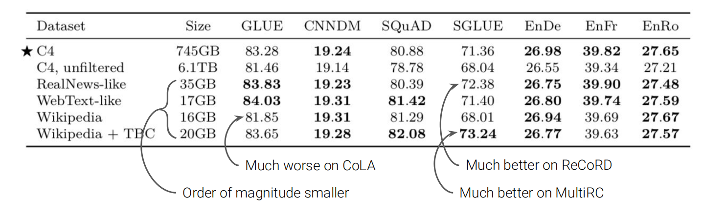
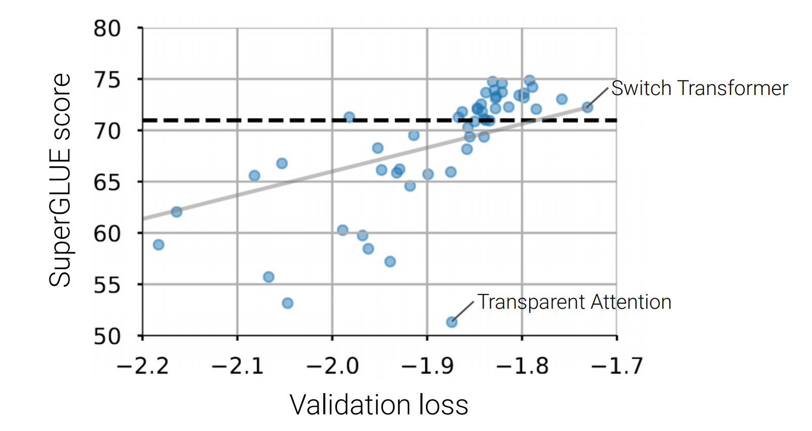

# Lecture14-T5 and large language models: The good, the bad, and the ugly

## Introduction

无监督的预训练+有监督的微调。是解决许多NLP问题的标准方法。

迁移学习的进展图：

2019年后迁移学习井喷式发展。新的数据集，新的微调方法层出不穷。但由于所使用数据集不同，模型参数不同，时间不同，优化器不同等原因很难判断到底哪种方法是更好的，例如：

那么给定现有的自然语言处理领域中迁移学习的格局，**在具有同样实验设置的条件下到底哪一种方案表现得最好呢？**

在确定方法后怎样推动我们现在使用得工具向前进步呢？我们如何挖掘出现有方法的限制呢？在不同规模下这些方法又有什么样的表现呢？

**text2text transfer transformer**(T5)

将所有文本处理问题建模为text2text任务。模型输入文本并输出文本。

例如在机器翻译中，只需提示模型翻译：

其中translate english to german为task prefix用于告诉模型想要他做什么。

例如判断一个句子是否合理（语法上语义上），我们直接让模型输出是否acceptable的文本，而不使用分类器：

再例如回归问题。模型需要输出一个浮点数字符串。结果再stsb benchmark上达到SOTA结果。

再例如摘要问题，只需将task-prefix变成summarize.

在训练阶段，使用**完成相同的目标**。在解码阶段，使用**完全相同的过程**。作者的观点是当一种提升迁移学习的技术能够提升这种模型的性能，于是就在很多**下游任务中都适用了**。

**预训练数据集**：变换数据集大小，filtering流程用于控制数据的质量

利用爬虫common crawl获取common crawl web extracted text->清洗数据，得到C4数据集。

## BASELINE MODEL

**预训练目标**：给定原始文本(ori text)，随机mask掉一些word，对连续的word使用一个占位符<x>,<y>等进行表示。训练的target为复原这些占位符对应的单词序列。（不是重建整个序列）。和BERT只mask掉一个单词不同这里mask掉的可能是连续的几个单词。

预训练阶段使用C4数据集和上述目标函数，BERT-BASE大小的Transformer的编码器和解码器。

微调阶段，在GLUE，CNN/DM，SQUAD（这里直接生成文本而不是指定文章中的token开始位置和结束位置），SuperGLUE，以及三种英语到其他语言的翻译数据集。对每个数据**单独执行微调。**

**一些实验结果**

上图为使用上述模型和预训练然后单独在不同数据集上fine-tune后得到的结果。首先可以发现在翻译任务上是否加入预训练影响似乎不是很大这是因为训练集已经足够大了。

在GLUE和SQUAD数据集上模型只训练了差不多四分之一的时间（但是更多的参数）就达到了和BERT差不多的效果。

## 实验

在下面的实验中，由于计算量较大**使用的超参数都是固定的**。其中打星号的是baseline模型

### **实验1**-不同语言模型的架构的影响

采用的目标是上述BASELINE的目标。Encoder-decoder模型就是BASELINE。

考虑5种语言模型：

- 传统encoder-decoder模型（seq2seq） 
- 参数共享的encoder-decoder模型
- 传统encoder,decoder model,但是层数减半（6层）
- 语言模型：先将输入输入到语言模型然后再进行预测target。
- Prefix语言模型

### 实验2：比较不同的预训练目标(training objective)。

- 训练模型预测下一个token（LM objective）

- 将输入打乱让模型还原未打乱的序列

- 如BERT一样的masked机制。

BERT-STYLE，MASS-STYLE：预测完整的un-corrputed文本.(大致相同的策略)

Drop Corrupted Tokens：将token全部丢掉然后让模型预测这些丢掉的token。

前两个需要恢复整个序列，后两个只预测mask的token(因此预训练成本较低)

### 实验3：比较不同预训练数据集

在和下游任务相似的数据集上进行预训练通常可以得到极大的gain

在COLA数据集上，wikipedian的performance很差。作者的观点是，C4数据集中有一些不干净的元素，而维基百科数据集太干净了导致在COLA数据集上的表现差异。

由上图可看出在小型数据集上的预训练结果也不一定较差，那么数据集大小的影响如何呢？

### 实验4：数据集大小的影响

人工将C4数据集减小一些，并使得**这些数据集在训练数据集中重复出现**。repeats表明重复次数。

数据集越小，相同步数后的LOSS相对更小。但最终在不同数据集上的finetune结果更差。所以更有可能是overfitting。

因此数据集的减小原则是**尽可能在预训练阶段不出现overfitting**

### 实验5：多任务学习

一次训练模型多项任务。这里是将预训练任务和**所有的下游任务**都放在一块。

**equal**:从所有数据集中抽取同样多的数据

**EXAMPLE-PROP**:抽取率和数据集大小成比例。由于预训练数据集通常是很大的，因此这种采样策略很可能最终导致抽不到任何数据。因此**引入常数K**表明抽取时假定预训练集的大小。

**Temperature-scaled**:将数据抽取比例取$\frac{1}{T}$次幂再做归一化。这样做显然增大了地样本数据集的采样比例。当温度T增大时，越倾向于均匀抽取数据。

使用多任务策略和baseline相比**牺牲了一些performance。**

### 实验6：减小多任务学习和预训练+微调模式的差距

结合多任务学习（包含unsupervised pretrainging），然后再在不同任务上fine-tuning,则**性能不会下降太多**。（第一行和第三行）。这样做的好处是**能够在预训练阶段对下游任务的performance进行监控**（因为使用了它们进行了训练），并**不会牺牲太多最终的performance**。这里的多任务学习输入只需**提供不同的task prefix即可**

下图给出了五种训练范式：

### 实验7-Scaling

实验基于如下问题：如果现在可行的训练时间是以前的4倍那如何提高performance呢？

- 可以将训练步数提高到4倍
- 可以将batchsize提高到4倍
- 可以将模型大小提升2倍，训练步数提升2倍
- 可以将模型大小提升4倍
- 集成4个模型（是否进行预训练）

实验表明相对于增加训练步数，increatse模型大小更有效。

### 实验-总结

综合上述实验结果如何得出最终的T5模型？

- 根据实验1，选择encoder-decoder架构
- 使用span-prediction obj（和baseline模型类似）
- 选择C4数据集，不必担心重复造成的overfitting问题，并且实验表明其最优性
- 使用multi-task pretraining+微调：由于训练时间较长需要**监视下游任务的情况**

- 增大模型大小

**不同T5模型大小的实验结果**

注意**Back-translation**的应用。注意我们的预训练仅用英语语料因此没有击败任何的Translation模型。

## 关于多语言的讨论

仅使用不同语言作为训练语料来训练T5模型，称为multilingoT5.

多语言C4数据集在不同语言上的分布如图所示，最多的语言为英语，最少的语言为Yoruba：

对于较少训练数据的语言为获得较大的样本采用上述temperature采样策略。较低的temperature倾向于**将所有数据用作均匀抽样。**

如图所示的实验结果表明当减小温度时在低数量样本的语言上（如URDU）表现良好。当增大温度时在高数量样本的语言上（如RUSSIAN）上表现更好。

**实验结果**：如图所示

zero-shot:不是每种语言都有fine-tuning数据，只在预训练数据中包含这些语言数据。我们只在英语数据集上fine-tuning模型然后输入其他语言数据查看输出结果。

translate-train:将英语微调数据集通过一个机器翻译模型翻译成其他语言。

in-language multitask:每种语言上都有一定fine-tuning数据。

在上图可看出当模型参数增加时前两种方式的差距较大而最后一种方式的差距很小。我们可以看出大模型能够**学习到语言本身更多的知识，学习到更广的分布**。

## 预训练阶段语言模型能学到多少知识？

阅读理解问题：

开放域问题：

closed-book question answering:

模型不**从外部获取知识**。仅仅给模型输入一个问题。

如果预训练步骤中包含我们用于QA的数据（例如这里让模型预测出Reank D出生信息中被mask掉的token）则期望模型能在fine-tuning阶段能recall这个信息。

实验中，由于需要评估模型在预训练中学到了多少知识，T5.1.1模型没有使用多任务预训练而直接使用最初的无监督预训练方式。

上述实验结果表明相较于显式检索知识的SOTA开放域问答系统T5模型差距较大。为了弥补不足引入一种新的训练OBJECTIVE即：Salient Span masking

- 在预训练阶段不随机mask掉word，使用命名实体识别识别出实体后mask掉命名实体。

如图结果表明这样的预训练做得越多则微调后获得的准确率越好。

引入该预训练目标后的结果：

以上这种定义目标的方式称之为**领域自适应**或**任务自适应**预训练。

**模型的知识是否都在预训练阶段取得的？**：在这些测试数据集上确实有许多knowledge的overlap.因此有可能模型是在fine-tuning阶段学到的知识而不是pre-training阶段。但是在遍历一次FINE-TUNING数据集之前T5模型在测试数据集上的performance就已经相对平稳了因此预训练部分可能已学到大部分知识了。

## 大型语言模型能够记住训练数据吗？

有时候预训练模型会**记住**预训练语料中的一些敏感信息，尽管这些信息**在预训练语料中仅出现很少次数**，下面是一个GPT模型的例子。给定一个task prefix让其续写，它给出了一些敏感信息。

实验方式是给GPT-2一个prefix，采用三种采样策略生成文本。

然后依据基于**困惑度perlexbity（之前的笔记）**的6中不同指标评估生成文本。

经过去重之后，选择TOP-100个sample

谷歌搜索这些sample文本。并且查找GPT-2训练集中是否有这些文本。

下图是GPT-2模型中sample出来的200000个点的分布情况：

对上图中红点和蓝点表明选择出的sample，蓝色表明这些选择出的东西确实在训练集中。这意味着相比ZLIB模型，GPT-2模型在给定一个序列后（这里是task prefix）更擅长预测下一个TOKEN。并且尤其对已经记住的训练语料，在生成时能给出较小的困惑度。

**模型大小对记忆的影响**

由实验结果看出较大的模型能记住相对较小次数重复数据而随着模型减小数据需要重复很多次数才能记住。其中XL,M,S分别表示GPT模型的尺寸。

## Transformer架构的讨论

如图为不同transformer变种在预训练后达到的dev loss和在WQ和SUPERGLUE数据集上微调后的表现：

switch transformer增加了参数量但没有增加一定的processing步骤。可以看到即使它都达到了最好的valid loss但是在WQ上表现良好但在SUPERGLUE上表现较差。作者argue是由于SUPERGLUE数据大多需要推理，WQ更需要knowledge intensive的能力。而switch transformer的增加参数量的trick（不增加processing的步骤）能**提升模型可以内化的知识量但是不能帮助模型推理**。

