# Lecture1-介绍和词向量

## 语言和词义表示

- 机器翻译
- GPT-3：universal model
  - 预测下一个words
  - prompt机制：告诉GPT模型该做什么
    - 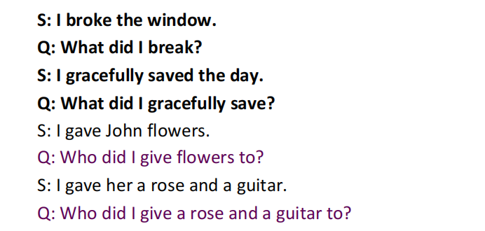
  - SQL翻译：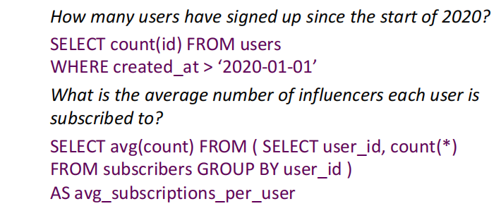

**如何表示词义：**

词义：

- 单词，短语所表示的含义

- 人类想要表达的含义，使用单词，手势等
- 作品，艺术层面所表达的含义

理解meaning的最普遍语言学方式

符号signifier(symbol)和符号所表达的含义或事物signified(idea or thing)之间的转化。

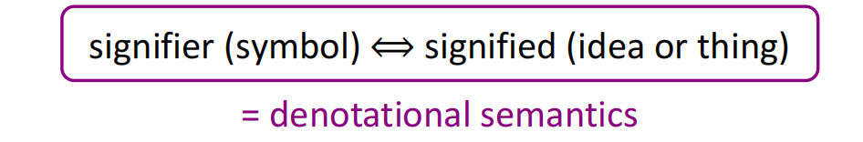

eg:树

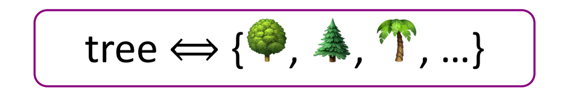

### wordnet-词典表示

**基于词典的表示方法**：包含同义词集合和上位词集合的语料库。

上位词：is a的关系。例如熊猫是动物，动物是熊猫的上位词。

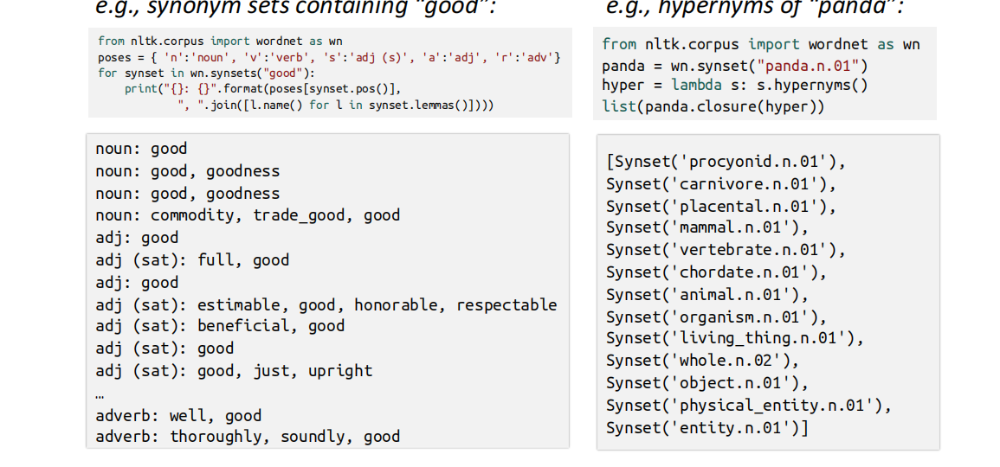

问题：

- 不能细微分辨词义：eg：仅在某些上下文中proficient才是good的同义词
- 不能及时更新
- 主观
- 需要人类创建和调整
- 不能计算词义相似性

### 	Discrete Symbols-One-hot表示

传统NLP中，将词语看作离散符号,称为localist表示。这种离散符号使用one-hot vector表示：

$model = [0,0,0,0,0,1,0,0,0,0],hotel = [0,0,0,1,0,0,0,0,0,0]$

**问题**：不同单词表示是正交的。因此不能用于相似度信息。

**解决方案**：

- 使用wordnet计算相似性：但wordnet本身不完整
- **学习在向量本身中编码相似度信息**

### 通过上下文表示-Word vectors

**分布式语义（distributional semantics）**:单词的含义是通过其临近经常出现的单词给出的。

**上下文（context）:**在文本中,单词w邻近(固定窗口大小内)单词集合是单词w的上下文。

- 通过使用多个w的上下文建立w的表示。

- eg:bank
- 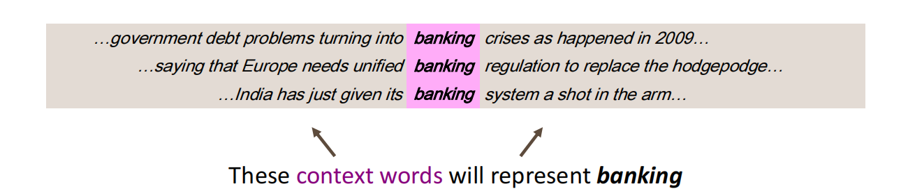

**词向量**

也叫word embedding。每个word建立一个**稠密**的实值向量表示。

- 衡量指标：是否能准确预测出其上下文的单词

词向量是一种分布式表示，因为其含义分布在**所有维度上**。例如banking在300个维度上都有实值：

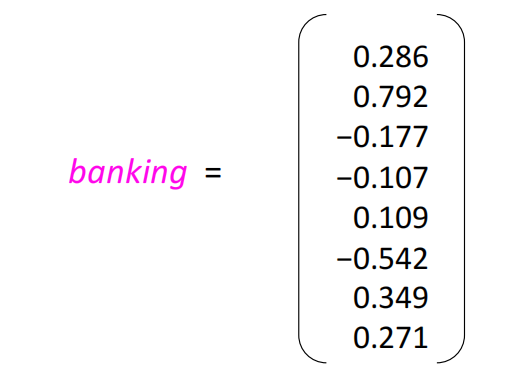

词被嵌入到高维空间中。投影到低维空间中会损失大量信息。例如在二维空间中的可视化：

相似的词语被聚集到一起了：

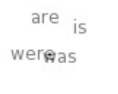

## Word2Vec：Overview

想法：

- 大量的语料
- 固定的词汇表：每个单词通过词向量表示

给定中心单词c（图中红色表示）,上下文词汇（图中粉色表示），计算每个上下文词汇再给定中心单词的出现概率：

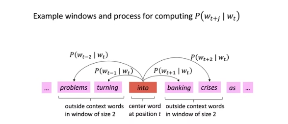

两种框架：

- skip-gram:依据中心词预测上下文词
- CBOW

## Word2Vec:objective function

对所有的位置$t  = 1,\cdots T$,作为中心单词c。计算固定window大小m中上下文单词的似然：
$$
L(\theta) = \prod_{t=1}^T \prod_{-m \leq j \leq m,j \neq 0} p(w_{t+j}|w_t)
$$
objective function:是上述对数似然。
$$
J(\theta) = -\frac{1}{T} \sum_{t=1}^T \sum_{-m \leq j \leq m,j \neq 0} log p(w_{t+j}|w_t)
$$
想最大化似然，则最小化对数似然。

**问题：如何计算$p(w_{t+j}|w_t;\theta)$**

每个单词w使用**两个**词向量：

- $v_w$，当w是中心词汇时
- $u_w$，当w是上下文词汇时

这样使得后续目标函数优化更容易。如果每个单词使用一个词向量，计算出的导数将会相当复杂。注意目标函数的形式，每种单词都会作为中心词汇和上下文词汇进行计算。两个词向量有可能非常相似。

于是，对一给定**中心词汇c**和一个**上下文单词o**,给定中心词汇，上下文词汇出现的概率为：

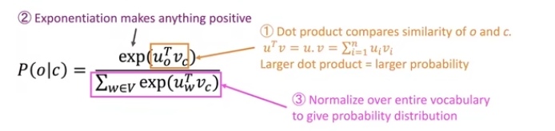

- 取指数用于避免概率计算出现负数

- 分母用于做归一化，使得这是一个概率分布

**softmax函数**：上述目标函数即为softmax函数
$$
softmax(x_i) = \frac{exp(x_i)}{\sum_{j=1}^n exp{(x_j)}}
$$

- max:**放大了最大的**$x_i$的概率
- soft:也为一些较小的$x_i$分配了一些概率

## 训练模型-优化参数以减小损失

模型参数$\theta$:所有单词的上下文词向量，所有单词的中心词向量

- 设d为词向量维度,V为词表大小，$\theta$有$2dv$个参数。

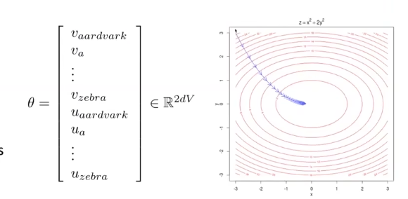

- 方法：梯度下降算法，沿着梯度的负方向行走

目标：
$$
minimize \ J(\theta) = -\frac{1}{T} \sum_{t} \sum_{-m \leq j \leq m,j\neq 0}\log p(w_{t+j}|w_t)
$$
其中$p(o|c) = \frac{exp(u_o^T v_c)}{\sum exp(u_w^T v_c)}$  

概率相对于中心词向量$v_c$的梯度:
$$
\frac{\partial p(o|c)}{\partial v_c} = \frac{\partial \log \frac{exp(u_o^T v_c)}{\sum_w exp(u_w^Tv_c)}}{\partial v_c} 

= \frac{\partial u_o^Tv_c}{\partial v_c} - \frac{\partial \log \sum_w exp(u_w^Tv_c)}{\partial v_c}
$$
其中：
$$
\frac{\partial u_O^T v_c}{\partial v_c} = u_O
$$

$$
\frac{\partial \log \sum_w exp(u_w^Tv_c)}{\partial v_c} =

\frac{1}{ \sum_w exp(u_w^Tv_c)} \cdot \frac{\partial \sum_w exp(u_w^Tv_c)}{\partial v_c}
=\frac{1}{ \sum_w exp(u_w^Tv_c)} \cdot \sum_w \frac{\partial exp(u_w^Tv_c)}{\partial v_c}
=
\frac{\sum_x exp(u_x^T v_c)u_x}{ \sum_w exp(u_w^Tv_c)}
$$

上面的推导使用了**链式法则**。将上式最右侧整理一下：
$$
\frac{\sum_x exp(u_x^T v_c)u_x}{ \sum_w exp(u_w^Tv_c)} = \sum_x u_x [\frac{exp(u_x^Tv_c)}{\sum_w exp(u_w^Tv_c)}] = \sum_x u_x p(x|c)
$$
最终得到：
$$
\frac{\partial p(o|c)}{\partial v_c}  = u_o -\sum_x u_x p(x|c) = observerd - expected
$$
后面一项$\sum_x u_x p(x|c)$可以看作是词向量$u_x$在概率分布$p(x|c)$下的**期望**。对于softmax模型下，得到的梯度大多都是$observed - expected$的形式。如果模型给出的v_c能使得看到的和期望基本接近，则梯度较小。

**词向量的属性：**（以gensim为例）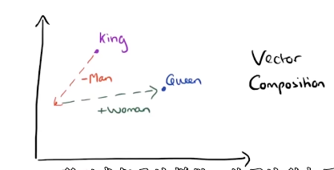

如图所示，king减去man的词向量表示，加上woman的词向量表示，得到queen的词向量表示。称为analogy:

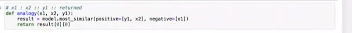

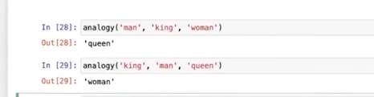

问题：

相同的上下文中出现反义词词向量：john is really **tall**,john is really **short**,可能导致反义词词向量相似。

一些虚词to,so等出现在很多的上下文中，词义表示可能不准确。

忽略了单词的**位置信息**。eg:模型中对上下文单词的预测不考虑该单词处于中心词之前还是之后，目标函数无区别，**但是word2vec对句子结构更敏感**。

