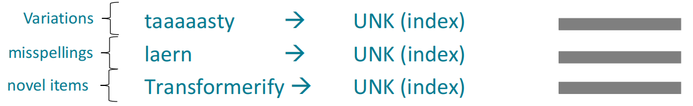
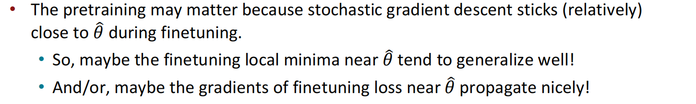
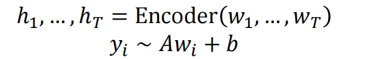

# Lecture10-Transformer and Pretraining

## subword models

语言词汇表总是有限制的，对文本中未出现过的词语将被赋予一个UNK标签。

包括variation,misspelling,novel item。

即使它们表达了某种含义，如图所示：

许多语言有**很复杂的morphology**，或者说word structure；所以在许多语言中，**词汇表有限这一假设通常是不成立的**。

eg:例如：斯瓦希里语动词可以有数百种变位词，每一种都编码各种各样的信息。（时态，情绪，确定性，否定，关于对象的信息，++）

两种极端：

- 单词粒度
- 字符粒度，依赖于神经网络来学习字符的组合而构成的含义

subword model介于这两个之间。

## byte-pair encoding  Algorithm

性质：

- 语料库中较为常见的**字符序列**通常在词表中被加入。
- 语料库中不常见的**字符序列**通常在词表中**会被切成很多块**

该算法原本被用在机器翻译中。但现在wordpiece算法被用在预训练模型中。

如上图所示，在算法运行过后，常见词语hat或learn在词汇表中被完全保留。taaaasty等单词出现次数较少，因此被视作三个子词。如果切分出的子词并不是原始语料中一个单词的完整部分则加一个井号在后面。

在以后的笔记中，所说的word都指的subword或word本身。

## Motivating model pretraining from word embeddings

### 预训练

传统分布式词向量的问题：**没有将词语放入上下文中考虑来给出其embedding**

eg:

如图两个record具有不同含义，但是word2vec或glove词向量却给了它们相同的embedding。

预训练方法是一种将**输入的一部分隐藏**，并且**训练**模型来**重建**这些输入的方法。例如在word2vec的skip-gram模型中，我们是利用中心词汇来预测其上下文的词汇故也相当于是一种预训练词向量。

在大约2017年阶段，我们通常是将word2vec等分布式预训练词向量（不含上下文）输入给一个**参数完全随机初始化的模型**。模型被训练并用于例如QA，MT等下游任务。这完全依赖于模型从**随机参数开始**从数据中学习如何理解上下文(句子如何组合，单词在特定上下文的语境中表达何种含义)进而完成任务。显然这种方法**依赖于充足的数据教会模型学会上下文理解进而完成下游任务**。

在现代NLP中，几乎所有模型参数都是通过**预训练**得到了初始化的。事实证明这种方案**增强了语言表示（sim word to sim vec），提供了良好的参数初始化方式**

### 从重建输入中能学到什么呢？

- 通过预测大学所在地，学习到一些琐事（常识）知识。

- 通过预测可能的her,my等，学习到一些**语法知识**

- 通过预测her，学习到woman和her之间共指（更一般地说，单词之间的联系）

- 通过预测可能在海洋中存在的事物，学习到词汇语义类别

- 通过预测bad，前面的描述表明这句话的情感是bad

- 通过填充一个任务中的缺失部分，学习到一些短语所代表的含义(went to,standing ...)，并进行简单推理

- 学习到斐波那契数列

### pretraining

**通过语言模型的预训练**

训练一个神经网络在大量语料中尝试语言模型，并保存模型参数。

**预训练+微调的范式**

预训练阶段：具有大量语料。可以学到一般化的东西。

微调阶段：不具有太多的训练数据。

**为什么预训练和微调有用**

## 预训练方法

### Decoder

**方式一**

通常使用**语言模型**来预训练解码器。即$p(w_t | w_{1 : t})$，但**在微调阶段不使用这个概率分布**

通过训练一个分类器来进行微调。这样梯度就能在整个网络中进行回传。例如下图所示的linear layer是从头开始训练，下面的红色网络是预训练。所有的网络参数一并finetuning

**方式二**

预训练通过语言模型的方式，微调时**将网络作为一种生成器，即微调$p_\theta(w_t | w_{1:t-1})$**

这种方法在输出是词汇表中序列的任务时（和预训练一致）**很有用**：对话，summary。
$$
h_1, \cdots h_T = Decoder(w_1 \cdots w_T) \\
w_t = Ah_t + b
$$
**神经网络的最后一层已经过了预训练，但是还需要fine-tuning。使得分布接近于邻域相关的任务**

#### GPT

其中在线性层中先将隐藏层的768维投影到3072维中，然后再将3072维重新投影回768维中。

那如何在特定任务上进行fine-tuning呢？以NLI任务为例，该任务输入两个句子对。其中一个句子为**前提(premise)**，另一个句子为**假设(hypothesis)**并输出这两个句子对间的关系是蕴含关系（entailment），是冲突关系（contradict）还是中立的（既不是蕴含又不是冲突）。如图所示：

在GPT模型中以句子对：

为例给定DECORDER输入：

在EXTRACT TOKEN对应的隐藏层表示处**再利用一个分类器进行分类即可**。

实验结果：

#### GPT-2

GPT-2是在更大量的数据下训练出的GPT版本。

### Encoder

与DECODER不同，ENCODER在建模时不仅能看到以前的word,还能够**看到future word**，这就限制了我们使用语言模型。可以**将句子中一些比例的单词换为[MASK]然后预测这些[MASK]处的原始单词。**在计算LOSS时**仅计算[MASK]对应位置的损失。**

这样的模型称为MLM(masked Language Model).

#### BERT: Bidirectional Encoder Representations from Tranformers

##### Masked LM

做法：随机选择的15%的token,选择**维持，替换为[MASK]，替换为随机TOKEN**三种处理方式中的一种作变化，让模型**预测**原始未变化的TOKEN。比例如下：

如图所示，原始句子为I WENT TO STORE.went被替换成了pizza,to维持不变，store被替换成了特殊的[MASK]。于是模型被要求预测并还原这三个词语。三种变换机制的引入增强了随机性，模型是**无法确定其周围的词语是否是正确的**，这使得语言模型就能更好地从整体上捕捉上下文联系(eg:encoder处输入出现替换went之后的pizza但是**模型需要根据上下文来判断出这里就是应该填入went**，也需要依据上下文判断这里的to确实是正确的to，即使前面有错误的pizza)。除此之外**需要注意我们的目标是为每个token建立一良好的语言表示而不是仅仅考察依据上下文的恢复能力**如果仅仅引入MASK机制那模型很可能在遇到MASK时就知道要预测而在没遇到MASK时就知道不要预测并倾向于关注MASK TOKEN只为MASKtoken建立一个好的语言表示,而对其余non-mask word不管不顾。

##### Next Sentence Prediction

如图所示给定两句话它们中间使用SEP标志分隔开。第二句话要么是紧接着第一句话，要么是**随机抽取的另一句话**。BERT模型被要求预测第二句话是否应该紧跟在第一句话之后。训练也会有噪声因为不知抽取的另一句话是否真的不能跟在第一句话之后。

但是今后有研究表明NEXT SENTENCE PREDICTION这一预训练任务**是没有必要的**。

**预训练一次，微调多次！**

##### 实验结果

#### LIMITATIONS

encoder不能用于像decoder那样**随着时间步增加不断生成整个上下文**(decoder可以，这称为**自回归**)，但可以[MASK]某些个token让其进行预测。

#### BERT的延展

- ROBERTA（使用更长的语料）和SPANBERT（每次MASK一个SPAN）

ROBERTA的结果还证明BERT是UNDERFIT的：

从实验结果看出即使增加训练步骤，不增加数据，结果也不会提升。但是增加了数据结果回大幅提高。

### Encoder-Decoder

如图所示，我们可以将输入$w_1 ,w_2 \cdots w_T$用于作encoder的输入，encoder处仍然使用BIDRECTIONAL ENCODER.将隐藏状态用于作decoder的输入。decoder是个语言模型，目标是生成我们给定的$w_{T+1} \cdots w_T$。损失函数的计算**仅在**decoder处计算语言模型的损失。

这样,encoder处能够从双向上下文中受益并且decoder处就可以**用于训练整个模型（包括encoder）**

_Exploring the Limits of Transfer Learning with a Unified
Text-to-Text Transformer_(T5模型论文)

该paper发现表现最好的是称为**span corruption**的方法。做法是将不同长度的span使用一个**唯一且单独的**占位符替换。在decode处还原这些占位符。如图所示：

对encoder的输入如下：

则期望decoder的输出（即语言模型的训练）为：

在预测Y对应的单词时，decoder仍然**能够看到encoder那里提供的Y之后的输入**（语言模型:长度信息自由？）

## Very large models and in-context learning

**GPT-3** (in-context learning)

in-context example：指定将要执行的任务

conditional distribution mocks:继续执行任务

eg:

