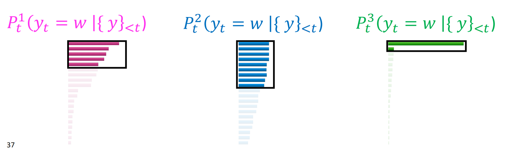

# Lecture12-Natural Language Generation

## 定义和应用

定义：构建能够自动产生连贯和有用的书面或口头文本供人类使用的系统

应用：机器翻译，对话系统，摘要（文档摘要，E-MAIL，Meeting）

**DATA2TEXT GENERATION**

总结从知识图谱，表格等数据结构中获取有效文本信息。

**visual Description**

**Creative Generation**:故事或文章，诗句

## **Formalizing NLG: a simple model and training algorithm**

在**自回归**模型中，对每个时间步$t$，模型输入一串token序列$\{y\}_{<t}$，输出一个新的token $\hat y$

正式的，模型在时间步t，已经输入$\{y_{<t}\}$的所有token，输出t时刻产生的**非归一化概率分布**即：
$$
S = f(\{y\}_{<t},\theta)
$$
其中f是我们的模型。利用softmax对分数执行归一化得到t时刻产生每个单词的概率：

模型的训练目标是**最小化每个时间步在ground truth上的负对数似然**
$$
L_t = - \log P(y_t^* | \{ y_{<t}^*\})
$$
在测试阶段，对每个时间步t的每个词，在给定前面所有时间步词的条件下，**通过解码算法t**，得到输出$\hat y_t$
$$
\hat y_t = g(P(y_t|\{y_{<t}\}))
$$

## Decoding from NLG models

### Greedy Methods

选择使得$p(y_t|y_{<t})$最大的词语即可，重复上述步骤：
$$
\hat y^t = argmax_{w\in V} p(y_t = w|y_{<t})
$$
还可使用beam search算法。

但是**基于贪心的解码算法可能导致重复问题。**

如图所示，如果强制使得模型每次输出I dont know这个短语，可以从图中看出**随着重复遍数的增加模型针对该短语的负对数似然评分越来越小，意味着模型认为该生成i dont know的概率越来越大**，从而导致重复问题。

图中可看出基于Transformer的模型比基于LSTM的模型的confidence还要低一些。

当序列不断增长时，**这种情况并不会消失**。模型**会越来越认为应该生成重复的短语。**

在基于Transformer的模型中，如图所示显然**这种问题更大**，因为图中在更多的序列长度后模型针对预测重复短语的confidence更高，这是因为Transformer的注意力机制不会忘掉之前的状态。

如何降低模型生成的重复语言呢？

一种简单的方式是直接使得模型不要重复n-gram。

近年来有**最小化连续句子之间的embedding distance的方法，但是这种策略不会减轻句子内的重复**；**提出一种新的LOSS，惩罚每个时间步attend到同样的单词的行为**。**或者一种新的目标，惩罚生成已看到过的token的行为。**

那么基于贪心的算法是否合理呢？有研究表明如图所示橙色为human生成的text对应的概率，蓝色为使用beam-search贪心算法生成的text概率。可以看到human生成的text概率总是**飘忽不定的，是具有较强的可变性的**，即现实情况是大多数情况下无法预测人类要说什么。(如果能准确预测的话为啥还要听那个人说话！)

### Sampling method

#### Top-k sampling

采样能使得模型生成text的可变性增大。在每个时间步根据分布$p(y_t | y_{\{<t\}})$进行抽样。

但是，该分布的大部分概率密度都集中在一些少量词汇中，而分布的尾部仍有很多的词汇，这些尾部的词汇由于其概率密度较低**很有可能是和上下文无关的**，因此，我们限制其不能被采样到。方法是**top-k sampling。**仅采样概率密度k最大的token。

如果仅使用固定的k，下图中上面的概率分布（**较为平坦**）效果很好。但下面的概率分布（**较为尖锐**）中引入了一些位于概率分布尾部密度的token的sampling可能（即上下文不相关的token），可能还需要cut掉更多的候选项。

#### Top-p sampling

从上面的实例可看出当概率分布较平坦时，较小的k可能会**漏掉一些可能正确的选项（因为大家的概率都差不多）**。当概率分布较尖锐时，较大的k可能会加入一些上下文无关的分布较小的token。

解决方法是根据分布的**均匀**性变化动态采样值k，**设定一个累计概率密度阈值从大到小选择直到概率密度之和大于等于阈值**

#### scaling randomness

在每个时间步t生成的词汇w的概率由softmax函数给出：

使用一个系数$\tau$来改变分布的平坦性或均匀性。

直观上由于指数函数的影响放大一个数再取指数会拉大与其他数的差距因此分布会更尖锐，反之亦然。因此

- 当$\tau < 1$分布倾向于变得更尖锐，会导致更少样的输出（由top-p算法的流程知道我们的采样就只集中在概率密度较高的单词中）
- 当$\tau > 1$分布倾向于变得更均匀，会导致相对多样的输出，由top-p算法的流程知道我们的采样集中在词汇表中的大部分单词中

### Improving Decoding:re-balancing distributions

融入更多的外部信息来**校准模型的分布进行预测**，不要仅仅依赖于模型分布

**解决方案1**

- 初始化一个大型语料库中获取的短语及其向量表示。
- 解码阶段，在数据库中查找最相似的短语，通过将当前上下文的向量表示与语料库中的向量表示作相似性计算，得到一个基于短语的概率分布$P_{phrase}$。
- 使用$P_{phrase}$来re-balance模型的输出分布$P_t$

**解决方案2：**Backpropagation-based distribution re-balancing

有些情况下可能需要将在一个领域内训练好的模型转移到另一个领域内，通常上述基于检索的做法也不能很好地校正这个分布。我们可以引入一个evaluator（attribute model）来衡量模型给出的分布有多好，并告诉我们应该校正成的分布。

### Improving Decoding：Re-ranking

一些情况下即使对分布做了re-blancing还是**无法避免模型生成一些坏序列**

解码**一些序列**。为每个序列分配一个质量分数并对分数进行re-rank

最好的方法是使用**困惑度**，但是由前一部分的图像可以看出**重复序列**有着很高的困惑度！。

更多的性质：

使用**多个并行的re-ranker**投票决定。

### Decoding的挑战

decoding仍然是自然语言生成的一个挑战。现有做法大多是校准生成序列以期望其更好地接近人类语言。

人类语言很noisy,不能够通过简单的衡量指标来衡量(例如语言模型概率最大化)

不同的解码算法会引入不同的bias

不同decoding方法的引入减轻了语言模型在人类语言生成中的分量。我们应尽可能建模人类语言的生成方式而不仅仅是像语言模型一样选择下一个最大概率的单词。

## Training NLG

回顾我们在机器翻译笔记中对于decoder训练方式的介绍。在基于极大似然估计的训练策略中，我们使用**极大似然估计**方法最小化训练语料的负对数似然。这倾向于模型给一些我们很常见的短语打很高的分，因此在NLG任务中就愈发容易生成这些短语，并在最坏情况下还可能不断生成这些短语，造成模型生成文本的多样性较差！所以我们不能仅最大化似然概率来训练一个模型来让其建模人类自然语言。

### Unlikelihood Training

引入$C = \{y^*\}_{<t}$，表明在时间步t给定某个context下**不期望生成的word集合**,用于防止模型重复生成先前时间步就见到过的word以提高生成文本的多样性。我们给定上下文$\{y^*\}_{<t}$的条件下极小化目标函数：
$$
L_{UL}^t = -\sum_{y_{neg} \in C} \log (1 - p(y_{neg}|\{y^*\}_{<t}))
$$
同时保留原始的teaching-force的极大似然估计的目标函数：
$$
L_{MLE}^t = -\log p(y_t^* | \{y^*\}_{<t})
$$
最后在给定时间步t的目标函数为：
$$
L_{ULE}^t = L_{MLE}^t + L_{UL}^t
$$

### **Exposure Bias**

回顾在训练阶段，我们使用teaching forcing策略训练模型，模型在每个时间步输入的是gold-word。但是在解码阶段模型是自回归的即输入的是其前一个时间步产生的word以产生下一个时间步的输入，输入不再是用gold word。结果是模型的生成文本和人类语言的正常模式相差很远。我们将这种现象称之为**exposure bias**。

解决方法主要是在训练时尽可能模拟decoding的做法：

**scheduled sampling:**训练时当前时间步以概率p直接使用上一个时间步的输出而不使用goldword

**dataset aggr**:在训练的间隙使模型生成的序列并加入训练集

**sequence rewriting:**从已有的语料库中检索一个序列，学习通过增加移除修改序列token的方法编辑序列生成最终结果。由于开始点都已经是从已有的语料库中检索序列了所以倾向于更少地遭受exposure bias

#### RL-Based Methods

**RL**：将NLG建模为**马尔可夫决策过程**

不直接输入gold word使模型直接decode并生成序列并**通过一定的评估策略为其评分**。模型生成序列后，通过代价函数：

对每个时间步的**奖励**并求和。对每个时间步当奖励较高时模型倾向于在下一次采样中就生成这个token。

**reward函数估计**：

直接使用最终的eval metric。这里面有直接对整个生成序列打分的评估方案，可以使用这些方案产生的score作为每个token生成的reward:

但是直接使用上述评估策略也会有问题,可能模型只是会充分利用了eval metric本身:

还有什么衡量方法能用于进行reward估计呢？

不幸的是RL算法通常是不稳定的，并有冷启动问题。我们可以使用teaching-forcing的策略先pretrain一个模型再利用RL继续训练。由于一些衡量指标总是正值（例如BLUE得分）所以通常再reward项目中引入一个baseline项目b。有两种估计baseline的方法：使用线性回归根据当前状态s预测，再decode一个序列将其得分作为baseline

最后，模型通常会以一种意想不到的简单方法来达到这些reward的较高值，我们需要想办法来mitigating掉这些使得模型能够match到我们期望的行为。

### 总结

## Evaluation（Important）

### Content overlap metrics

