# Lecture13-共指解析

## 共指解析的定义

识别单词中涉及同一实体的所有提及

如图所示所有黄色的高亮部分都指的是vanaja:

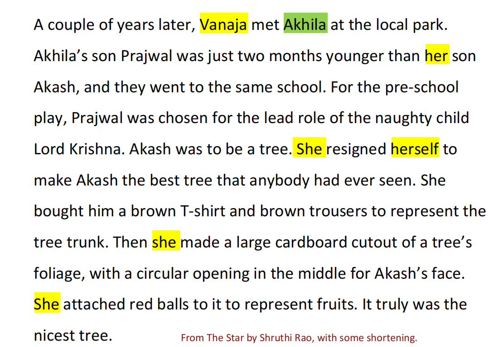

## 应用

- 文本理解：信息抽取，QA(he was born in 1961问题中包含who)，摘要

- 机器翻译：每种语言针对性别，数字和标点符号等**有不同的特性**

在机器翻译途中需要明确这些特性，哪个对象指代的是哪个对象。

例如在下面的实例中，我们需要明确使用he而不是she,就需要明白这里的指代是针对于juan的。

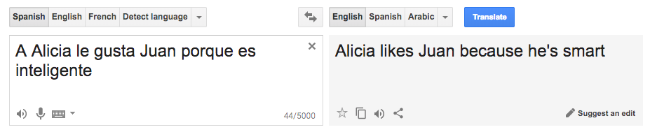

- 对话系统

下面的对话中模型需要明确第三句话中的three指的是上一句话中的3:00。第三句话中的Two回答是How many tickets

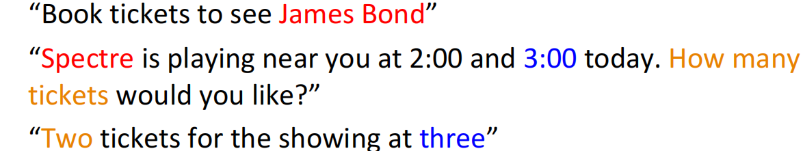

## 两步操作

- 发现提及，注意这些提及需要是**嵌套的**

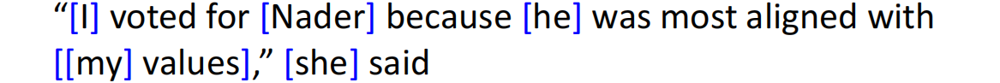

- 对所有提及进行聚类。下图中指代同一提及的使用相同的颜色标志出来了。

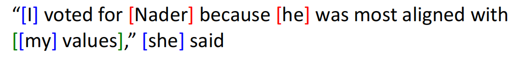

### Mention Detection

提及是文本中的一个span,指代某个实体。通常有：

- 代词：I your,it,she等。解决方案是使用**词性标注器**
- 命名实体：people,places等。解决方案是**命名实体系统**
- 名词短语："a dog"等。解决方案是使用**解析器（constituent parsing）**

如果简单地将这些所有类型文本都标注成提及，则会产生过度标注问题。例如下面的一些短语根本无明确的指代实体。

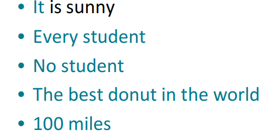

那么如何处理这些提及呢？直观想法是使用一个分类器来过滤掉一些无关的提及。更普遍的方法是保留这些提及，继续运行共指解析算法，然后过滤掉那些没有与任何实体匹配的提及。

也可以只针对提及发现这一任务训练一个分类器，摒弃上述传统的pipeline做法。或者直接摒弃mention detection，采用端到端的模型从所有的span出现之间联合进行上述两步操作。

### coreference的语言学视角

这里需要区分两个概念后面我们可以看到两者有交集但也有各自单独的部分。

**coreference:**两个mention指代的是**世界上同一个entity，两个mention没有依赖关系**。例如：Barack obama traveled to...Obama....。这里的两个Obama就是**指代的同一个世界上的实体，后一个Obama并不依赖于前一个**

**复指（anaphor）**:当一个term(anaphor)指代另一个term时，这个term的意思在一定程度上被这另一个term所诠释。通常还需要一定上下文的介入。

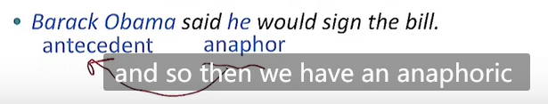

下图给出了复指和共指的关系的比较：

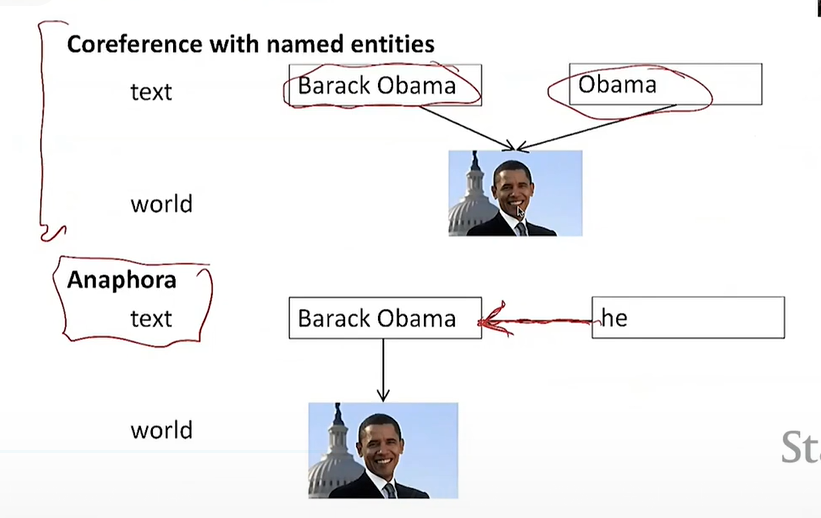

两者概念的关系以下图表达：

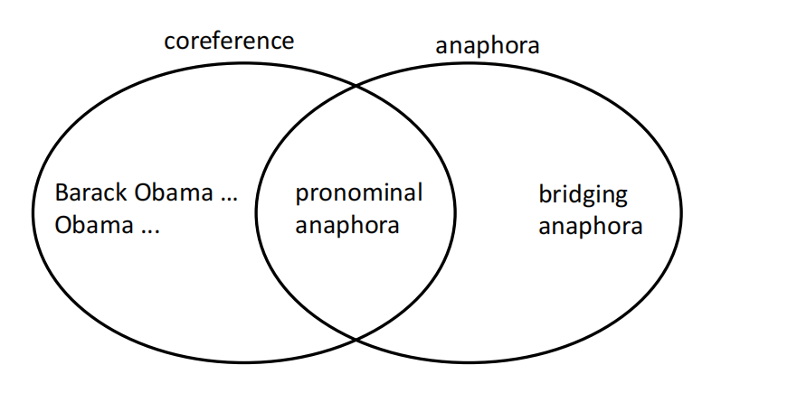

由图可以看出不是所有的复指关系都是共指关系。

首先不是所有的复指关系中涉及的mention都可以指代现实世界中的一个东西。例如下面的例子：

every dance twisted her knee.

No dancer twisted her knee.

在第二句话中,her knee和No dancer存在复指关系。但是No dancer不能去指代世界上的任何一个事物，因此这里**不存在共指（con-reference关系）**。

其次，如图所示：

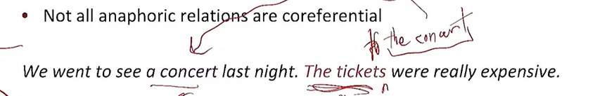

The ticket的后面实际上是省略了of the concert这与concert存在复指代，The ticket和a concert之间就存在依赖。我们认为the ticket和concert之间存在复指关系但由共指的定义它们不指代同一个事物因此不是共指关系。我们将其称为**Bridge anapora**

由复指的定义可以看出先行词通常是在anaphor（通常是一个代词）之前，但事实可能不总是这样。这称为下指。例如下图中的anaphor指代lord而Lord处于后面

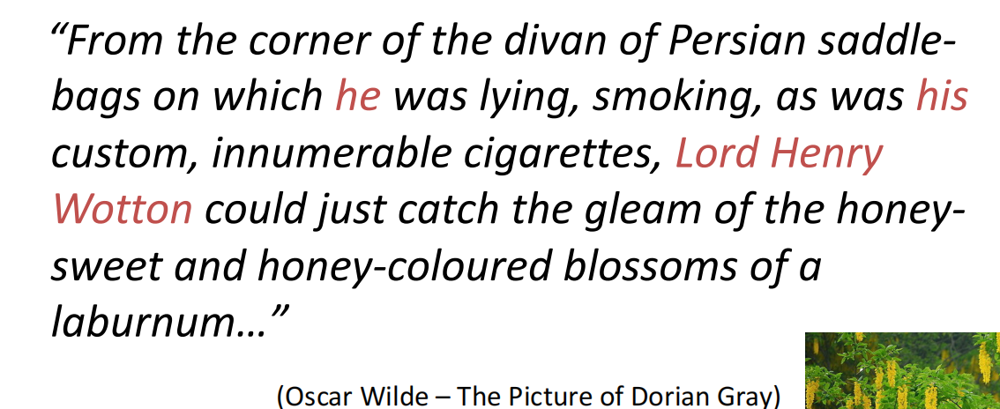

综上所述,理解语言离不开我们对上下文一个很好的诠释.而Conreference的解析更是如此.当我们自己阅读一个文章,进行一段对话或浏览一个网页时,我们通常都是**自己建立了一个discourse model**以发现一些共指,复指等语言关系,能帮助我们解释当前遇到的文本.

## 四种共指解析模型

