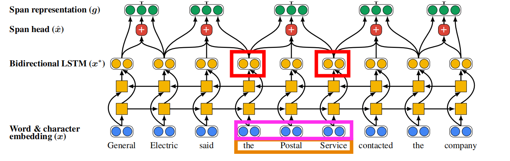

# Lecture13-共指解析

## 共指解析的定义

识别单词中涉及同一实体的所有提及

如图所示所有黄色的高亮部分都指的是vanaja:

## 应用

- 文本理解：信息抽取，QA(he was born in 1961问题中包含who)，摘要

- 机器翻译：每种语言针对性别，数字和标点符号等**有不同的特性**

在机器翻译途中需要明确这些特性，哪个对象指代的是哪个对象。

例如在下面的实例中，我们需要明确使用he而不是she,就需要明白这里的指代是针对于juan的。

- 对话系统

下面的对话中模型需要明确第三句话中的three指的是上一句话中的3:00。第三句话中的Two回答是How many tickets

## 两步操作

- 发现提及，注意这些提及需要是**嵌套的**

- 对所有提及进行聚类。下图中指代同一提及的使用相同的颜色标志出来了。

### Mention Detection

提及是文本中的一个span,指代某个实体。通常有：

- 代词：I your,it,she等。解决方案是使用**词性标注器**
- 命名实体：people,places等。解决方案是**命名实体系统**
- 名词短语："a dog"等。解决方案是使用**解析器（constituent parsing）**

如果简单地将这些所有类型文本都标注成提及，则会产生过度标注问题。例如下面的一些短语根本无明确的指代实体。

那么如何处理这些提及呢？直观想法是使用一个分类器来过滤掉一些无关的提及。更普遍的方法是保留这些提及，继续运行共指解析算法，然后过滤掉那些没有与任何实体匹配的提及。

也可以只针对提及发现这一任务训练一个分类器，摒弃上述传统的pipeline做法。或者直接摒弃mention detection，采用端到端的模型从所有的span出现之间联合进行上述两步操作。

### coreference的语言学视角

这里需要区分两个概念后面我们可以看到两者有交集但也有各自单独的部分。

**coreference:**两个mention指代的是**世界上同一个entity，两个mention没有依赖关系**。例如：Barack obama traveled to...Obama....。这里的两个Obama就是**指代的同一个世界上的实体，后一个Obama并不依赖于前一个**

**复指（anaphor）**:当一个term(anaphor)指代另一个term时，这个term的意思在一定程度上被这另一个term所诠释。通常还需要一定上下文的介入。

下图给出了复指和共指的关系的比较：

两者概念的关系以下图表达：

由图可以看出不是所有的复指关系都是共指关系。

首先不是所有的复指关系中涉及的mention都可以指代现实世界中的一个东西。例如下面的例子：

every dance twisted her knee.

No dancer twisted her knee.

在第二句话中,her knee和No dancer存在复指关系。但是No dancer不能去指代世界上的任何一个事物，因此这里**不存在共指（con-reference关系）**。

其次，如图所示：

The ticket的后面实际上是省略了of the concert这与concert存在复指代，The ticket和a concert之间就存在依赖。我们认为the ticket和concert之间存在复指关系但由共指的定义它们不指代同一个事物因此不是共指关系。我们将其称为**Bridge anapora**

由复指的定义可以看出先行词通常是在anaphor（通常是一个代词）之前，但事实可能不总是这样。这称为下指。例如下图中的anaphor指代lord而Lord处于后面

综上所述,理解语言离不开我们对上下文一个很好的诠释.而Conreference的解析更是如此.当我们自己阅读一个文章,进行一段对话或浏览一个网页时,我们通常都是**自己建立了一个discourse model**以发现一些共指,复指等语言关系,能帮助我们解释当前遇到的文本.

## 四种共指解析模型

### 基于规则的算法

称为Hobb算法。是一种传统的代词anaphora共指解析算法。

在深度学习方法出来之前Hobb算法**一直被用于基于机器学习算法的特征之一**

**Knowledge-based Pronominal Coreference**

如果共指解析系统不去理解上下文那么**极有可能造成错误结果**

如图所示，it需根据full还是empty来决定指代的是pitcher还是cup即需要根据上下文选择they的先行词。而上述基于规则的Hobb算法对这两种句子输出相同的结果，这是由于两句话**具有相同的句法结构**。

上述挑战称之为**Winograd Schema**，作为图灵测试的另一种替代方式。

### 基于Mention-pair的算法

对每个mention pair$m_i,m_j$赋予一个概率$p(m_i,m_j)$。例如对下面这句话中的she查看所有的先行词并决定他和哪个构成共指关系。

希望正例的概率尽可能大，负例的概率尽可能小。

**Training Objective**

设文本中有N个mention，在数据集中，如果两个mention$m_i,m_j$是正例则$y_{ij} = 1$否则$y_{ij} = -1$。只需要利用交叉熵损失建立目标函数：

**Testing**

在测试阶段如果$p(m_i,m_j)$超出某个阈值则认为两者存在共指关系。

再计算传递闭包即可实现聚类。

算法的劣势很显然，如果犯了一个错误那么在计算传递闭包后可能将两个类合并成很大的一个。

### 基于mention-ranking的算法

通常情况下距离当前mention较远的mention不构成共指关系了，并且通常情况下一个mention仅有一个明确的先行词，但是我们模型确预测除了全部。我们可以仅让模型预测一个先行词（分数最高的）。

我们可以在文本最前面添加一个NA让这些词指向它以表明当前的mention不与前面的任何东西构成共指关系。

可以设计基于softmax的目标函数，对一个mention与其构成正例的mention模型需要赋予其中至少一个较大的概率。

训练只需最大化目标函数目标函数：

$p(m_j,m_i)$如何**计算呢？**

统计分类器，神经网络，LSTM，Transformer等

**non-neutral coref models:Features**(略)

**neutral coref model:**

additional feature：两个mention之间距离之类的信息。

## Learning Character-level Representations for Part-of Speech Tagging

与传统word-embedding不同，在字符级别的维度上进行卷积进而获取单词的嵌入表示可以有效解决Out-of-vocab的问题。

可以将其与word2vec联合使用。

## 端到端的神经网络共指解析器（基于BI-LSTM）

- 编码：词嵌入+上述字符嵌入
- 输入BI-LSTM
- 考虑**一定长度范围内的所有span**

每个span的表示：使用开头，结尾和span本身基于注意力的表示。加之一些额外的特征。

注意这里的注意力分数是使用span中最后一个单词的表示进行的。最后，计算每个span是否是一个mention的分数$s_m(i)$，两个span是否是共指关系$s_a(i,j)$。

两个span最终是否是共指关系，考虑span是否是mention且两个span是否是共指代的关系。因此最终分数为三部分求和：
$$
s(i,j) = s_m(i) + s_m(j) + s_a(i,j)
$$
注意模型的计算复杂性较高，于是**需要进行剪枝（例如限制span长度）**。attention机制的引入表明span中哪些单词是最重要的，最有代表性的。

## 基于BERT的共指解析

