# Lecture15-Integrating Knowledge in LM

## Introduction

核心问题：语言模型能用作**知识库**吗？

有研究针对语言模型是否学习到知识**做了一定的测试**：

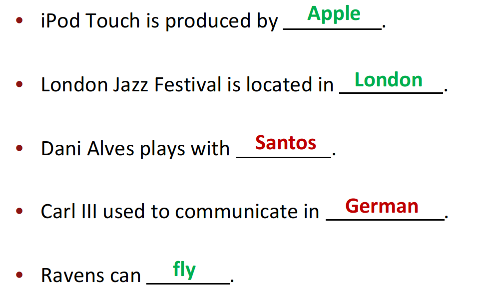

但许多情况下得出的预测也不见得在事实上时正确的。

- Unseen facts:一些事实在训练语料中**完全没有出现过**
- Rare facts:由于某些事实重复次数较少语言模型没有看足够的次数来记住这个事实
- Model Sensitivity:LM可能在训练阶段已经看到事实了，但是在测试阶段**提示（prompt）的短语下可能给出错误答案**

例如：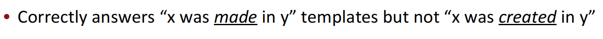

预训练语言模型的表示能够极大**提升促进需要利用知识的下游任务表现**。例如对下游任务中实体关系抽取任务，在预训练中学到关于这些实体的一些知识显然是有用的。那么语言模型能够**替代**传统的知识库吗？即我们不显式地查询例如SQL的知识库，而是使用prompt技术来从**语言模型中查询**。这需要LM有较高的能力来recall一些事实。

在传统的知识库查询中，通常使用SQL语句查询知识：

在LM查询中，预训练阶段将一些东西mask掉（非结构化数据上预训练），测试阶段采用prompt方法询问LM：

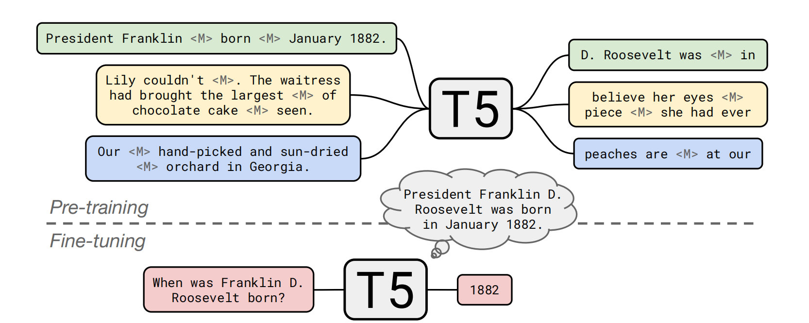

这样做的优势和劣势很明确。

在训练方面LM通常在很多非结构化的数据数据上预训练，而显式建立一个KB（结构化）需要复杂的人工标注或NLP相关的流程。在查询方面LM支持很多灵活的语言查询，而KB需要严格结构化的查询语言在很多时候泛化性能较差。例如下面的例子中传统KB没有FINAL F域因此不会返回任何结果但语言模型可能会学到final F和某个关系是相似的。

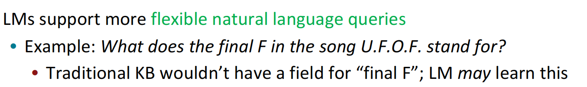

但LM作为知识库解释性差，难以信任（LM是明确知道事实还是由于一些bias影响给出的答案），难以更改（LM中难以更新或删除知识）

## 技术

### Add Pretrained Entity Embeddings

通常事实是由**实体**来表达的。例如：

**北京**是中国的首都。其中北京是实体。

但是仅仅依靠pretrained word embedding是**没有办法给出实体上的信息的**

例如U.S.A和United States of America具有不同的词嵌入但是它们确实指的是相同的实体。

那么动机就是我们能否**给予每个实体赋予一个embedding呢？**

**entity linking**:将文本中的一个提及转换到**知识库中的一个实体**。例如下图所示需要知道Washington指的是人而不是地点，需要将这个提及**映射**为地点对应的实体。而针对United States需要将其映射为美国本身。显然需要上下文的介入。

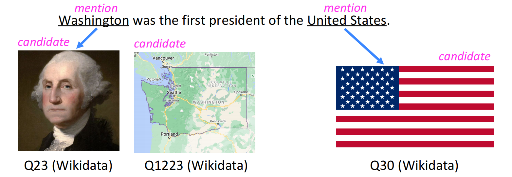

- 基于知识图谱的图embedding(例如TransE：Obj embedding + relation embedding = other obj embedding)
- 基于单词-实体共现的方法（例如wikipedia2Vec）
  - 给定一个实体，看**哪些单词最有可能出现在其周围**
- 基于Transformer的编码**实体描述**方法（例如BLIK）

注意实体嵌入和word嵌入来自**不同的空间**。

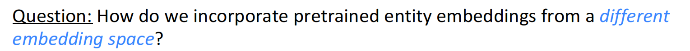

如何**融合**pretrained embedding和entity embedding呢？分别利用一个线性变换,将两者投影到相同的维度。再通过一个非线性激活函数。其中$e_k$是单词$w_j$对应所在的实体。
$$
h_j = F(\mathbf W_j w_j + \mathbf W_ee_k + b)
$$
_**ERNIE: Enhanced Language Representation with Informative** **Entities**_

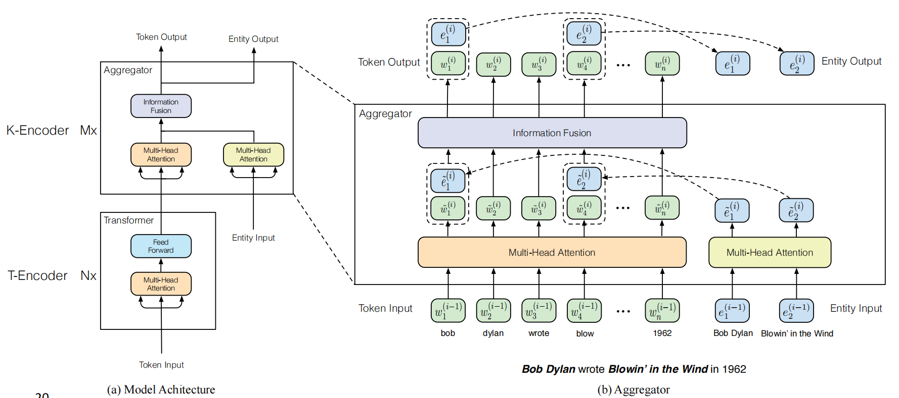

如图所示包含text-encoder和knowledge encoder。

knowledge encoder的每一层为一个aggregator，假设实体和实体对应的第一个单词对齐。则经过第i层后的输出结果为（第一个式子中单词不对应实体的不加实体项e）：

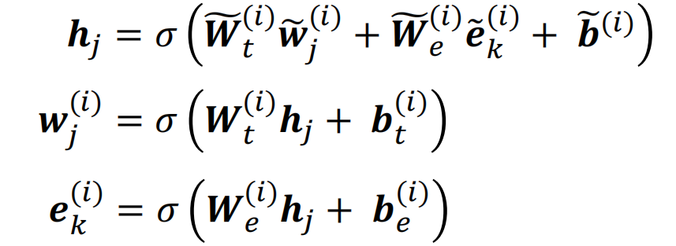

在预训练阶段，除了采用类似BERT的masked LM和next sentence prediction方法，为了融入知识引入knowledge pretraining task，随机mask掉token和entity的对应关系并给定一个token预测其应该对应的entity（预测集合是文本中原有的entity）。

例如在上图中我们需要预测Bob是和Bob dolan对齐还是和Blown in the wind对齐。实验表明当这个任务做好了可以**更好地融合单词和实体表示**。即：
$$
p(e_j | w_i) = \frac{exp\{Ww_i \cdot e_j\}}{\sum_k exp\{Ww_i \cdot e_k\}}
$$
其中分母为对所有的entity求和。最终的损失为三项求和：

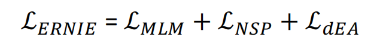

实验结果表明，联合entity embedding和knowledge task才能**更好提升性能**

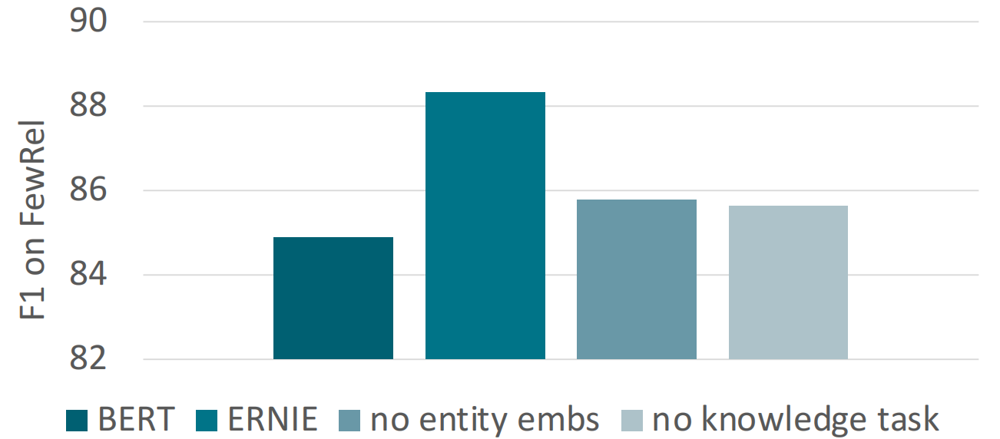

模型优势在于通过fusion技术联合了实体+context信息并采用了knowledge pretraining任务以提升了在下游knowledge-driven的任务。劣势在于需要标注实体且需大量预训练。

有工作也探讨过不需过多预训练的方法。

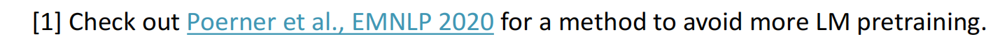

**_Knowledge Enhanced Contextual Word Representations_**

**直接预训练一个** integrated entity linker。在预测entity linking时在一些hard candiate上预测，而不是**仅限于句子中的实体**。

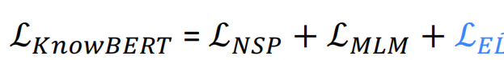

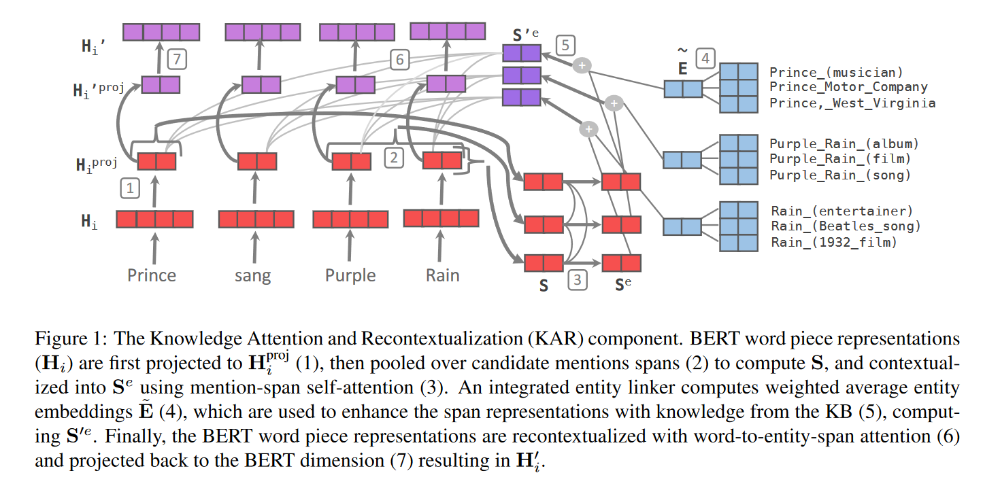

### using external memory

在上述方案中如果**需要修改knowledge base**那么就要重新训练所有的部分（包括entity embedding和语言模型）

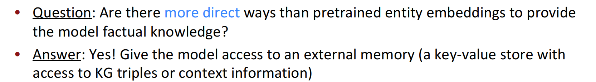

优势在于能够更好支持插入和更新知识（也就减少了预训练），并且增强了**可解释性**

_**Barack's Wife Hillary: Using Knowledge-Graphs for Fact-Aware** Language Modeling (KGLM)_

我们可以让一个语言模型的生成以知识图谱为根据。

原先语言模型的预测方式为：
$$
p(x^{t+1}|x^t,x^{t-1}\cdots x^1)
$$
其中$x^1,x^2 \cdots x^{t}$为单词序列。

现在我们引入实体信息，在t+1时间步根据**先前时间步的实体信息和单词信息预测**：
$$
p(x^{t+1},\xi^{t+1}|x^t,\cdots x^1,\xi^t,\cdots \xi^1)
$$
在遍历序列时，**从原始知识图谱中选择与当前序列相关的子知识图谱，称之为local KG.**在训练时假设实体都是已知的。

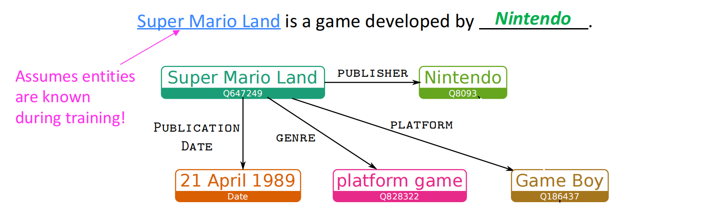

例如当前遍历到super mario land这个实体，就在原始KG中选择该结点与其邻居结点，以及对应的关系，构成local KG.

但在有些时间步的预测**不可使用**这个local KG，例如上图中的game对应的时间步。在语言模型的最开始步骤local KG是空的，**也无法利用**。

那么语言模型如何知道**何时才使用KG**来预测下一个单词呢？

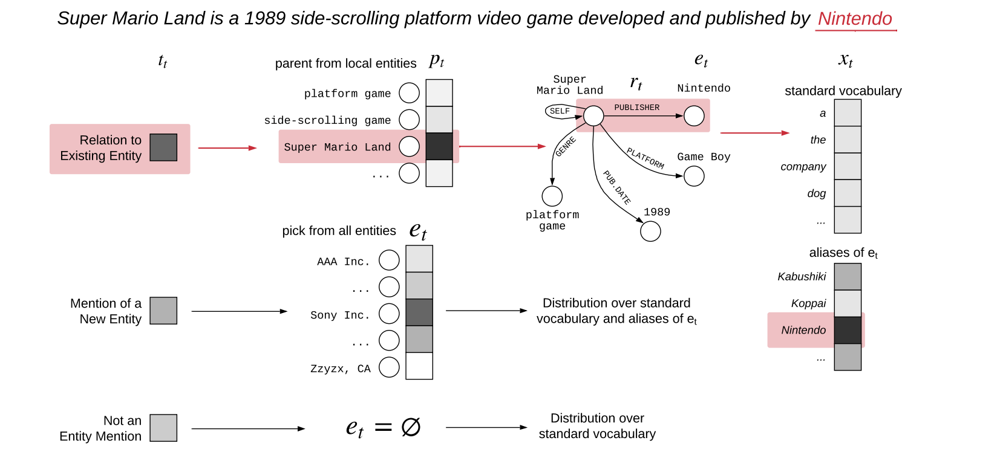

每个时间步利用LSTM的隐藏状态分类下一个单词的类型：

- related entity(in the local KG)
- new entity(not in the local KG)
- not an entity(就是LSTM生成的单词)

下面分别阐述预测方式。

**related entity**

知识图谱中的每条有向边可以使用三元组(parent entity,relation,tail entity)来表示。

在Local KG中让每个实体作为parent entity打分（softmax函数），为从该parent entity出发的所有relation打分。如图所示：

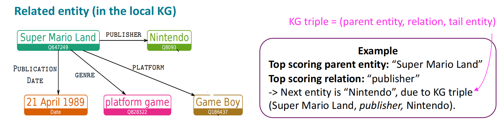

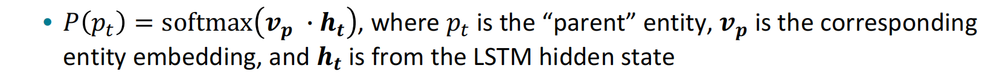

选出tail entity后，下一个单词为经过该tail entity别名扩展后的词汇表中的最可能的token.

实体别名：是一个短语，在上图的例子中可以是Nintendo的任意别名例如：

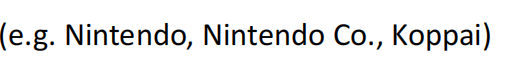

**new entity:**全新的，不在local KG中的实体。在全局KG中寻找得到最高分数的实体（使用LSTM网络的隐藏状态和KG中预训练好的实体embedding），加入local KG。下一个单词利用同样方法预测。

**not an entity**:只需直接在词汇表中预测。

**为何只采用local kg而不采用全局KG？**：课程指出用于计算父节点的softmax的个数较少。

在事实补全任务上该模型超越GPT-2和AWD-LSTM性能。由于知识库的引入模型更倾向于预测更加specific的token，但GPT-2预测更一般化的token

最后，想要更新知识库只需更新知识图谱上的边或结点，非常方便：

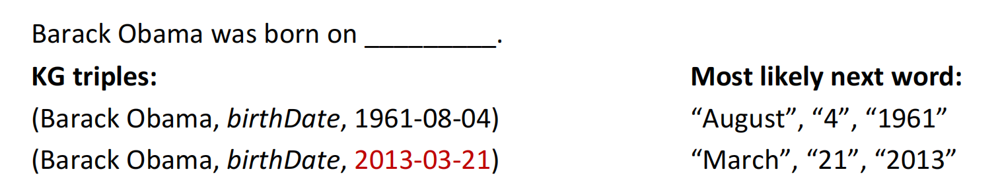

_**Nearest Neighbor Language Models (kNN-LM)**_

论文基于学习文本序列相似性比预测下一个单词更容易的事实提出一种基于KNN检索增强的语言模型。例如：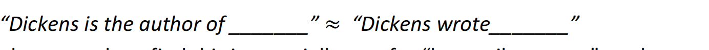

文本序列相似，通常具有同样的下一个token，即使不知道下一个单词。研究表明这种方式对处理“long tail pattern”效果较好，例如语料中极少出现的事实（只需要复制）。

将所有文本序列的表示存储到一个最近邻数据库中，在推断阶段找到k个最相似的sequence然后检索对应的k个下一个单词。最终的预测结果为语言模型的分布和该检索概率分布的加权求和：
$$
p(y|x)  = \lambda P_{kNN}(y|x) + (1 - \lambda)P_{LM}(y|x)
$$
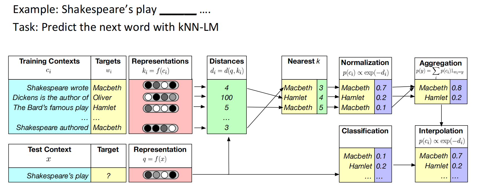

上述模型在领域自适应中效果也很好只需更换data store

### 修改训练数据

_**Pretrained Encyclopedia: Weakly Supervised Knowledge Pretrained Language Model (WKLM)**_

论文提出想法是将语料中的实体利用**相同类型的不同实体**进行替换。选择相同类型的实体是保留句子的语言学正确性（防止模式上的错误）。对每个实体模型预测其是否被替换。

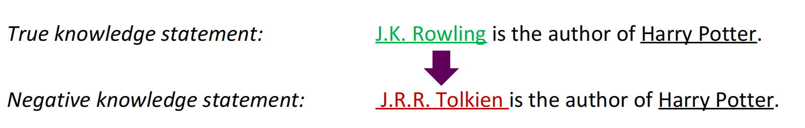

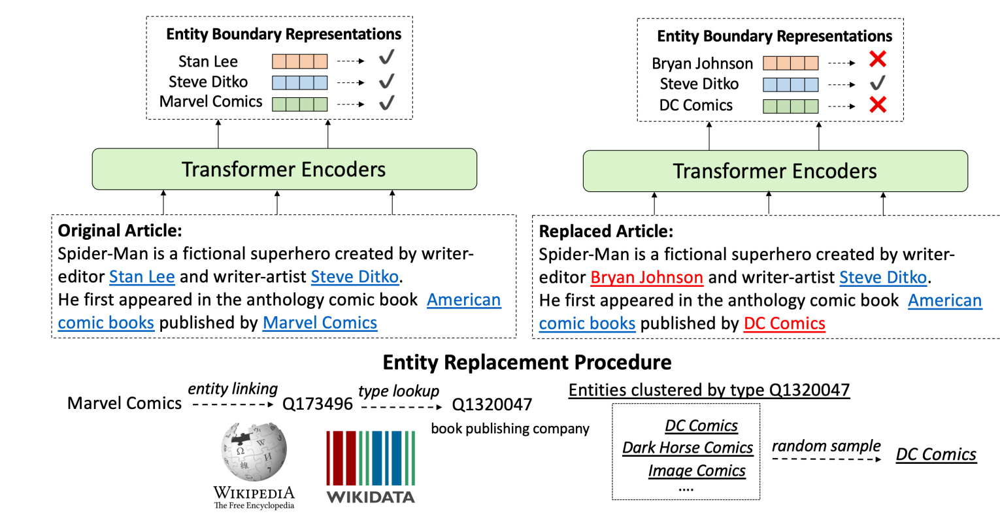

采用对数似然函数作为优化目标最大化真实实体的概率最小化负样例实体的概率：

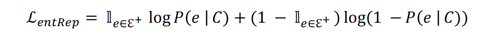

最终的损失是MLM损失加上上述实体损失。其中MLM的损失是token级别的而entrep损失是实体级别的。实验表明两者缺一不可。MLM能帮助模型学到更general的信息，引入entrep损失后相比较仅使用MLM学习更长的时间获得了更好的performance.

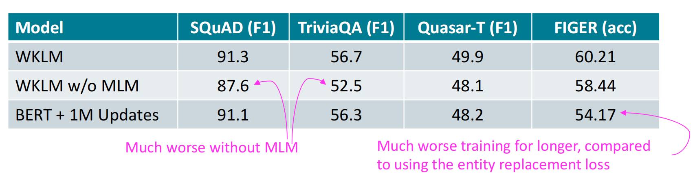

_**ERNIE: Enhanced Representation through Knowledge Integration**_

mask短语或实体

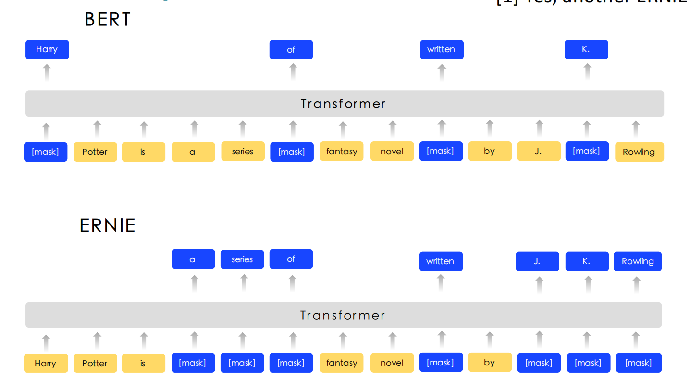

_How Much Knowledge Can You Pack Into the Parameters of a Language Model?_

_REALM_

使用sailent span masking策略随机mask掉 salient spans（命名实体或日期），而不是在local上下文的span

实验结果表明这样的mask策略更好帮助语言模型的知识编码。

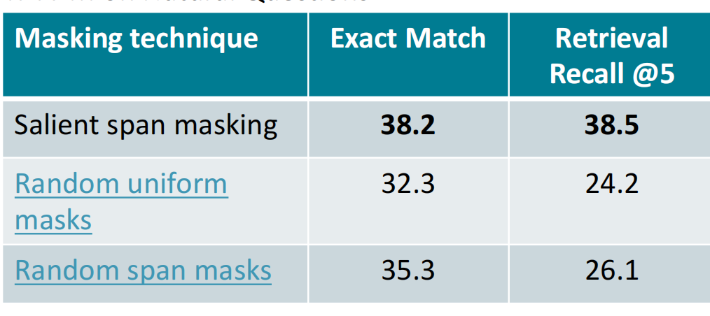

## **Evaluating knowledge in LMs**

### 提示方法

_**LAnguage Model Analysis (LAMA) Probe**_

在不经微调的语言模型中，能存在多少常识或事实知识呢？论文将涉及这些知识的token mask掉并让语言模型填空。并将表现和关系抽取或问答系统模型的baseline作比较。结果如图，评估方式采用Top-1 precision（评分最高的是否正确）

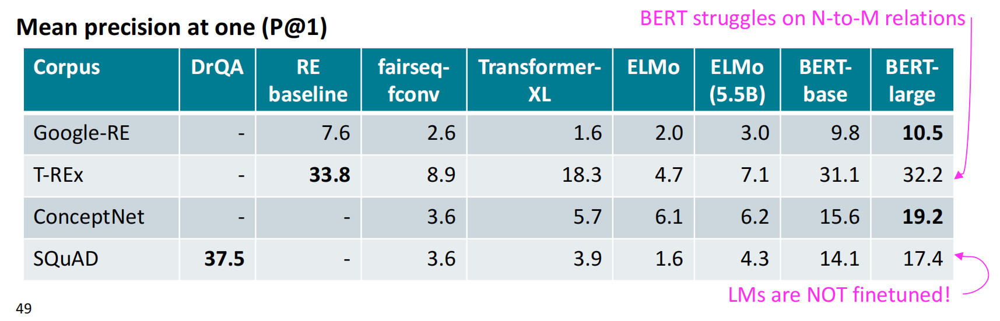

利用LAMA来评估劣势很显然。首先很难理解模型为什么这样做。语言模型（例如BERT）也许仅是记住co-occurence的一些模式，而不是真正encode在其中的知识。例如挖掘出主语和宾语表面上的相似性：

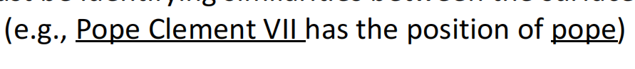

下一个单词更有可能预测出pope,因为前面有Pope Clement VII

对每种关系LAMA只有一种预先定义好的模板，

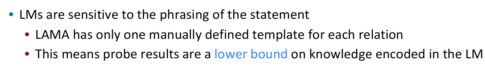

**_A More Challenging Probe: LAMA-UnHelpful Names (LAMA-UHN)_ **

基于上述语言模型很可能依赖实体的表面形式来作出预测这一现象，我们移除上述LAMA中能够不使用relational knowledge answer的实例。这些实例包括：主语和宾语之间的string match,或”revealing“person name（由于语言模型的Bias导致看到特定的名字就给出特定的信息，例如母语，出生地，国籍等。这就导致无法确信是bias还是学到了Knowledge）问题。

结果：

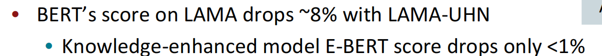

**_Developing better prompts to query knowledge in LMs_**

一些情况下LM可能是已知事实的，但由于测试阶段query本身的不一致导致无法给出正常结果。

例如预训练语料前者，测试时却使用后者。由于句子结构限制可能导致LM的confuse：

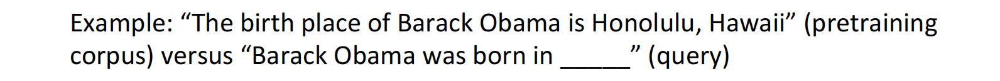

**可以生成**更多的Prompts，通过**挖掘**prompt的模板。有使用依存分析的方法从wiki上获取的。或**使用back-translation**技术。**增加**语言模型回顾起在预训练阶段学到的fact的机会。

实验结果：

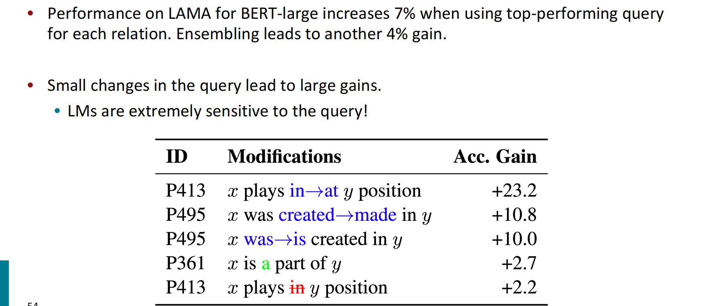

上述例子也**引出了**LM针对不同query的健壮性问题！

### **Knowledge-driven downstream tasks**

衡量knowledge-enhanced的语言模型将知识运用到下游任务上的能力。和直接提示的方法不同通常需要在下游任务上微调模型。通常的任务有

- 关系抽取：两个实体间的关系。例如[比尔盖茨]出生在[Seattle]。两个实体的关系为出生城市
- 实体类型：*[Alice] robbed the bank; label: criminal*
- *“What kind of forest is the Amazon?”; label: “moist broadleaf forest”* 

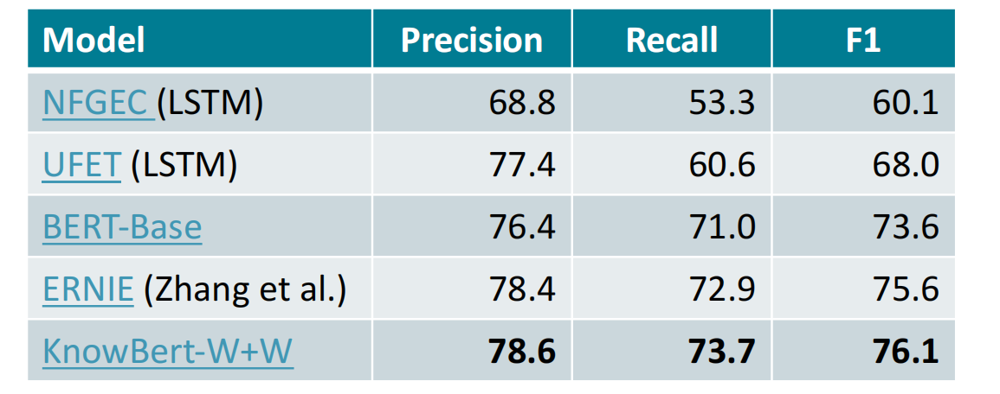

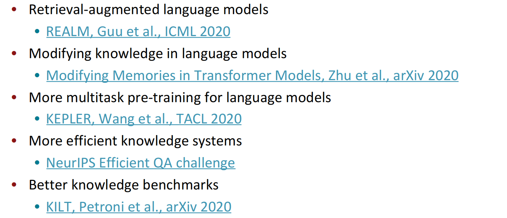
