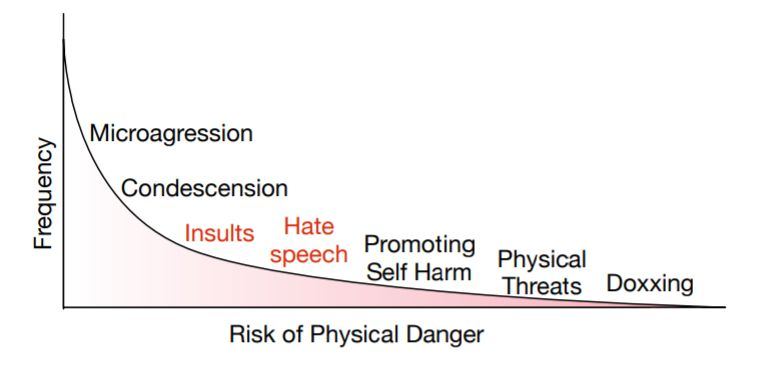

# Lecture16-Social & Ethical Considerations 

人们普遍的误解是，语言与单词及其含义有关。实际上，语言是和人类和他们的意思密切相关的（包括人类的biases）。

**伦理学**:在生活中追求什么是好是坏，在生活中做什么是对是错（good + right）

电车难题,checken dilemma

## IQ classifier

- Problem1：iq  is a incorrect proxy for the future success
  - 没有future是否成功的标签，智商作为代理预测未来是不正确的

- Problem2：数据本身就具有偏差
- 结果：
  - 不同数据类型下有**不同的acc**、
  - 
- 但是对于模型的bias,**是谁造成的（责任）并不明确**

## 面部特征识别

**从面部特征识别性取向是有伦理的吗**

**从dating website中下载数据这一行为的伦理讨论**

**数据本身的偏置(bias)**

在数据集本身中具有较多的bias，不能代表**真实的数据分布**

那么，如何**揭示一个黑盒模型中的bias呢？**

当我们对敏感属性、需要更广泛的世界知识的复杂实验条件进行预测时，我们能不能使用不可解释的模型吗？

如果可以，怎样**正确评估模型的bias呢？**

misclassification代价很大！

## 评估AI系统的条件

注意**超越准确率的一些重要指标**，如模型分类的错误代价等

## NLP中的伦理问题

- 算法上的bias:social bias in data & NLP models
- Incivility：

- 隐私侵犯：privacy violation & language-based profilling
- misinformation:fake news,information manipulaion,opinion manipulation
- 

## Algorithm bias:social bias in data & models

### Implicit bias

- Why do we intuitively recognize  a default social group?
  - Implicit bias

**我们如何作出决策？**：存在两种**决策**系统

可惜的是，从进化论的角度讲，大脑**可以存储学习到的信息**，以便**快速检索和自动判定**

- 大多数情况下都会使用system1作出决策
  - 称为cognitive bias

### How do implicit biases manifest?

**Microaggressions**

- Online data is riddled with **SOCIAL STEREOTYPES**

微歧视（microaggression），也就是不易被人察觉的细微的歧视行为。微歧视不同于普通歧视，表面上并未有露骨的攻击意味，多表现在日常语言、肢体语言，或者其他环境中对特定对象（如少数族裔、有色人种、残疾人、女性）进行有意或者无意的轻视、怠慢、诋毁和侮辱等。由于unconscious bias（无意识偏见）的存在，很可能有时我们并没有意识到我们的言语和行为对别人造成了怎样的影响。

**bias in data**

- 语言中的bias：steoretypes,prejudices,toxic comments,historical human biases（例如网络上有更多男医生的照片，相比于女医生）,human reporting bias(主题，数据的频率并不是**真实世界中的分布**)
- 数据集中的bias:数据选择与抽样的bias(例如从哪种语言中抽样，从哪些位置抽样)，数据集标注者选择的bias,数据集标注者的认知bias

### AI is only System 1

**AI只是system1!**

- AI是以数据为中心的系统。现有的系统没有使用文化，social context等。系统并不知道哪些归纳偏差是好的，不知道如何控制AI系统
- 过度拟合的混杂因素和虚假的相关性，包括社会偏见

- 而黑盒模型的不可解释性**导致很难主动揭示这些偏见**

__Jurgens D., Chandrasekharan E., and Hemphill L. (2019) A Just and Comprehensive Strategy for Using NLP to Address Online Abuse. ACL__

最近的自然语言处理方面的进展集中在公开的恶性语言（例如仇恨言论）,但很少关注没有直接编码在词汇中的隐藏的消极情绪。

__Breitfeller L., Ahn E., Jurgens D., Tsvetkov Y. (2019) Finding Microaggressions in the Wild: A Case for Locating Elusive Phenomena in Social Media Posts. *EMNLP*__

- 即使是SOTA的NLP算法模型**也不能**正确找出microaggressions

__Sap M., Card D., Gabriel S., Choi Y., Smith N. (2019) The Risk of Racial Bias in Hate Speech Detection. ACL__

分类器过拟合训练数据中过分表示的social attributes,**忽略了**social和cultural context

__Kiritchenko S. and Mohammad S. (2018) Examining Gender and Race Bias in Two Hundred Sentiment Analysis Systems. **Sem*__

模型有可能过拟合数据中的 spurious artifacts	

我们认为在预测情感，但实际上也在预测**一些与情感相关的label（gender or pervasive）**

最后，模型还有不可解释的问题。

## NLP中的Bias

看一个机器翻译的例子。

源语言中**没有第三人称代词的性别信息**，目标语言中**确出现了这类信息**

方法：

- 有关性别的信息用special token来替代
- 列出所有可能的翻译结果
  - she is a doctor
  - he is a doctor

**Bias in Dialogue systems**

****

**更主动的方法**

**自动发掘**implicit bias and veiled toxicity

- 训练数据中对分类器预测最为有用

问题：

- 数据集
  - 众包 & 有监督分类
    - 不能选择合适的标注者
    - 标注者可能会有各自的认知偏见，通常**选用多个标注者标注同一个实例**	

