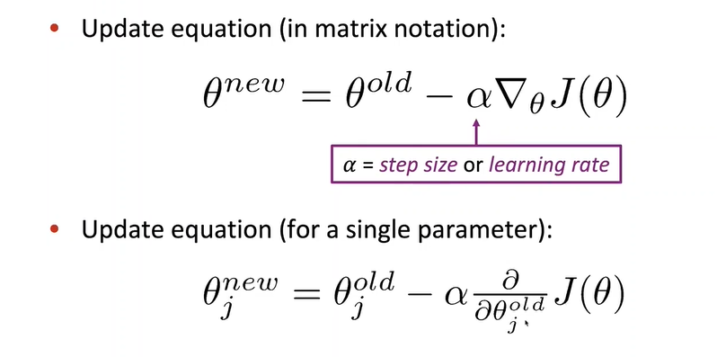
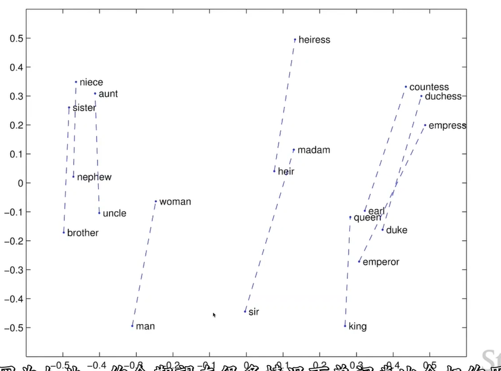
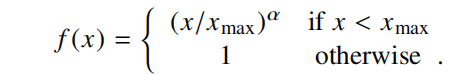
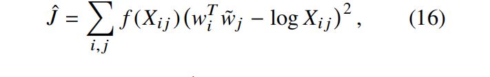

# Lecture2-Word Vectors,Word Senses,Neutral Classifiers

## Word Vectors

### word2vec

更新向量，以便他们能够准确预测周围的词语。算法能很好地捕捉单词相似性。

参数：

模型称之为**词袋模型**，因为不关注位置信息。通过将**相似地词语放置在向量空间中相近地位置**word2vec算法最大化了似然函数。高维空间中，向量能在不同地维度上接近。

最后的词向量为上下文词向量和中心词向量的平均。

但是也可以一个词一个词向量，但在窗口中自身和自身点积的计算使得计算很混乱

### （随机）梯度下降

从当前参数$\theta$开始，计算$J(\theta)$的梯度。每次采取小步长移动。

问题：目标函数不是凸的（不如上图所示）。但是效果还是很好。

**梯度下降中**$J(\theta)$需要对所有窗口求和。因此梯度计算复杂性很高。我们引入**随机梯度下降**。不断采样window,计算每个window上的梯度，或在一个窗口批次中更新梯度。学习会块多个数量级，但是会引入极大噪声，但效果**还是很好**。随机梯度下降中，每次采样窗口仅涉及2m+1个单词，因此仅对至多2m+1个词向量有梯度更新，因此**梯度是稀疏的**。

深度学习框架中，通常是行向量形式存储（内存连续）。在有些时候指向更新一些特定的词向量（例如确实出现过的）这时候可以引入**稀疏矩阵操作**或维护一个哈希值。

### word2vec family

word2vec是一种词向量学习框架。有两种模型变体；

- skip gram:预测context words，基于中心词
- Continuous bag of words：通过上下文词，预测中心词

### negative sampling

在word2vec中，softmax使得梯度计算很复杂。由于词表较大，于是计算
$$
p(o|c) = \frac{exp(u_O^T v_c)}{\sum_w exp(u_w^Tv_c)}
$$
的分母复杂度较高。解决方案是引入negative sampling策略。

针对在context window中的**一个**单词，和不在context window中的**多个**单词（通常是随机抽样）训练一个二元逻辑回归。目标函数为：
$$
J_t(\theta) = \log \sigma(u_O^T v_c) + \sum_{i=1}^k E_{j \sim P(w)} [\log \sigma(-u_j^Tv_c)] \\
J(\theta) = \frac{1}{T} \sum_{t=1}^T J_t(\theta)
$$
其中$\sigma(x) = \frac{1}{1 + e^{-x}}$,需要最大化在$J_t(\theta)$中第一项的点积，同时在均值意义下最小化第二项中的点积。取负数后为最小化目标函数：

采样分布如何选择？通常采用分布：
$$
P(w) = \frac{U(w)^{\frac{3}{4}}}{Z}
$$
其中$U(w)$为一元分布(unigram distribution)，Z是归一化常数。定义为单词频率/语料中单词总数。$\frac{3}{4}$使得提高抽样更罕见的词语的概率。

negative sampling实际上试图以更高效的方式完成softmax目标函数所作的事情，即最大化与窗口中单词的点积并最小化与窗口中其他单词的点积，这样才能使分母变小，分子变大。ns算法中仅采样一个正例，采样多个负例是为了使模型更稳定。

## Count-Based Methods

假设窗口大小为1，语料库中有三句话：

- I like deep learning

- I like NLP

- I enjoy flyign

则可得出如下对称共现矩阵：

这样I可以用第一列表示,like可以用第二列表示etc。这样在I和you中，由于都可以出现在语料的同一位置，因此理应具有相似的共现向量。

基于window的方法能捕捉到一些语法和语义信息。还有基于word-document的方法，对于每个文档记录出现的单词，通常会引出文档话题，称之为"latent semantiv analysis"

**简单窗口向量存在问题：**

- 随词汇表增加，向量大小和维度增加
- 稀疏
- 稀疏性导致较大随机性（模型的稀疏性问题）导致模型健壮性下降

方法：引入低维向量。将**最重要的信息存储在一个固定维度，低维，稠密的向量中**

**降维**：

- 奇异值分解：通过对上述共现计数矩阵进行分解。如图所示：

直接在原始计数矩阵上运行SVD工作的很不好。COALS MODEL对矩阵格点中的计数进行缩放后再运行SVD：

- 动词->到做该动词的人。大致平行且大小相同

## Glove词向量：Count Based + Direct Prediction（context-based）

- 基于COUNT的方法（**基于矩阵分解的思路**）：训练快速，有效利用了语料库的统计信息（已经获取了一个词和全部词的共现情况了，可以无噪声地，更高效地训练）。但其最初是被用来建模单词相似度的，并且可能不正确地较大的counts以较大的重要度(例如和the,and,to等共现的词语可能被模型认为具有较高相似性)
  - eg:在word analygy任务中**表现很差**

- 基于Prediction的方法（**基于local context window的方法**）：没有充分利用统计信息（仅在窗口内sample不同的words），训练较慢。但在不同任务上性能很优，能捕捉更多复杂的语义模式(除了单词相似性之外的)。
  - eg:在word analygy任务中**表现优异**

### Encoding meaning components in vector diffrence

引入一些记号：

- $X_{ij}$，j在i作为中心词的上下文中出现的次数。
- $X_i = \sum_k {X_{ik}}$,即单词i所有上下文中所有单词的出现次数
- $P_{ij} = P(j|i) = \frac{X_{ij}}{X_i}$，给定中心单词i的条件下，单词j出现的概率

**问题：**语料库中共现统计量能够如何表示语义？

**关键一点：**共现概率的比值能编码meaning components

**meaning components**:使得man-king,woman-queen,从动词到做该动作的人或物的语义抽象。

、

如图所示，从第一行可看出，ice和solid较多共现，因此$p(x|ice)$概率较高，使用红色表示。ice与gas较少共线，因此$p(x|ice)$较低。以此类推。第二行和第三行填法同理。

欲求solid和gas之间的meaning components,发现在第三行中，分别使用solid和gas计算造成的比值一个较大，一个较小，**说明比率能够解释solid和gas之间的语义差别**。

而对于water和random而言，与ice,steam的共现概率都较大或都较小。因此共现概率的比率接近于1.根据共现概率比值不能区分。

**Q：How can we capture ratios of co-occur prob as linear meaning components in a word vector space?**

A:使用**对数线性模型**。即$w_i \cdot w_j =\log p(i | j)$。那么就有：$w_x \cdot (w_a  - w_b) = \log \frac{p(x|a)}{p(x|b)}$

**目标函数**：
$$
J = \sum_{i,j}^V f(X_{ij}) (w_i^T\tilde w_j + b_i + \tilde b_j - \log X_{ij})
$$
其中$w_i^Tw_j = \log p(i | j)$,b为偏置量.$f(X_{ij})$用于让模型更专注常出现的单词对；为什么最后变平？放置停用词等大量出现造成的影响。

优点：

- 训练速度快
- 适应大型语料库
- 即使在小型语料库，小型vector中也能表现很好
- 充分利用了统计量：即考虑了全局word-word co-occurence counts

## 词向量评估

### NLP中的评估

NLP中的评估指标分为**内部**和**外部 **两种。

内部指标：直接对特定的或中间子任务进行评估。在词向量中，就是评估词向量本身有多好。计算快速帮助理解系统。但是如果不将词向量引入**真实任务**，还是不能评估其好坏，因此引入外部指标

外部指标：在真实任务上的评估。但需要较长时间计算准确性。不清楚是哪个子系统的问题，子系统是否出了问题。如果将一个子系统换成另一子系统能**提升准确性**，那么就成功了！

### 词向量-内部评估

**词向量类比**

a:b :: c:? -> man:woman :: king:?

形式化为
$$
d = argmax_i \frac{(x_b-x_a +  x_c)^T x_i}{||x_b - x_a + x_c||}
$$
但是$i$不能是输入向量中的其中一个。

在Glove词向量中，可以看到能够良好的捕获词向量间的meaning components，例如aunt-uncle,woman-man,heiress-heir等。如图所示：

对不同的语义关系，glove词向量也能很好地学习到：

也能在句法，语法层面学习到：

GLOVE词向量评估和超参数:

- 更多的数据可以提升性能！
- 300dim最好
- 

### 词向量-外部评估

eg：命名实体识别

## Word Senses And Word Sense Ambiguity

很多单词具有较多词义。尤其是那些出现已久的，和常用词汇。那一个词向量能完整捕捉这些语义信息吗？

_**Improving Word Representations Via Global Context And Multiple Word Prototypes(Huang et al. 2012)**_

- 较复杂。首先需要学习词义，再根据词义学习向量表示
- 有些时候，将词义一分为二是不恰当的

_**Linear Algerbraic Structure Of Word Senses,With Application to Polysemy (TACL 2018)**_

同一词不同含义进行加权：
$$
v_{pike} = \alpha_1 v_{pike_1} + \alpha_2 v_{pike_2} + \alpha_3 v_{pike_3}
$$
其中$\alpha_i = \frac{f_i}{\sum_i f_i}$为加权系数。混合后，显然若词中某个含义与给定词汇是相似的，很可能作点积后都具有较大的相似性。

在高维空间中，向量是稀疏的，可以根据**稀疏编码的思想**分离出三个components:

## Appendix-Glove词向量的推导和讨论

**参考文献：glove原始论文:**_**GloVe: Global Vectors for Word Representation**_

### Glove模型推导

引入一些记号：

- $X_{ij}$，j在i作为中心词的上下文中出现的次数。
- $X_i = \sum_k {X_{ik}}$,即单词i所有上下文中所有单词的出现次数
- $P_{ij} = P(j|i) = \frac{X_{ij}}{X_i}$，给定中心单词i的条件下，单词j出现的概率

设单词$i,j$的词向量$w_i,w_j$，设单词k的词向量$\tilde w_k$。给定i,j的条件下，需要使用这三个词向量的一个函数来表示$\frac{P_{ik}}{P_{jk}}$。即：
$$
F(w_i,w_j,\tilde w_k) = \frac{P_{ik}}{P_{jk}}
$$
F需要在向量空间中编码$\frac{P_{ik}}{P_{jk}}$。并且在直观上，$\frac{P_{ik}}{P_{jk}}$的大小取决于单词i,j的语义之差，以及单词k是否能够将此语义之差体现出来（eg：单词water不能体现ice和steam的语义差，但是steam可以体现ice和steam的语义差）。于是我们的搜索空间仅限于自变量是$i,j$向量之差和单词k的函数，即：
$$
F(w_i - w_j,\tilde w_k) = \frac{P_{ik}}{P_{jk}}
$$
注意上式右侧为**标量**。尽管可以使用神经网络等工具将向量映射到标量，但是这里为了保留**需要捕捉的线性结构**，进一步假设自变量为$(w_i - w_j)^T w_k$的值：
$$
F((w_i - w_j)^T \tilde w_k) =\frac{P_{ik}}{P_{jk}} \quad \Delta
$$
为了保留i,j,k的对称性，进一步假设：
$$
F(w_i^T\tilde w_k) = P_{ik}
$$
这样$\Delta$式变为：
$$
F((w_i - w_j)^T \tilde w_k) = \frac{F(w_i^T \tilde w_k)}{F(w_j^T \tilde w_k)} \quad *
$$
其中$F(w_i^T \tilde w_k) = P_{ik}  = \frac{X_{ik}}{X_i}$

*式是一个微分方程。解这个微分方程得到$F = exp$.于是就有：
$$
exp(w_i^T\tilde w_k) = \frac{X_{ik}}{X_i}
$$
即：
$$
w_i^T\tilde w_k = \log X_{ik} - \log X_i
$$
上式还是不具有对称性。$X_i$和k是独立的，使用一个偏置量$b_i$来代替$\log X_i$。

同时为保留对称性，为上式右侧加上$\tilde b_k$。于是等式变为：
$$
w_i^T \tilde w_k = \log X_{ik} + b_i + \tilde b_k
$$
即对一对单词i,k而言，**应尽可能满足上式，才能满足近似具有*式所满足的条件**。但是对于不同单词对(i,k)，他们出现次数的不同应该对结果影响权重不同。较小出现的(i,k)对如果具有较大权重会引入较大噪声，因此定义权值函数$f(X_{ij})$来加权。最终目标函数为所有单词对加权误差损失的总和：

文献实验表明如下的函数work最好：

### 与其他模型的关联

给定中心单词i，在skip-gram模型中,单词j出现在单词i的上下文的概率:
$$
Q_{ij} = \frac{exp(w_i^T \tilde w_j)}{\sum_k exp(w_i^T \tilde w_k)}
$$
损失函数为负对数似然：
$$
J = -\sum_{i \in corpus ,j \in context(i)} \log Q_{ij}
$$
将所有具有i,j的项聚合到一起，$X_{ij}$为语料中以i为窗口,j出现的次数。上式子等价于：
$$
J = -\sum_{i,j} X_{ij} \log Q_{ij} = \sum_i X_i \sum_j P_{ij} \log Q_{ij} = \sum_i X_i H(P_i,Q_i)
$$
其中$H(\cdot,\cdot)$衡量了两个分布（给定中心词i的上下文词j的分布）的熵值。

熵值是两个分布距离的度量，这里将其换作平方距离，并且不归一化常数：

其中$\hat P_{ij} = X_{ij},\hat Q_{ij} = exp(w_i^T\tilde w_j)$。这时候$X_{ij}$很大，有可能还会导致优化难以进行，因此取对数：

减少一些停用词（过大的$X_i$的影响）。对权值函数进行修改：

### 计算复杂度分析

