# Lecture5-语言模型和RNN

## 正则化

### L2正则化

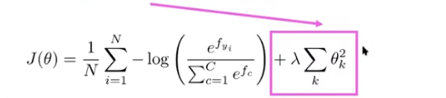

- 只是有效的参数才赋予他非零值。注意该正则化项是一个整体，和example无关

**过拟合**是非常正常的现象，尤其是大模型中，甚至可以做到使得training error接近于0。

正则化被用于**预防过拟合**。

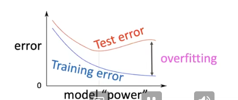

### Dropout

Feature Co-adaptation：**特征仅在其他特定的特征的存在下才有用**

- 训练阶段：50%神经元的输入置为0
- 测试阶段：模型所有权重加倍

由于随机将输入置为0，对不同的训练实例不能保证某些特征的共现，即可能被随机丢弃。使得**模型不能仅依赖于某些特定的特征进行分类，即将权重分配到不同的结点上（L2正则化）**

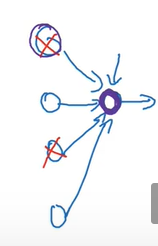

对朴素贝叶斯而言，所有特征是独立的；而对于逻辑斯蒂回归而言，特征在其他特征下而被设置，即都有相互关联。Dropout提供了在两种算法之间的机制。同时，由于每次训练使用不同特征，和Bagging也有关联。

在L2正则化中，正则化项$\sum \theta_i^2$**将所有参数看作具有相同的地位**。而Dropout对不同的特征正则化的强度不同（使用较多的特征被正则化得较多）。

dropout集成包括**所有从基础网络出去非输出单元后形成地子网络**。与集成方法不同,dropout有参数的共享，另一个子网络可以使用原始子网络的所有参数。

## 非线性激活函数

神经网络多层堆叠$Wx + b$所形成得映射终究是线性的，引入激活函数。

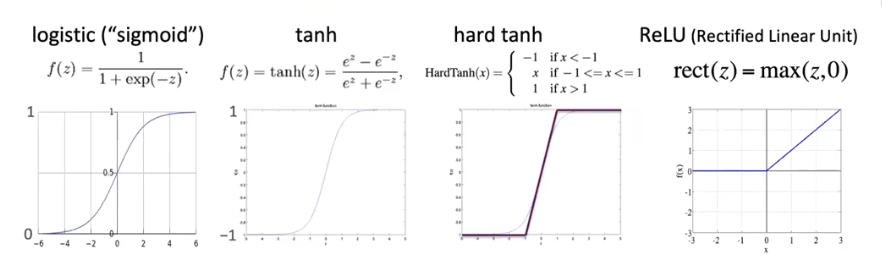

tanh函数：看作是sigmoid函数的shift.弥补了sigmoid函数只能映射到正空间的不足。并且**指数计算复杂度较高**

RELU：简单快速（梯度计算和回传较快）。可考虑将其组合作为任何函数的近似。**是现代神经网络的首选**

## 权重初始化

为防止权重的对称性而使得模型不能学到任何东西，采用**将权重随机初始化为较小非零值的方式**。bias通常为0，但W通常被初始化为U(-r,r)之间的随机值。

Xaiver初始化：每一层的初始化参数的方差应该和前一层神经元个数$n_{in}$和后一层神经元个数$n_{out}$的和呈反比：
$$
Var(W_i) = \frac{2}{n_{in} + n _{out}}
$$

## 学习率

通常依据数量级来设置学习率的初值。学习率设置太大模型可能不会收敛，学习率设置国小训练过慢。

随着训练步数增加，**可以使得学习率逐步下降来获得良好的结果（学习率衰减）**

- 方式1：每k个epcho将学习率减小一半

一个epcho为遍历一次训练集的训练。**每次遍历训练集都需要打乱数据**，防止模型学习到数据出现的周期性模式。

- 方式2：通过式子$lr = lr_0 e^{-kt}$计算
- 方式3：周期性学习率(cyclic learning rate)

## 语言模型

**定义：**预测下一个单词。

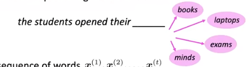

**形式化定义：**

给定单词序列$x^{(1)},\cdots x^{(t)}$,计算下一个单词的概率即：
$$
P(x^{t+1}|x^{(t)},\cdots x^{(1)})
$$
其中$x^{(t+1)} \in V$是词汇表

通过条件概率公式，可以认为是一串文本的出现概率：

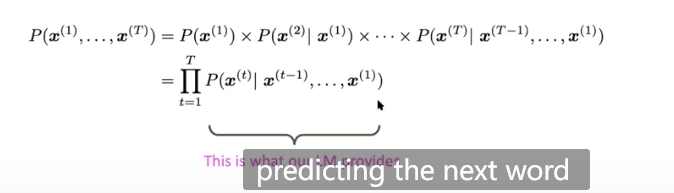

### n元语言模型（n-gram）

定义：一个n-gram语言模型是n个连续的单词束

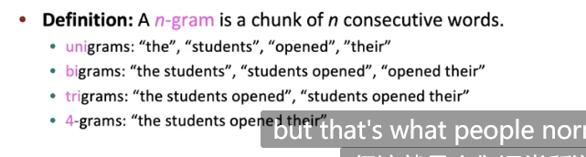

 	

**马尔可夫假设：**

$x^{t+1}$仅依赖于前n-1个单词。即：

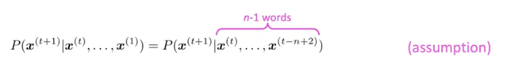

由条件概率的定义：

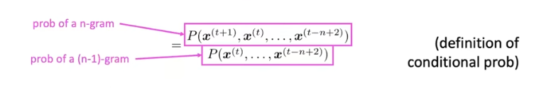

直接以计数的方法计算概率。

**简单的例子**

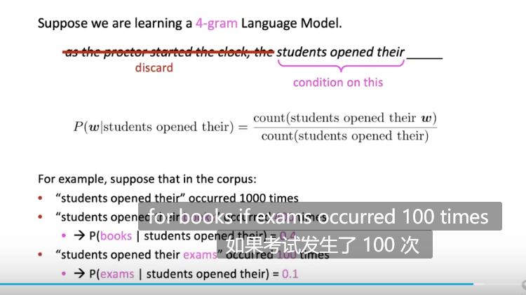

**忽略了proctor context**，马尔可夫假设忽略了先前的上下文

**n-gram语言模型的稀疏性**

如果上述算式中的分子从未出现过，将出现0概率。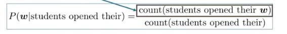

解决方案：对每个单词w，加上$\delta$，称为**平滑(smoothing)**

如果上述算式中的分母从未出现过，则不能计算概率了！

解决方案：直接向前看。例如上例中count(students opened their)直接使用count(opened their)近似，如果还不行则继续向前。直到这是一个uni-gram model为止。

当增加n-gram语言模型中的n时，**稀疏性问题会愈发严重**。通常情况下,n不能超过5；

**存储问题**

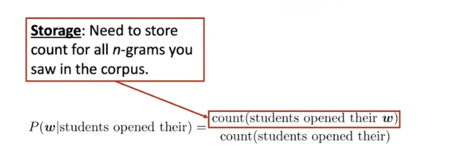

而神经网络能够更好地**compact**信息。

**文本生成**

每次往前看n-1个单词根据上述条件概率生成

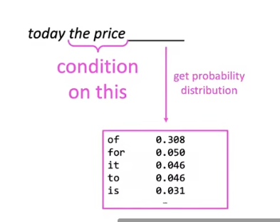

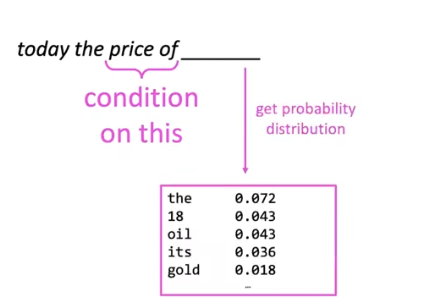

如图所示为生成文本：

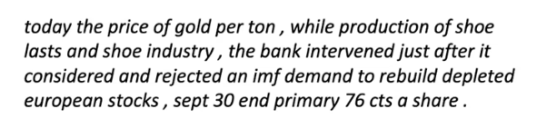

语法上合格。但完全不合乎情理，即我们每次不能只向前考虑3个单词。但是增加n值会增加模型的稀疏性和模型大小。

### Fixed-Window Neutral Model

如图所示忽略窗口之外的词语，预测窗口内的最后一个单词：

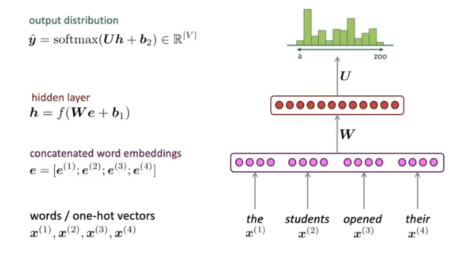

_A Fixed Window Neutral Model_

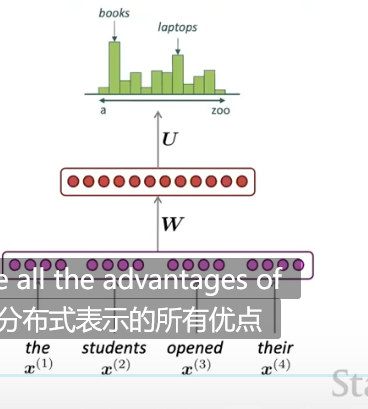

这种基于窗口的语言模型不是一种很好的**解决语言模型的策略**，但**给词语有了很好的分布式表示**，语义相似的词语会具有相似的预测结果。

例如，将上图中的students换成pupil,在n-gram语言模型中或许没有与pupil有关的语料但由于pupil和students相似，该方法能很好预测出下一个单词。

优点：

- **不存在稀疏性问题**
- **不需要存储已经发现的所有n-gram**

缺点

- 窗口过小。但如果增大窗口会导致W增大
- position independent:不同的单词如上图中的$x_1,x_2$在W矩阵中被不同的权重相乘。不具有对称性。
  - 实际上这是word2vec,朴素贝叶斯等模型都具有的弊端。它们都不考虑单词出现的顺序即位置信息

**需要一个语言模型处理任意大小的context，更多的参数共享(pos indenpent)但是仍然对单词在文本间得距离敏感**

### RNN（Rrecurrent Neutral Network）

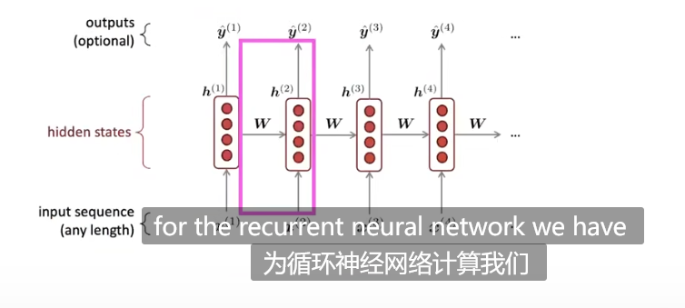

循环的含义：每一次向前传播，每个步上以同样的参数(即不断地将输入传递给自身，也是一种参数共享)进行运算。

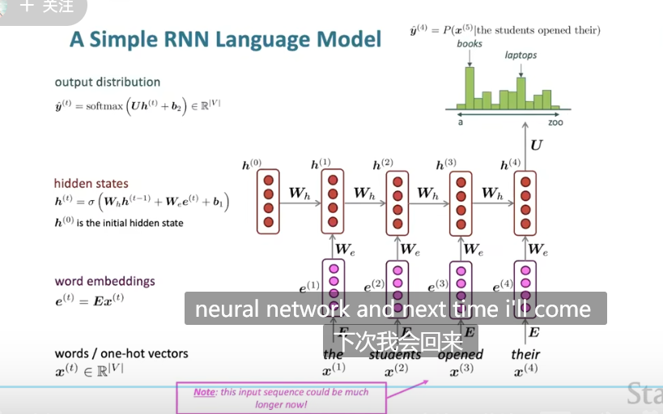

如图所示，每个时间步长上有一个**隐藏状态$h_t$**，通过**前一个步长的隐藏状态和当前步长的输入来决定当前步长的隐藏状态**

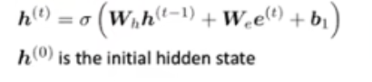

当前时间步长的输出可用于语言模型的预测，即如图所示预测the students opened their的下一个单词的分布

**优点**

- 处理任意长度的文本
- 时间步长为t的计算能够**理论上使用以前任意步长的信息**

- 对长文本而言，模型的大小不会增加
- 每个时间步长使用相同的权重引入了**对称性**，使得每个输入不再是独立的

缺点

- **计算复杂度高**
- 难以访问很多步长以前的信息

