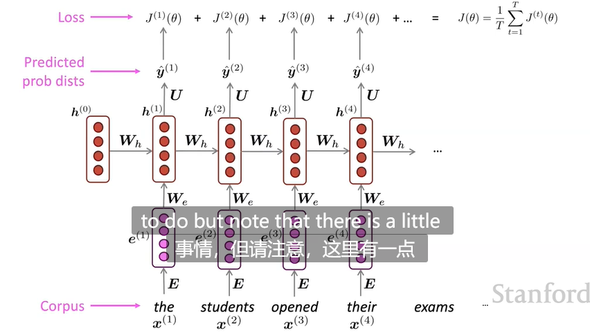
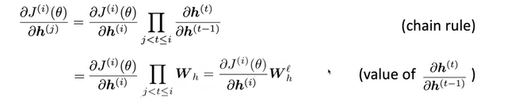
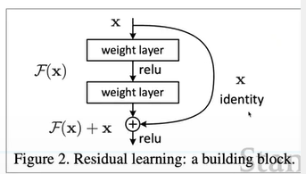

# Lecture6-Simple RNN And LSTM

## RNN语言模型

### 训练

给定文本语料库$x^{(1)} \cdots x^{(T)}$,将其输入到RNN-LM中。于是每个时间步长t上就有一个输出概率分布$\hat y^t$（给定以前的单词，预测当前的单词）

损失函数定义为当前时间步t**预测出的下一个时刻概率分布$\hat y^t$**和**下一个**时间步t+1的真实词语**真实分布$y^t$（$x_{t+1}$的one-hot编码）**之间的**交叉熵损失**。

每个时间步长作平均，得到**整个训练集上的训练损失：**

上面的训练方法称为**teaching forcing**。即对当前时间步t预测出下一个时间步的输入单词的分布，如果下一个时间步的真实单词在该分布下概率较低，则**模型会受到很重的惩罚(penalty)**

但是，如果利用所有的语料来训练则训练代价过于昂贵。这时采用**随机梯度下降**。通常做法是对一个句子(或一批句子通常32个)计算梯度并更新权重。

### BackPropagation Through Time

如图所示，如何计算
$$
\frac{\partial J^t}{\partial W_h}
$$
方法是**对每个时间步长上的$W_h$**分别求梯度然后累加：
$$
\frac{\partial J^t}{\partial W_h}  = \sum_{i = 1}^t \frac{\partial J^t}{\partial W_h}|_i
$$
右式中每一项是对**不同时间步上的W_h求偏导的**，每一项是不同的。要推导，应使用**复合函数的链式法则**：

每个时间步作为上述自变量中的$x(t),y(t),z(t) \cdots$.其中**每一项都等于$W_h$**

如图所示，为避免较高的计算复杂性，可以只在最后的几个时间步中**回传梯度**并更新参数，效果也很好。

### 文本生成方法

每个时间步**采样单词**。将该单词送入下一个时间步的输入。如无开始单词，使用一个CLS单词替代。最终SAMPLE出一个特殊的结束符作为生成结束标志。

生成的文本**高层次的文本结构**很正确，但意义上不make sense。下图是一个RNN文本生成的实例，可以看到食谱做法很不对，但是RNN模型确实知道要去生成title,category之类的东西：

## 语言模型-评估

困惑度：语料文本似然的倒数即
$$
Perplexity = \prod_{t=1}^T [\frac{1}{P_{LM}(x^{t+1}|x^t \cdots x^1	)}]^{\frac{1}{T}}
$$
$\frac{1}{T}$为**归一化值**。这等价于**交叉熵损失的指数：**

显然困惑度越低语言模型效果越好。如图所示，为RNN和GRAM模型的困惑度变化情况：

困惑度是高困惑度句子和低困惑度句子的平均，例如：

Listen To Me To Say Thank ____ ,基本可以确定下一个词就是you，困惑度较低

I saw ____ ,很无法确定下一个词语，困惑度较高。

## 为什么使用语言模型?

语言模型**是一种衡量模型语言理解能力的benchmark task**

在**许多任务中作为子任务存在**

- 自动摘要，语音识别，拼音输入法，对话系统

## RNN的应用

eg:词性标注(Part of speech tagging)。每个时间步预测词性而不是单词

命名实体识别

**情感分类（句子编码）**

编码可以使用最后一个隐藏层的输出。但是最好使用每个时间步长隐藏状态的编码取平均或取最大值，这给予了**良好的对称性**

**QA（question answering）**

下面实例中RNN作为一种问题编码器存在

**语音识别**（conditional 语言模型）

## 梯度消失和梯度爆炸

如图所示，计算$\frac{\partial J^4(\theta)}{\partial h^{(1)}}$应使用链式法则：
$$
\frac{\partial J^4(\theta)}{\partial h^{(1)}} = 

\frac{\partial J^4(\theta)}{\partial h^{(4)}} \times 

\frac{\partial h^{(4)}}{\partial h^{(3)}} \times

\frac{\partial h^{(3)}}{\partial h^{(2)}}  \times

\frac{\partial h^{(2)}}{\partial h^{(1)}}
$$
如果中间项$\frac{\partial h^{(k)}}{\partial h^{(k-1)}}$**很小**，则最终的梯度很小。造成参数无法更新！这就是**梯度消失问题**

假设激活函数使用线性函数$\sigma(x) = x$,RNN隐藏状态更新的式子为：
$$
h^t = \sigma(W_h h^{(t-1)} + W_x x^t + b_1) = W_h h^{(t-1)} + W_x x^t + b_1
$$
由链式法则可知：

假设$W_h$的特征值$\lambda_1 \cdots \lambda_n$均小于1，$q_1 \cdots q_n$为**对应的特征向量**

将上式子写成使用W矩阵的特征向量作为基向量的表示形式：

由于$\lambda_i <1$，因此高次幂趋向于0。由于梯度信号的消失，**简单的RNN只能够建模临近间的单词信息。**

如图所示，模型被要求填空，这就需要建模文本中第7个单词和该空的长距离依赖信息。由于梯度消失，简单RNN不可学习到这种长距离依赖，因此就无法预测。

相反，如果计算出的梯度较大由更新公式

每次更新的步幅过大会导致参数位于不好的配置状态中，这会造成LOSS极大，极端情况下可能造成INF或NAN的损失。称为**梯度爆炸**

解决梯度爆炸的方法之一是**梯度修剪**。当梯度大于某个阈值时，将梯度的范数减小，但是**方向不变**。即同样的方向，但是**走的步长不同**

梯度消失和梯度爆炸是**所有神经网络中**都共有的问题，尤其是层数较多的网络，导致位于较前的层学习得较慢。由此许多神经网络架构通过**直接连接**来解决：

eg:ResNet残差网络：

eg:dense connection

eg:High Way Connections

**通过门控机制**控制直接连接和通过神经网络层的结果；

## Long Short-Term Memory RNNs（LSTMs） 

让RNN维护长距离信息是很困难的。如果让RNN显式地维护一个**内存(memory)呢？**

每个时间步t上有一个隐藏状态$h^t$和一个cell state$c^t$,向量长度都是n。

cell $c^t$:用于存储long-term information

LSTM网络能够对cell**读取，擦除，写信息**，分别使用**三种不同的门控制**

- 门值为1，则开启。否则关闭。或者是0-1之间的值
- 门是**动态的**。门值根据**当前上下文进行计算**

在第t个时间步，计算三种门：

计算更新之后的cell值为遗忘门乘以之前时间步的cell值，以及输入门乘以当前新计算出的cell值（采用element-wise product实现）：

eg:遗忘一些停用词的信息are,the等等

注意**所有门的计算，包括新产生的cell$ \tilde c^t$**的计算都是可以**并行的**。

**LSTM的real secrete：**
$$
c^t  = f^t \cdot c^{t - 1} + i^t \cdot \tilde c^t
$$
**式子**中使用了**加号**！即当前时间步长的cell的值取决于**先前时间步**的cell值加上新计算出来的cell值，即我们可以**自由地加入信息，可以自由的保留信息，可以自由地删除信息**。例如如果f被设置为1，i被设置为0，则**信息被完全保留**。LSTM无法保证**梯度消失和梯度爆炸**问题被完全解决，但**提供一种非常好的学习长距离依赖的方法**

而普通RNN中时间步之间的关联为**乘法**，如果矩阵"较小"时信息传递消失，导致难以维护长距离时间步信息。

建议：能使用LSTM则不用简单RNN

## 双向RNN和多层RNN

如图所示，terribly的隐层状态可看作是其**上下文表示**。但这只含有从左到右的信息。如何包含从右到左呢？

**引入双向RNN**，将前向RNN和后向RNN的表示**连接起来**

形式化地，在每个时间步t：

其中$RNN(\cdot)$表示RNN单元，可以是LSTM,简单RNN，GRU等

注意:双向RNN只在**能够访问到整个输入序列时才有用**，但由于语言模型只能根据**以前时间步**的输入来预测**当前词语**，因此双向RNN不能用于语言模型。

但是在其他情形下，**双向很有用**

- BERT模型：Bidirectional Encoder Representation from transformers

