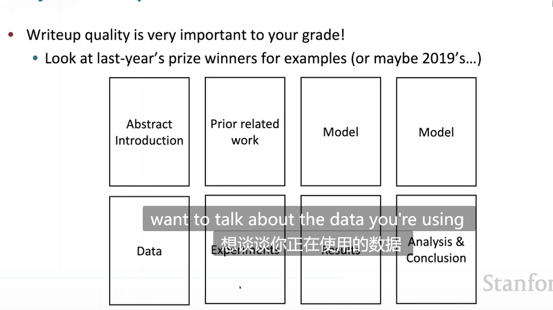

# Lecture8-Final Project Tips

## Attention机制

### 公式

给定**编码器隐藏状态$h_1,h_2 \cdots h_N$**。在**解码器**的时间步t，我们得到隐藏状态$s_t$。针对该时间步t，计算隐藏状态相对于每个编码器隐藏状态的注意力分数：
$$
e_t= [s_1^Th_1 \cdots s_t^Th_N] \in R^N
$$
将其通过softmax层获得**归一化的注意力概率：**
$$
\alpha_t = softmax(e_t)
$$
解码器时间步t的带有注意力的输出为编码器所有输出在归一化注意力$\alpha_t$下的加权求和即：
$$
\mathbf a_t = \sum_{i=1}^t \alpha_i^t \mathbf h_i
$$
最终将注意力输出$\mathbf a_t$与该时间步隐藏层输出$s_t$相连接得到：

### Attention机制的优势

- 使得decoder集中关注于源句子的某个部分
- 模拟人类翻译的过程：look back at the source setence
- 解决了**瓶颈问题**，即不用只看encoder的最后一步
- 解决**梯度消失问题**，即提供了shortcut连接到距离当前时间步较远的状态state

- 提供了**一定的可解释性**。通过观察attention score给出的概率分布，**网络能自行学习出源句子和目标句子的对齐信息**

### Attention的变种

假设我们有**value**：$h_1 ,h_2 \cdots h_N \in R^d$,一个query:$s \in R^{d_2}$。通常情况下attention包括

- 计算attention分数 $e \in R^N$
- 通过softmax函数计算归一化分数$\alpha = softmax(e)$
- 使用归一化分数来对value进行加权

不同的attention区别在于**计算attention分数的方式不同**

- 基本的点积注意力：$e_i = s^T \cdot h_i \in R$。**这意味着$d_1 = d_2$**
- 乘性注意力：$e_i = s^T Wh_i$,其中W是一个可学习的加权参数
  - W提供了s中的哪些部分,$h_i$中的哪些部分需要关注的信息。但是W可能有很多参数。直觉上只需要2*d维度的向量，前d维说明s中哪些部分需要被关注,后d维说明$h_i$中哪些部分需要被关注,但是引入W矩阵能**将s中的任意元素和$h_i$中的任意元素相乘，以更好地提升相似度计算**
- reduced rank multiplicate attention
  - $e_i = s^T (U^TV)h_i = (Us)^T(Vh_i)$
  - 其中$U,V$都是**低秩矩阵**，$U \in R^{k \times d_2},V \in R^{k \times d_1}$,其中还有$k << d_1,d_2$
  - **参数显著降低**

- 加性注意力
  - $e_i = v^T tanh(W_1h_i + W_2s) \in R$，（查询和键值的长度可能不一致）
  - 其中v是一个**权重矢量**

### Attention is a general DL technique

attention机制可以用在**许多任务中**。

- **ATTENTION**机制中的加权操作提供了在value中信息的"selective summary"，**query**用于决定**关注**哪一个value
- **ATTENTION**机制提供了**利用固定长度的大小表示**来表示复杂集合数据的另一种方式，并且这种表示**是依赖于其他东西的（query）**
  - 不同于直接mean，直接pooling

## Final Projects

### Finding Research Topics

### Project Types

eg:诗句生成任务。以什么样的模型架构解决韵律，韵脚等问题。

- 使用词嵌入矩阵将RNN的输出投影到输出空间，减小了参数

- 损失将目标单词和其他单词的相似度考虑在内了

神经网络压缩

### Old DL in NLP vs NEW

## Exciting AREA in 2021

## DATASET

##  **Doing your research example:**Straightforward Class Project: Apply NNets to Task

在定义数据集的过程中，能否从一个从一个tweet中找到数据的摘要？

eg:可以使用记者们的推特和他们自己写的文章作为训练数据对。

## Pots of Data

**训练集,(tuning集),开发集,测试集的使用方法**

**为什么要这样做**

**注意**：测试集最好**仅在最后使用（尽量少使用）**，否则相当于在**slowly training test set**

最后就会有高bias

## getting your NN to learn

 

- 问题：没有信号传播,skip connection,etc

## Brief Introduction To QA

**谷歌问题搜索的例子**

- 首先找出可能包含该问题的网页
- 通过**阅读理解(reading comprehension)**来找出答案

