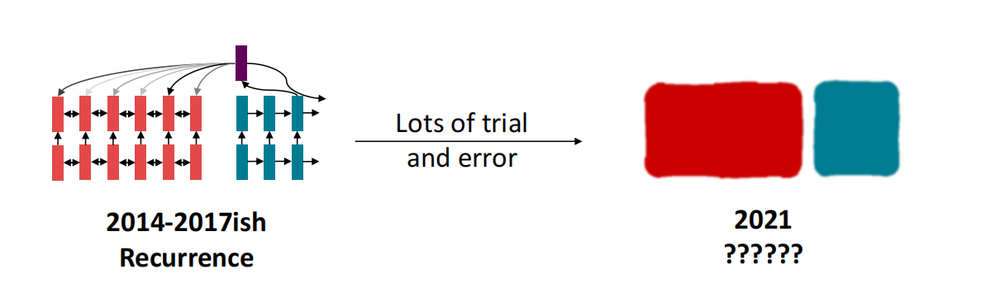
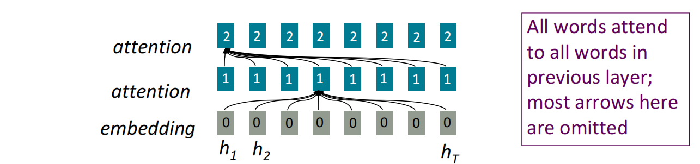
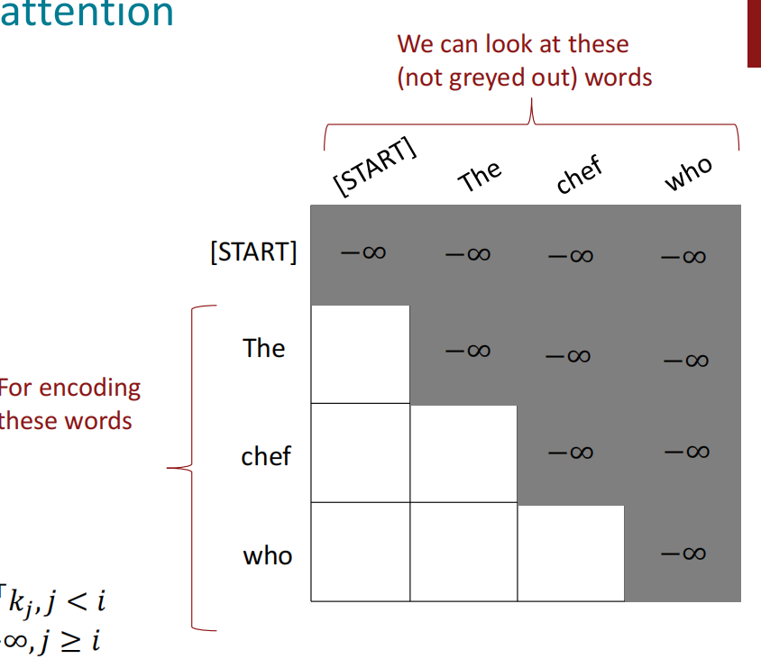
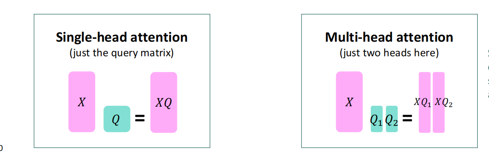

# Lecture9：Self Attention And Transformer

本讲的目标：设计一种建模语言的计算块

## RNN的问题

### Linear Interaction distance

$O(sequence \ length)$才能使得单词对进行交互。

- 梯度消失问题使得很难学习到长距离依赖

- 并且句子**通常不是句子组成的方式**（树结构）

### Lack of parallelizability

由RNN的结构可知，前向传播和反向传播都需要$O(seqlength)$的**不可并行的操作**

- 时间步较大的RNN的隐状态依赖于时间步较小的。

但是GPU通常能同时**一次性执行多个独立的计算**。

## Word Windows

**使用单词窗口建模Local context**(也叫一维卷积)

- 非并行化的操作不随着序列长度的增加而增加。这是因为h_T处的窗口和h_1处的窗口可以**同时计算**。于是在时间的维度上不存在计算依赖。s

word window可用于融合local context.对于长距离依赖而言，**通过堆叠窗口层能够促使距离较远单词间的交互。**例如如图所示，$h_2$和$h_T$在通过一层窗口层后无法完成交互，但是经过两层后（图最上方的红色表示）就包含了两者的交互信息。

## Attention

attention将每个单词表示作为一个**query**用于查询并整合**一系列value**。

对于一层attention，由计算方式可知显然可以并行化。串行只需要在不同的attention层间进行。即使单词间相距较远，**也可以直接进行交互**。

### self-attention

attention机制中对每个单词有query$q_1 ,\cdots q_T$,表明**当前单词应该关注哪个部分**。有**key**$k_1 \cdots k_T$表明**单词如何与query进行交互**，有value$v_1 ,\cdots v_T$用于加权求和**得到最终的计算结果**，在self-attention中，每个单词的三者是**有相同的来源的**的

计算公式如图

**Attention和fully connected layer的不同之处**

- attenttion能学习到dynamic interaction weights.该weight**能够随着输入的变化而变化**。是不固定的

如果考虑将self.attention作为我们上述提到的Buliding block，即通过上述公式的计算一次称为一层，堆叠多层。例如下图堆叠了三层得到结果：

**但是self-attention却不知道他输入单词的位置信息。**例如如果我们将the chef两个位置互换变为chef the,**那么通过**一层self-attention后的**输出结果是完全相同的。**我们首先来解决这一问题：

#### sequence order

尝试在key,query和value中**编码顺序即位置信息**。对文本中每个位置i，关联一个**位置向量**$p_i，i \in \{1,2 \cdots T\}$

设时间步i中的原始key,query,value向量分别为$\tilde k_i,\tilde q_i,\tilde v_i$，通常情况下将这些向量与位置向量相加而不是作连接：

**sinusoidal position representations**:？？？

位置i的位置向量使用$p_i$表示。下图表明了$[p_1 \cdots p_T] \in R^{d \times T}$中每个元素的大小情况。可以看到在固定的维度上值呈现**周期性重复**

优势：**绝对位置**可能并不重要（在给定dimension上函数的周期性重复如图所示）。由于周期性重启，可以将其扩展到任何位置

**position rep vec learned from scratch**

直接学习位置编码矩阵$[p_1 \cdots p_T] \in R^{d \times T}$

这种方法优势在于其灵活性，每个位置能够**自动学习位置表示以便能更好的拟合数据**缺点在于延展性不好，即不能给予$T$之外的位置给予表示。

但是**许多的系统都使用这种方法**

#### Non-Linearity

在注意力计算中，我们只是**对 value进行加权**

解决方案：每层self-attn的输出通过一个FFN；

​	

#### donnot look at the future

我们需要确保在机器翻译或语言模型等预测任务中计算self-attention时**不要关注将来的词语**否则模型显然是无用的。我们可以在每一步仅关注之前的单词，但不同的步骤下之前的单词数目是不同的，只有分别计算。这样就没有充分利用向量化机制加速。

解决方案：**mask the future in self-attention**

在这种预测任务下可以重新定义$e_{ij}$：

于是得到的注意力矩阵(第i行第j列为将第i个单词作为query,第j个单词作为key得到的注意力分数)为：

这样再通过softmax进行normalize时，**能够自动将-inf处的注意力分数置为0**

## Intro To Transformer

如图所示为transformer的总体架构：

### key-query-value attention

设$x_1 \cdots x_T$是输入到Transformer模型中的输入向量其中$x_i \in R^d$.对于每个单词的词向量，我们将其作为key,value,query的来源。**这就需要强调输入向量的不同部分**。Transformer通过将输入向量$x_i$作三种不同的线性变换来解决此问题:

设$x_i$为输入的行向量表示，在列的维度上堆叠形成矩阵$X \in R^{T \times d}$

$X = [x_1;x_2 \cdots ;x_T]$。将该矩阵乘以K,Q,V得到：

$XK \in R^{T \times d},XQ \in R^{T \times d},XV \in R^{T \times d}$

结果矩阵的每一行为单词对应的key,query,value对应的表示。

按照上述attention score的计算式子，计算经过softmax层（作用于行）的注意力分数矩阵，其中第i行第j列为第i个单词作为query,第j个单词作为key的注意力分数。最后将矩阵乘以value构成的矩阵得到每个单词对应的注意力加权输出（每行对应一个单词的注意力输出）。

### Multi-headed attention

在上述attention计算中对给定的单词$x_i$由上述矩阵的乘法我们更多关注的是使得$x_iQK^Tx_j^T$较大的单词j。但是**我们有时会因不同的原因想要关注其他单词。**这就引入了multi-head attention。

设我们有h个head，每个head需要对应一个query矩阵$Q_l$,对应一个key矩阵$K_l$和一个value矩阵$V_l$。每个矩阵的维度都是$d \times \frac{d}{h}$

对每个attention head单独进行上述运算：

将所有output_l的输出连接得到结果：

每个head都会尝试去"观察"不同的东西并且以不同方式**建立value vector**

由上图可知multi-head attention的计算量与原始计算量是**相同的**。但**确实引入了不同的head以关注不同的部分**。

### Residual Connections-残差连接

设神经网络当前层的变换为$Layer(\cdot)$，作用为给定上一层的输入$X^{i-1}$进而得到下一层输入即$X^i$.
$$
X^i = layer(X^{i-1})
$$

残差网络直接将$X^{i-1}$加入到$X^i$中：
$$
X^i = layer(X^{i-1}) + X^{i-1}
$$
残差网络有效解决梯度消失的问题。例如当前layer有sigmoid函数且我们的输入使得激活函数已经到达平坦区域因此回传梯度近似为0，但是通过残差路径使得还有梯度可进行更新。

此外残差网络还能让损失函数随着网络参数的变化更为平坦。如下图所示，作图显然很难找到全局最小值，很容易找到局部最小值从而无法移动。

### Layer Normalization

在模型数据前向传播的过程中会有较大的uninformative variation，通过**标准化**层输出来尽可能削减这些无用信息。文献Xu el2019指出Layernorm的成功主要归功于**他将梯度进行了归一化**

设$x  \in R^d$是模型中的一个向量，求其每个分量和的平均值：
$$
\mu = \frac{1}{d} \sum_i x_i
$$
计算方差：

最终归一化的结果：

加入的$\xi$防止分母为0

有些情况下还会引入增益参数$\gamma \in R^d$和bias参数$\beta \in R^d$，可用于强调不同元素的重要性。计算最终输出结果为：

layer norm能**增强网络隐藏单元的稳定性	**，在训练和测试阶段**均要使用**

### scaled dot product

当向量维数d增大时两个向量的点积在一般意义上都会增大，这会将softmax函数的梯度推到较小的位置上(梯度消失)。

计算multi-head attention时，我们的原始计算公式为：

引入scale因子后计算公式为：

## The Transformer Encoder-Decoder

编码如图所示：

decorder如图所示：

如图我们还剩下Cross-attention没有介绍。

设$h_1 \cdots h_T$为encoder transformer最后一层的输出，$z_1 \cdots z_T$是multi-heaed cross-attention块的输入。在Cross-attention中，我们将$h_i$表示的向量通过变换得到key和value，将$z_i$变换后的结果作为query计算cross-attention。

矩阵形式：（具体推导和传统attention相同）

## Greater Results with Transformers

在机器翻译上更好的结果，更小的训练开销

文档生成的结果：

## Transformer的变种和缺点

### 注意力计算

- 随着序列长度增加，**注意力复杂性二次增长**

低秩矩阵近似方法：

使用随机抽样等方法近似：

### Pos表示

- 更多的pos表示

