# Lecuture11 Question Answering

## QA的定义

建立系统**自动回答人类以自然语言提出的问题**

- 信息来源：文本，网页文档，知识库，表格，图片 etc
- 问题类型：事实性问题 vs 非事实性问题，开放域问题 vs 封闭域问题，简单 vs 组合问题
- 回答类型：文本的一段，一段话，一个表格，或yes/no

**IBM Watson的系统架构**

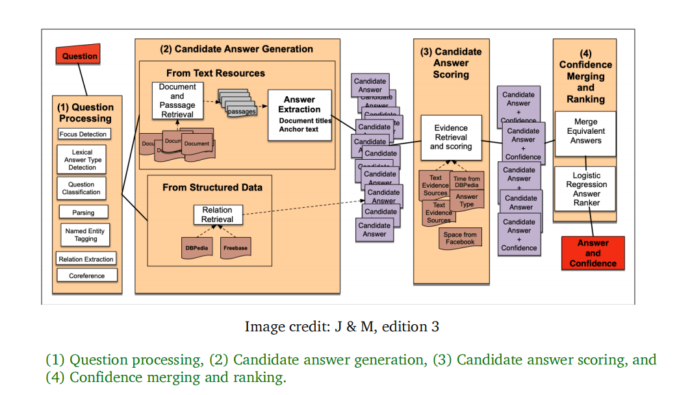

包含四个高度模块化的架构。

许多SOTA QA系统都建立在端到端训练和预训练模型之上

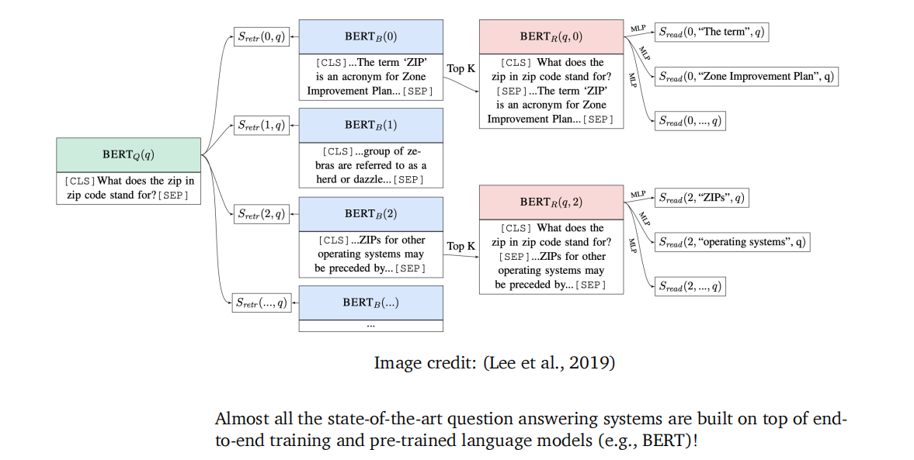

**knowledge-based QA**

以大型数据库为基础回答问题。

将问题转换成某种逻辑形式，逻辑形式在DATABASE中执行来给出最终结果：

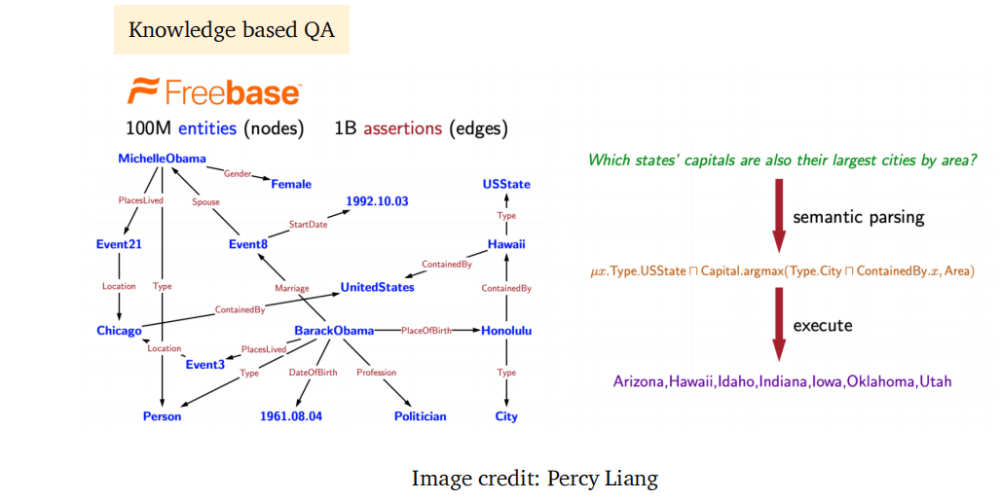

**visual QA**

根据图像回答问题。需要理解问题文本和理解图像

## Reading Comprehension

（P,Q）-> A.其中P是一段文本，Q是问题，给出一个答案

- 阅读理解是一个重要的testbed，衡量**计算机系统理解人类语言的能力**

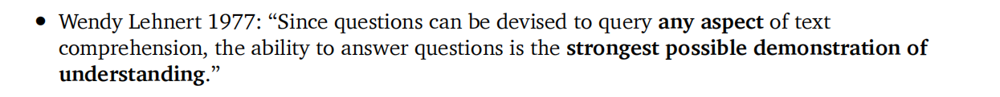

- 许多NLP任务能够被规约为阅读理解问题：

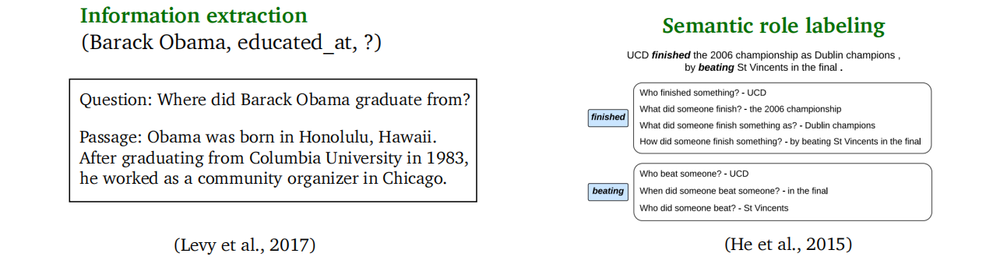

**斯坦福SQUAD数据集**

问题采用众包方式获取，语料从英文维基百科获取。每个问题的答案是原文中的一个span。数据集采用的评估策略为exact match（精确匹配）和F1值。

评估模型预测每个答案和每个gold answer的分数情况（EM和F1分数都计算），并取最大值。

并将预测每个答案得到的分数作平均得结果。

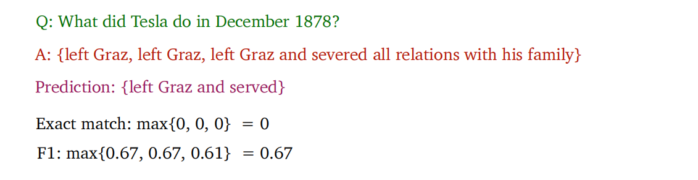

## Neutral Model for reading Comprehension

问题形式化：

输入：$C = (c_1 \cdots c_N),Q = (q_1 \cdots q_M),c_i,q_i \in V$

输出：$1 \leq start \leq end \leq N$

2016-2018年，基于LSTM和注意力的模型。2019+，基于大规模预训练的模型。

**Seq2Seq + attention**

我们之前利用了带有Attention机制的LSTM来实现了机器翻译。在模型解码器中，注意力机制**当前时间步的生成应该关注输入句子中的哪个词语。**而在阅读理解中，我们有文章C和问题q，因此需要**关注文章C的哪些个部分与问题紧密相关（具体得说，与问题中的哪个词汇紧密相关）**。最大不同之处在于，机器翻译中，我们需要decoder来生成目标语言句子。但是在阅读理解中，我们**不需要decoder生成，只需要分类器来给出原文中答案对应的开始位置和结束位置**

_BIDAF：Bidirectional Attention Flow Model_

在BERT模型出现之前该模型应用较广。在小数据集上表现优越。

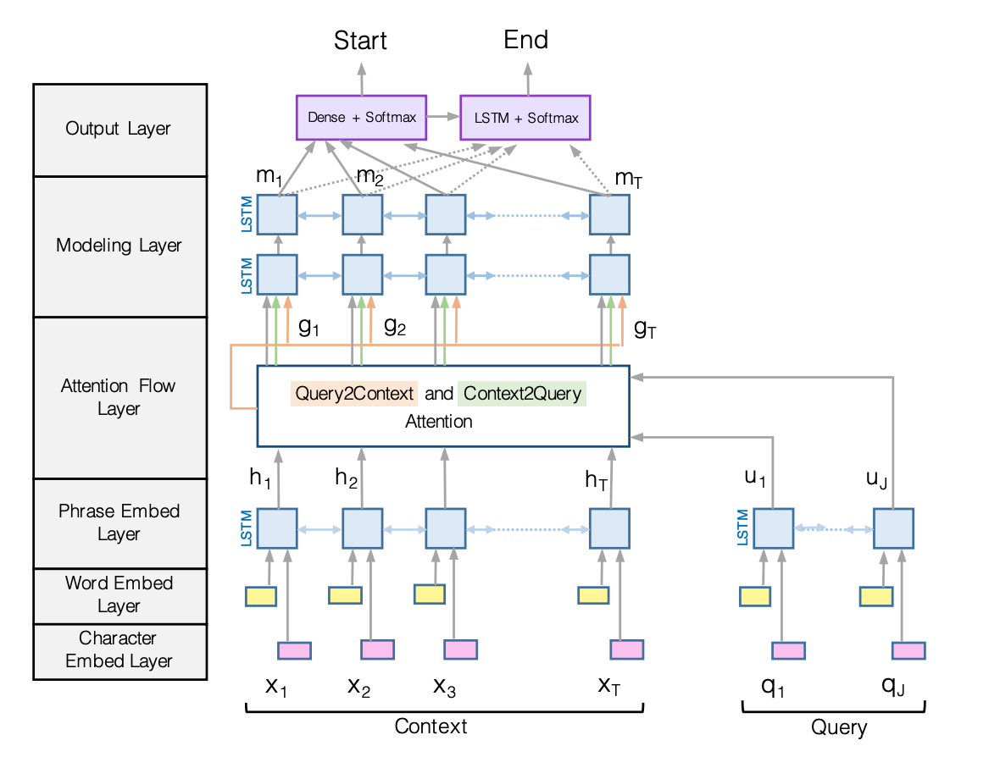

**BIADF编码阶段**

context和query单独处理。

**连接**word-embedding和经过CNN层处理的Character embedding（使得模型泛化到未见单词）。再通过一个双向LSTM模型获取contextual embedding（由于不考虑生成问题，使用双向而不是单向，这对于捕捉从左到右和从右到左的关联都很重要）。

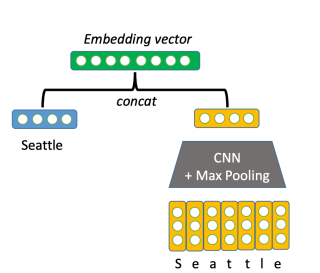

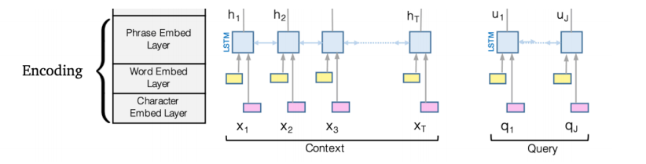

**Attention layer**

目的是捕捉context和query之间的关联。文章提供两种关联：

- context-to-query attention:**对context中的单词**，看query中看**哪些个单词与我当前的context单词最相关**。（相当于一种alignments）

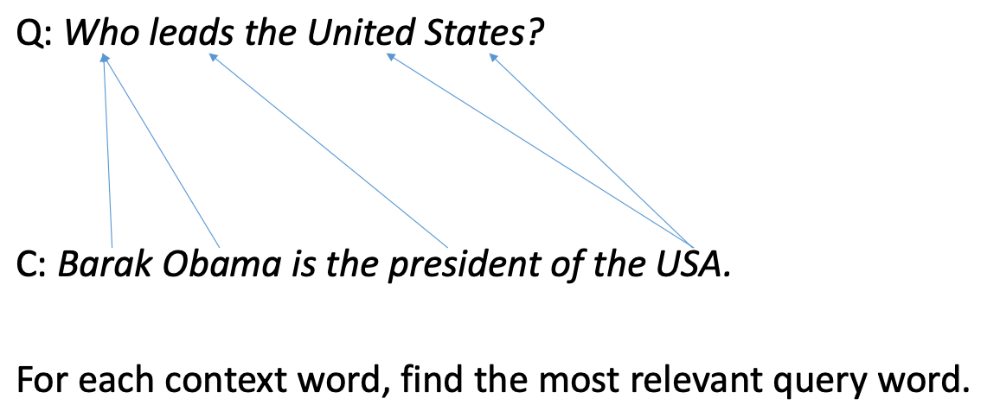

- query-to-context attention:**为尽可能去除与问题无关的context**，选择**与query单词最相关**的**context单词**。方法对context中每个单词，看其**与query中某个词语的最大相似度**，作为该context word与query的相似度。

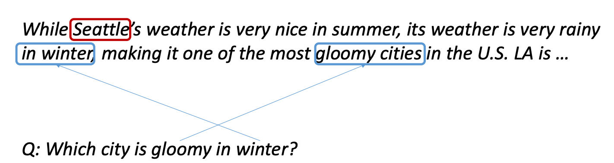

例如gloomy cities与query中的gloomy相关，in winter和query中的in winter也相关。

模型称为双向注意力因为同时具备了上述两种attention；

首先，对每一对$c_i,q_j$计算相似性分数，即context中第i个词和query中第j个词有多相似：

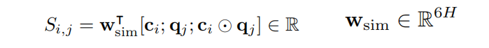

为了计算**context-to-query attention**，只需在S矩阵的第一维度上应用softmax，输出向量为每个问题向量的加权求和，捕捉了**query中哪些单词和我当前的context单词最相关**：

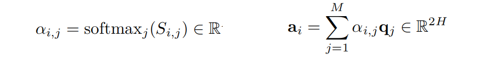

计算**query-to-context words**.$\beta_i$的计算中里层的max计算与当前context word(即第i个context)与query中的**哪一个token最相似，用于代表该context word与该query的相似度**。外层softmax实际上是对一列向量起作用，向量中每一行的数值代表第i个context word与问题的相关性。因此右式的加权求和就是**捕捉context中哪些单词和我的query是最相关的**。

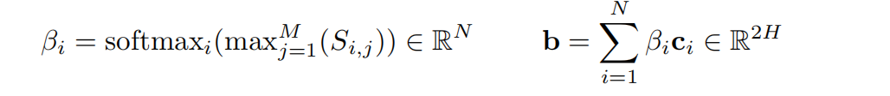

按上述的定义来看，**两种注意力机制是不对称的。**

最终的计算：

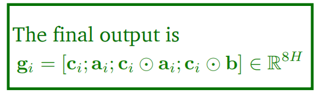

**Modeling And output Layers**

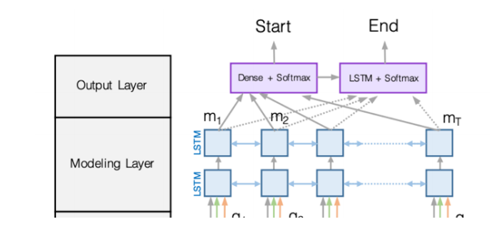

modeling layer:

上述attention layer**用于捕捉context和query之间的联系**。而这一层LSTM用于捕捉context之间的所有联系。

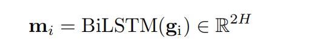

output layer:

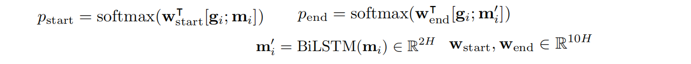

这里在$m_i$的基础上再加一层BILSTM的原因是**捕捉start和end token之间的某种联系，让它们的预测不是相对独立的**

最终的损失就是负对数似然：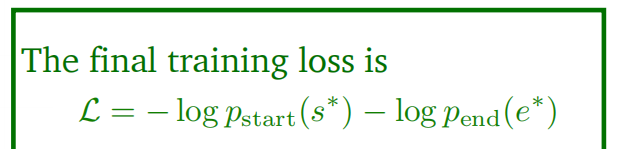

实验结果（消融实验）：

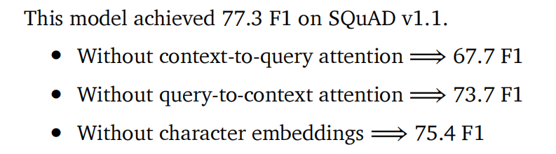

attention visualization:每行为query一个单词，每列为context中一个单词。每格点表示一个相似性：

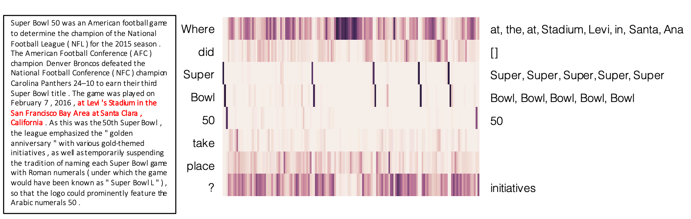

## BERT for reading Comprehension

将BERT用于QA很直观。

设问题为segment A,Passage为segment B。将[CLS]+A+[SEP]+B送入BERT模型中，预测start和end token的位置。如图所示：

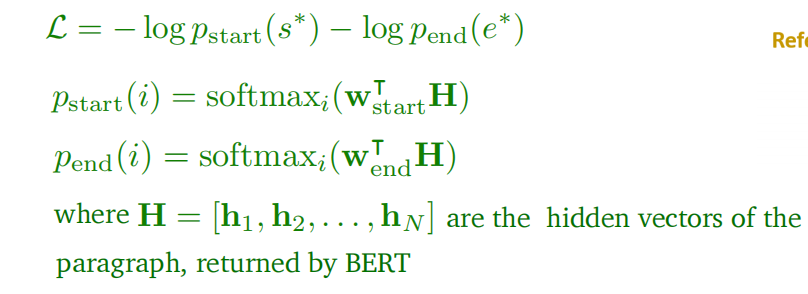

其中$h_i$为每个context word对应的隐藏embedding

一个huge success,ROBERTA,ALBERT在更大型的语料中训练：

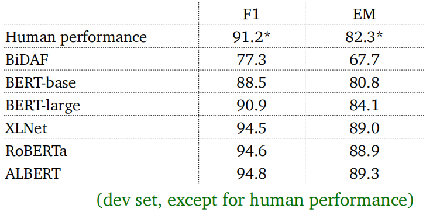

## 比较BIDAF和BERT模型

BERT模型参数较大（110M或330M）但是BIDAF只有2.5M参数。

BIDAF基于LSTM，BERT基于Transformer。

BERT是经过预训练的，**但是BIDAF只是基于GLOVE词向量的，其余参数都需要从数据集中训练**

注意到BIDAF MODEL和BERT模型都使用了注意力机制，它们是否在本质上是相同的呢？

BIDAF模型主要是建模问题和文章间的交互。而BERT模型中进行了如下四个：

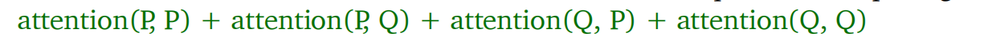

同时也有工作_Clark and Gardner, 2018_（BERT之前）表明加入attention(P,P)的机制**也能提高一定的performance**

## 更好的预训练目标

### Span Bert

可以mask掉连续的span，而不是随机mask 15%的随机单词。并利用span的两个端点来预测中间的span（这就将span的信息压缩到它的两个端点）

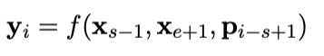

如图所示：

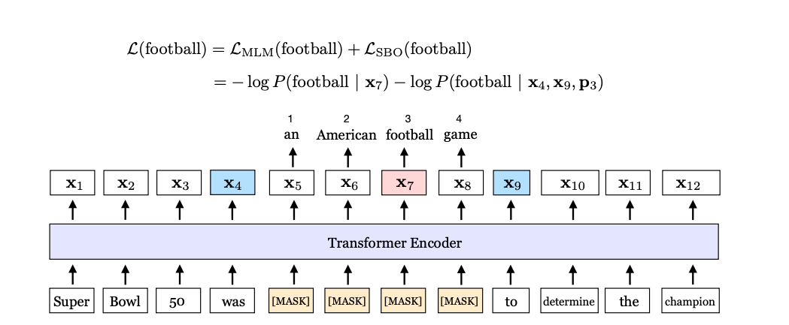

**span performance**

模型告诉我们，即使不增加模型大小，不增加数据大小。通过设置更好的训练目标也能在阅读理解和QA中取得更好结果。

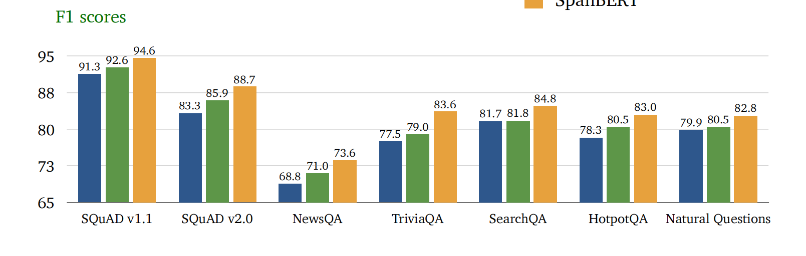

## Is reading comprehension solved?

现有系统还是在一些**外领域的问题或adversarial example**上表现较差。如图所示，在原有的段落中加入蓝色的句子之后，与该问题在词汇表面有较大的关联。**很多当时的系统给出错误的答案**

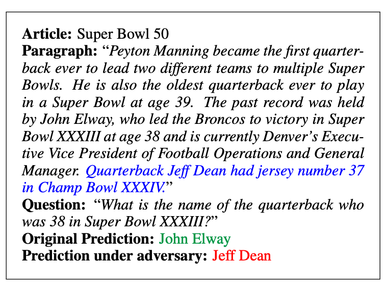

在一个数据集上训练的模型通常不能很好地泛化到其他dataset中。

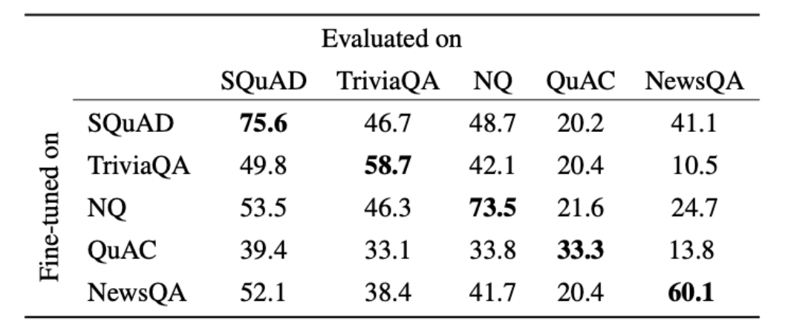

_Beyond Accuracy: Behavioral Testing of NLP Models with CheckList_

文章给出了不同测试类型下BERT模型的错误率。

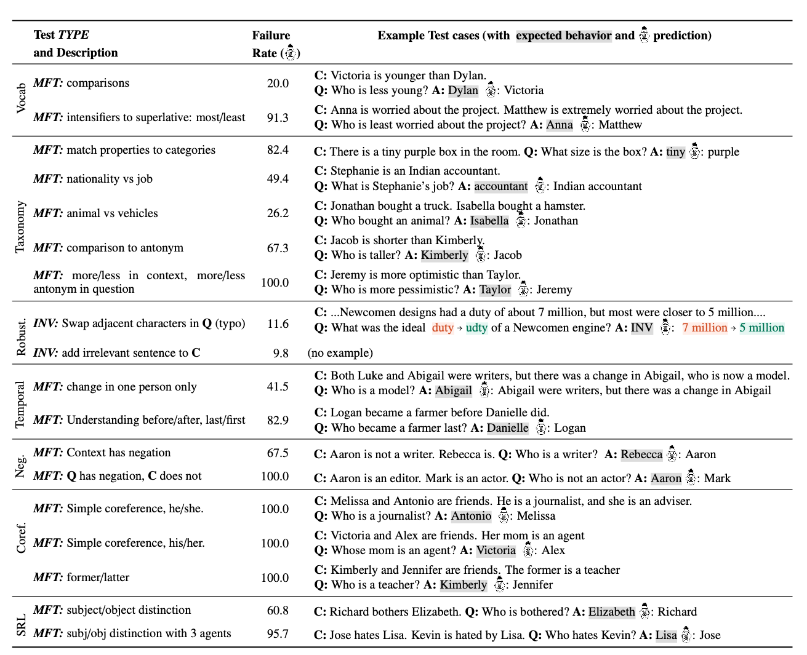

## Open-domain QA

在开放域问答中，我们没有一个passage。但是又一个很大的文档集合，不知道answer处于哪个位置。是一个更有挑战性的，更实际的问题。

**retriever-reader framework**

检索器负责从大量文档中检索可能存在问题答案的文档，reader模型阅读所有的document并返回答案。形式化的：

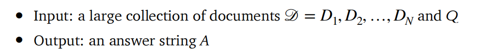

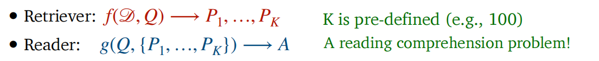

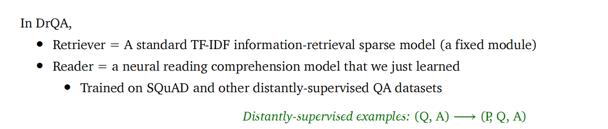

_Latent Retrieval for Weakly Supervised Open Domain Question Answering_

使用BERT模型将text编码成一个向量

retriever score = 问题表示和文章表示的点积

并联合训练BERT文章编码模型和阅读理解器。

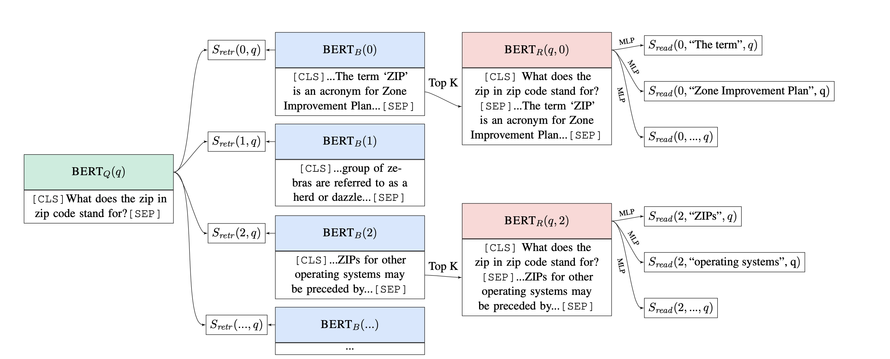

_Dense passage retrieval_

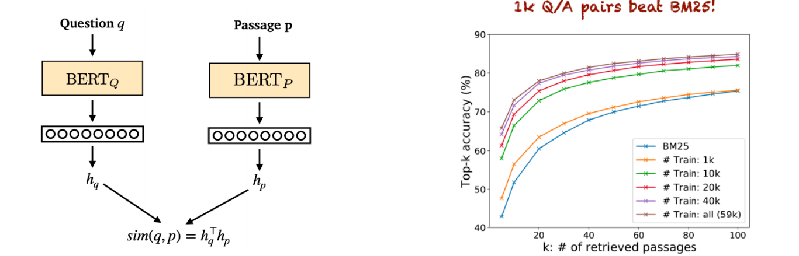

提出了一个可训练的检索器。使用quesion,answer的对来训练。

**Dense retrieval + generative models**

不抽取答案，而是**生成答案**

**Large language models can do open-domain QA well**

使用大型语言模型(T5等)，尝试finetune这些模型。**不使用检索**

**Maybe the reader model is not necessary too!**

将所有短语使用dense vector来表示，并使用最近邻搜索策略直接寻求答案。非常快速！

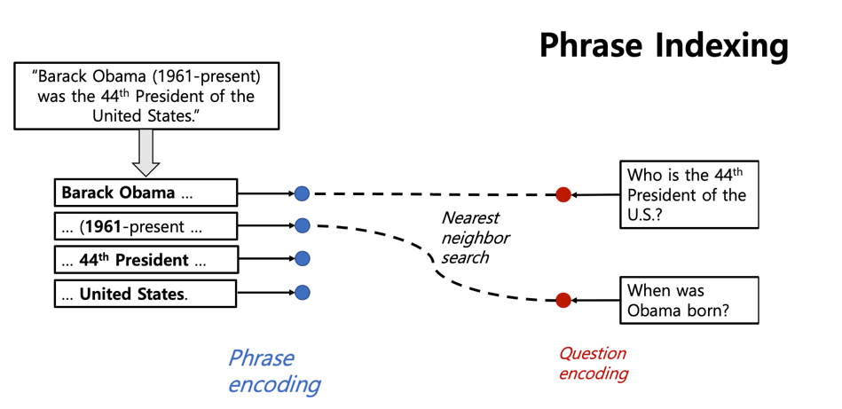

一种类型DADASET：问题和段落内容在词语上很多的重合线索，模型能很好地利用

DROP数据集：语义方面的问题。

语言模型的除偏很重要。