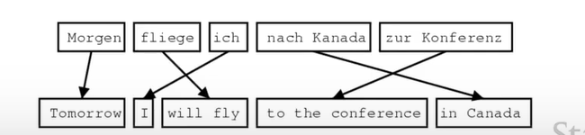
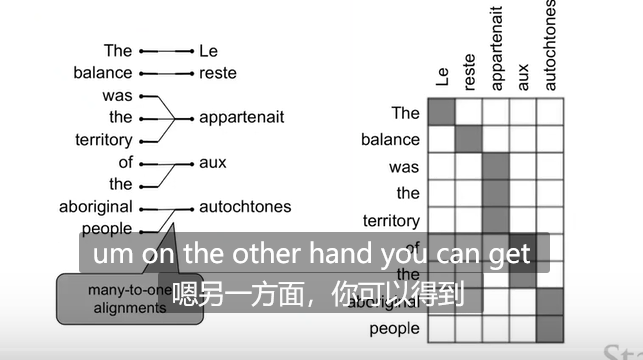
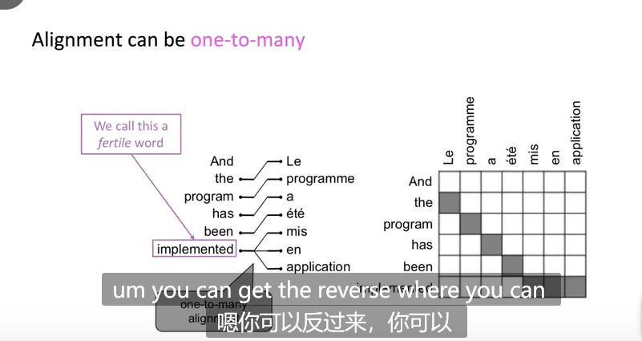
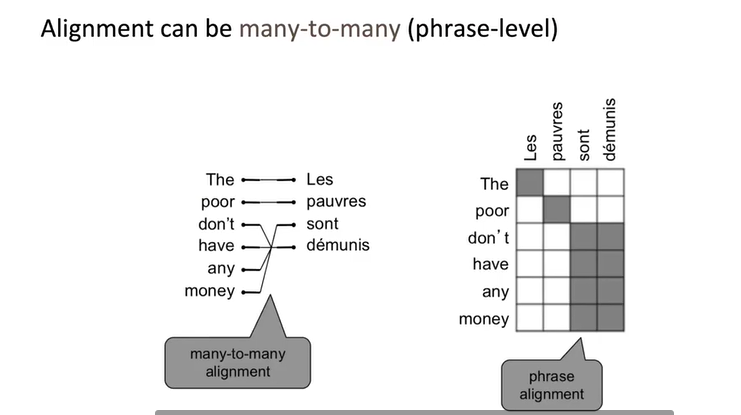

# Machine Translation,Seq2Seq,Attention

## 1990-2010：基于统计的的机器翻译

从数据学习一个**概率模型**。例如想要翻译到英语$y$，给定法语$x$。即
$$
argmax_y p(y|x)
$$
由贝叶斯公式得到优化目标：
$$
argmax_y p(x|y)p(y)
$$
其中前一项$p(x|y)$为transtion model。学习单词短语之间如何翻译。

后一项为$p(y)$，实质上是语言模型language model。

那么如何学习$p(x|y)$呢？

- 首先，需要大量的源语言和目标语言的文本数据

- **引入对齐机制（作为隐变量）！**

设a为用于对齐的隐变量（表示对齐的方式）。则模型概率变为$p(x,a|y)$。引入隐变量后就可明确词语之间是如何翻译的。

**对齐的困难性**

- 一些单词可能无对齐

- 可能是**多对一的**

- 对齐可能是**一对多的**

- 对齐可能是**多对多的**

对齐问题不仅发生跨语言，也发生在语言内部。

对齐的学习：EM算法。

**解码算法**：当模型学习到$p(x|y)$和$p(y)$时，如何找出$argmax_y p(x|y)p(y)$
