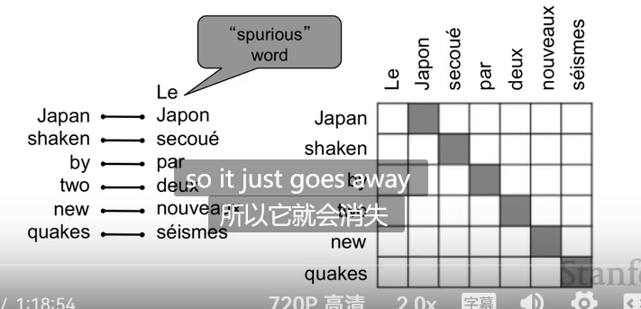
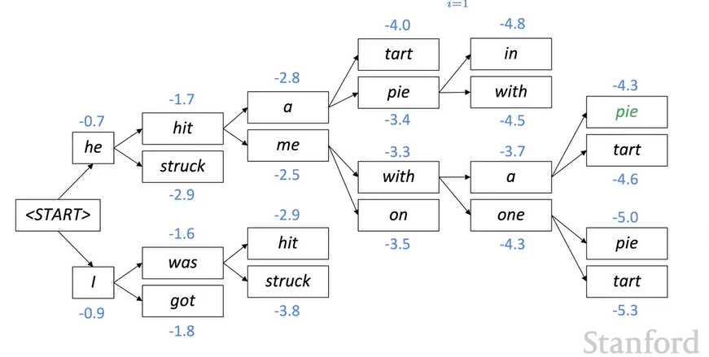

# Machine Translation,Seq2Seq,Attention

## 1990-2010：基于统计的的机器翻译

从数据学习一个**概率模型**。例如想要翻译到英语$y$，给定法语$x$。即
$$
argmax_y p(y|x)
$$
由贝叶斯公式得到优化目标：
$$
argmax_y p(x|y)p(y)
$$
其中前一项$p(x|y)$为transtion model。学习单词短语之间如何翻译。

后一项为$p(y)$，实质上是语言模型language model。

那么如何学习$p(x|y)$呢？

- 首先，需要大量的源语言和目标语言的文本数据

- **引入对齐机制（作为隐变量）！**

设a为用于对齐的隐变量（表示对齐的方式）。则模型概率变为$p(x,a|y)$。引入隐变量后就可明确词语之间是如何翻译的。

**对齐的困难性**

- 一些单词可能无对齐

- 可能是**多对一的**

- 对齐可能是**一对多的**

- 对齐可能是**多对多的**

对齐问题不仅发生跨语言，也发生在语言内部。

对齐的学习：EM算法。

**解码算法**：当模型学习到$p(x|y)$和$p(y)$时，如何找出$argmax_y p(x|y)p(y)$？如果直接枚举y则显然复杂度无法接收，可以**引入一些假设**，以使得**基于动态规划的算法（例如维特比算法）**奏效。

**缺点**：

- 基于统计的翻译方法**依赖设计许多复杂的子模块**
- 特征工程繁琐。因为需要设计良好的特征来捕捉语言特征
- 需要维护**额外的资源**。例如需要维护每种语言之间的**等价短语**

## Neutral Machine Translation

### Seq2Seq模型

- **端到端**的神经网络
- 称为seq2seq网络。

Encoder RNN:负责**编码源句子信息**。最后一时间步的vector作为Decoder RNN的初始化

Decoder RNN:语言生成，实际上是**语言模型**

- seq2seq的应用：总结，对话，Parisng（将解析序列作为生成），代码生成

seq2seq是一种**条件语言模型**，是由于它**依赖于整个encoder给出的编码**来生成语言。相较于语言模型（没有任何条件直接预测下一个单词）而言**评估上具有更小的困惑度**。形式化地，设源句子为$x$,目标句子$y$,则:

**端到端训练**

训练数据：（源语言，目标语言）语料对。在Decoder的每个时间步，**预测下一个时间步上的单词**。**对decoder的每个时间步**，损失为**下一个时间步的真实词汇**在当前时间步预测出的分布上的**负对数似然**，如第四个时间步就对应了下一个时间步在训练语料上词汇即with的负对数似然。

**最终的损失为每个时间步损失的叠加。**反向传播**更新decoder的权重又更新encoder的权重。**

### 多层RNN

对RNN而言，在时间步长上，已经显示出它的**deep**了。但还可以**堆叠RNN（将每个时间步的隐藏状态再喂给一个新的RNN）**，在另一个维度上**增加deep**。这让网络能够计算更复杂的表示。低层RNN计算**低层特征（词性，单词和短语的基本信息）**，高层RNN计算**高层特征（语义信息，将单词和短语组合以后的意思）**。

堆叠网络即增加网络层数有很大作用。例如LSTM网络中：可以设置2000维的隐藏状态的单层LSTM，也可以设置500维的隐藏状态的4层LSTM。模型的参数相当。但事实证明。后者更有优势。

_multi-layer deep encoder-decoder machine translation net_

- **如果引入较多的RNN层**，则需要**加入skip-connection或者dense-connection**

### 解码（decoding）

贪心解码在每次decoder时间步上都**采样概率最大的单词**。但是**不能做撤销操作（没有退路）**。例如：

注意我们的目标是找到一个$y$最大化：

#### Beam Search

**核心思路**：跟踪k个**最可能的部分翻译序列(称为hypothese)**。k称为beam size
对每个翻译序列(hypothese)，有一个得分：

在每个时间步，**跟踪k个得分最高的hypothese**

**集束搜索的实例：**

如图所示，decoder从start开始，第一时间步预测出he和I的概率最大分别为-0.7和-0.9。由于beam size=2，不舍弃任何路径（这就是跟踪2个得分最高的hypothese）。

从当前保留的2个hyp的每个结点开始搜索下一个单词的概率，如图所示，并利用上式计算生成的4个结点对应的每条hyp对应的score。

但是，在每个时间步，**跟踪2个得分最高的hypothese**.因此**舍弃得分较低两个结点对应的路径即$struck$和$got$**，仅在两个得分较高的结点上**继续搜索**。

重复进行这些步骤，最后在搜索树上回溯得到结果：

**停止准则**

在Beam Search中，不同的hyp可能在不同的时间产生<end>。**这时不能认为算法结束**，而要继续遍历其他可能更好的hyp，最终选一个最好的。

通常的停止准则有2个：

- 算法进行已经有T个时间步
- 已经得到了n个完整的Hyp

其中T和n都是可以自己自定义的。

**选择准则**

在停止准则达到后，得到一系列具有

的hyp。这时候**最好不直接选择那个得分最高的**。因为**语言模型倾向于给一个较短的句子打一个较大的分（从式子的定义也可看出随着t增加score更可能降低）**。但并不意味着句子越长翻译就越不好，例如要翻译英文报纸，每个句子的单词量中位数大概为20，但不能说2-3个得分较高的句子就能很好地反应这个语义。因此我们将准则修改为带有长度归一化的分数：

## 优势

- 更流畅（由于netural LM的存在），更能应用上下文(条件语言模型)
- 端到端优化（不需要单独优化分开的组件）
- 人类更少的参与（例如不需要特征工程）

## 劣势

- 可解释性差（难以调试）
- 难以控制（例如不能指定规则）

## 机器翻译的评估-BLUE得分

- 通过n-gram的精确性计算出一个similarity score

- 引入针对过短翻译的惩罚

但是，有许多方法能翻译出一个句子，有时一个实际上良好的翻译却与**人类本身**给出的翻译的n-gram的overlap很低。

## MT Progress Over Time

纵轴为blue score.可以看到，随时间推移，基于神经网络的翻译方法进步最大！

## 挑战

- 不在词汇表中的单词
- 领域迁移问题
  - 训练数据和测试数据来自**不同领域**

- 维护长距离上下文信息
- 缺乏数据
- 不能准确捕捉句子含义

**biase**

## Attention

在传统SEQ2SEQ模型中，解码器的生成完全依赖于编码器最后一个时间步的隐藏层输出。（**将其称之为信息瓶颈**）这就要求这个输出**具有整个源句子的所有信息**

机器翻译中，**单词的顺序**十分重要，因此**仅仅采用编码器每个时间步上的平均或求最大值等**不是好的方法。

我们设想在人类翻译中，翻译了几个单词就要**回头去关注源句子中的几个单词**。可以在模型中模拟类似的方法称为**注意力**

**定义：**在解码器的每个时间步骤，**使用直接连接的方式来关注源句子中的某个特定的部分**

如图所示，在获得解码器第一个时间步的隐藏状态后，**将其与编码器每个时间步的隐藏状态作点积并利用softmax计算分数**

可以看到在编码器的第一个单词上的注意力较高，表明我们更需要该词来完成我们的翻译任务。将这些分数分别与对应时间步的encoder输出加权平均得到一个向量，它就包含了我们更多关注的时间步上的单词的大部分信息。

将该向量和隐藏层本身的向量相连接并经过softmax层得到输出。

