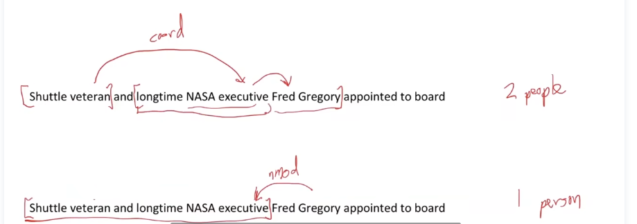
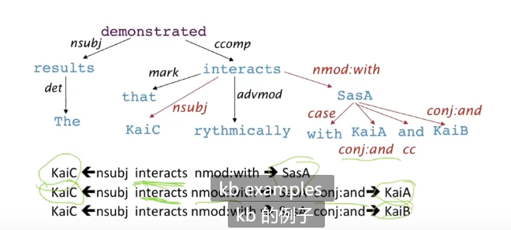

# lecture4-Dependency Parsing

## 两种语言学结构视角

### 上下文无关文法(CFG)

开始单元：**单词**

cat N(名词)，cuddly adj(形容词)，by p(介词)

door N(名词) ， the(Det 冠词)

单词组成**短语**

[the cuddly cat] (NP名词短语),[by [the door] (NP名词短语)] PP（介词短语）

- 短语结构将单词组成嵌套的部分

终结符：

产生式：

### 依存结构（Dependency Structure）

依存结构展示了哪些单词依赖(修饰,依附,参数)那些单词

依存分析：头部（head） -> 依赖(dependent，修饰，依赖头部)

在修饰关系中，就是**被修饰成分 -> 修饰成分**

例如crate修饰look

by the door 的the 修饰 door

by the door整个短语修饰crate

in the kitchen整个短语修饰crate，crate连一条到in the kitchen的变

### 为什么需要语言结构？

**为什么需要句子结构？**

**语言的结构不同解读造成语义理解错误**-介词依附歧义

日常经常忽略这种错误，因为人脑**会根据上下文自动推断正确的含义**。

解析的数量以卡特兰数给出：$C_n = \frac{(2n)!}{[(n+1)!n!]}$是指数级别的

**连词范围起义**

**形容词/副词修饰歧义**

**动词短语依附歧义**

动词短语to be used for olympics beach volleyball 可以修饰beach,也可以修饰mutilated body

**依存分析有助于提取语义解释信息**

eg:提取生物医学语料中的蛋白质->蛋白质交互信息

在上图中，通过找到KaiC,走到interacts nmod:with 关系就可以找到与KaiC交互的蛋白质SasA

通过找到SasA的连词and，通过路径就可以找到另一种与SasA交互的蛋白质KaiA

## 依存语法(Dependency Grammar)和依存结构(Dependency Structure)

依存句法(syntax)是一由词汇间关系所组成的句法结构，这种关系通常是二元非对称关系(使用箭头表示)，称为**依存(dependencies)**

- 箭头连接一个**头部（governor,superior,regent）**和一个**依赖(dependent)（modifier,inferior,subordinate）**。并加上**语法关系的标签(subject,prepositional object,apposition)**

eg:cuddly cat。cat为头部,cuddly为依赖。画一条从cat指向cuddly的箭头。如图所示：

- 依存关系通常**会形成一棵树**

