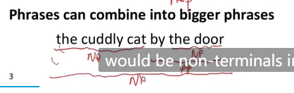
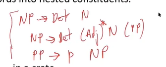
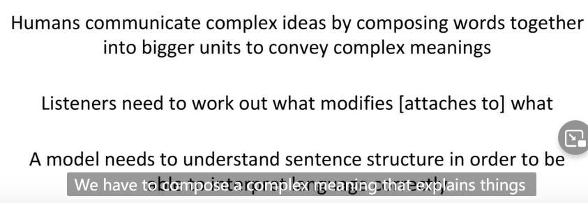
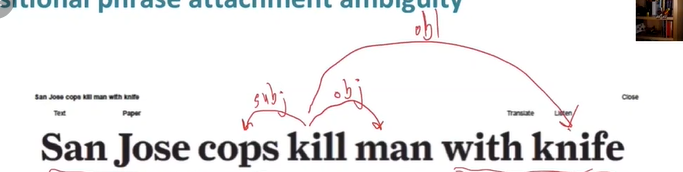

# lecture3-Dependency Parsing

## 两种语言学结构视角

### 上下文无关文法(CFG)

开始单元：**单词**

cat N(名词)，cuddly adj(形容词)，by p(介词)

door N(名词) ， the(Det 冠词)

单词组成**短语**

[the cuddly cat] (NP名词短语),[by [the door] (NP名词短语)] PP（介词短语）

- 短语结构将单词组成嵌套的部分

终结符：

产生式：

### 依存结构（Dependency Structure）

依存结构展示了哪些单词依赖(修饰,依附,参数)那些单词

依存分析：头部（head） -> 依赖(dependent，修饰，依赖头部)

在修饰关系中，就是**被修饰成分 -> 修饰成分**

例如crate修饰look

by the door 的the 修饰 door

by the door整个短语修饰crate

in the kitchen整个短语修饰crate，crate连一条到in the kitchen的变

### 为什么需要语言结构？

**为什么需要句子结构？**

**语言的结构不同解读造成语义理解错误**-介词依附歧义

日常经常忽略，因为人脑**会根据上下文自动推断**。

