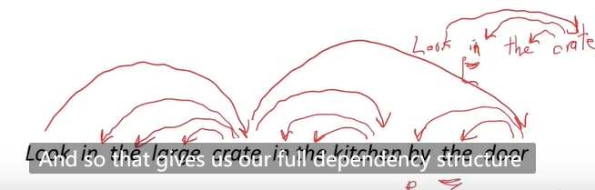
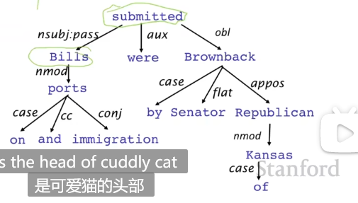
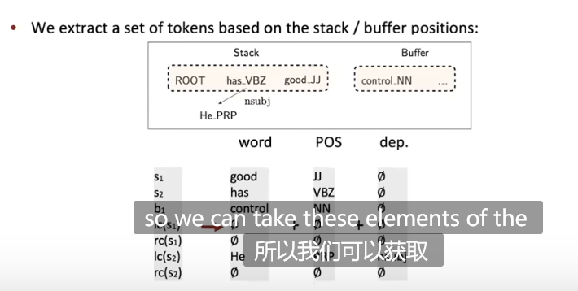

# lecture4-Dependency Parsing

## 两种语言学结构视角

### 上下文无关文法(CFG)

开始单元：**单词**

cat N(名词)，cuddly adj(形容词)，by p(介词)

door N(名词) ， the(Det 冠词)

单词组成**短语**

[the cuddly cat] (NP名词短语),[by [the door] (NP名词短语)] PP（介词短语）

- 短语结构将单词组成嵌套的部分

终结符：

产生式：

### 依存结构（Dependency Structure）

依存结构展示了哪些单词依赖(修饰,依附,参数)那些单词

依存分析：头部（head） -> 依赖(dependent，修饰，依赖头部)

在修饰关系中，就是**被修饰成分 -> 修饰成分**

例如crate修饰look

by the door 的the 修饰 door

by the door整个短语修饰crate

in the kitchen整个短语修饰crate，crate连一条到in the kitchen的变

### 为什么需要语言结构？

**为什么需要句子结构？**

**语言的结构不同解读造成语义理解错误**-介词依附歧义

日常经常忽略这种错误，因为人脑**会根据上下文自动推断正确的含义**。

解析的数量以卡特兰数给出：$C_n = \frac{(2n)!}{[(n+1)!n!]}$是指数级别的

**连词范围起义**

**形容词/副词修饰歧义**

**动词短语依附歧义**

动词短语to be used for olympics beach volleyball 可以修饰beach,也可以修饰mutilated body

**依存分析有助于提取语义解释信息**

eg:提取生物医学语料中的蛋白质->蛋白质交互信息

在上图中，通过找到KaiC,走到interacts nmod:with 关系就可以找到与KaiC交互的蛋白质SasA

通过找到SasA的连词and，通过路径就可以找到另一种与SasA交互的蛋白质KaiA

## 依存语法(Dependency Grammar)和依存结构(Dependency Structure)

依存句法(syntax)是一由词汇间关系所组成的句法结构，这种关系通常是二元非对称关系(使用箭头表示)，称为**依存(dependencies)**

- 箭头连接一个**头部（governor,superior,regent）**和一个**依赖(dependent)（modifier,inferior,subordinate）**。并加上**语法关系的标签(subject,prepositional object,apposition)**

eg:cuddly cat。cat为头部,cuddly为依赖。画一条从cat指向cuddly的箭头。依存关系通常**会形成一棵树**。

通常会添加一颗fake root，其有一条从自身指向依存树根节点的箭头。这样**每个单词恰好是1个别的结点的依赖了**。在构建依存分析器时，**通常会引入这个fake root**

## Universal Dependencies TreeBanks

**TreeBank**:句子的依存结构抽象成依存分析树

似乎建立TreeBank是很耗时，但也有优点

- **如果建立依存语法**只对一种特定的依存分析器起作用。但TreeBank可被用来做很多事情：
  - 语言学家发现TreeBank中**不同的句法模式**
- 当人们建立TreeBank时，很多时候考虑的是**语言的核心部分**。使用TreeBank做事情可以得到更好的统计信息
- 用于衡量一个解析器(parser)好坏(NLP系统)的有效数据库

## 依存分析（Dependency Parsing）

定义：对句子中的每个单词，确定**一个单词B**，使得该单词是单词B的依赖对象(dependent)。

约束条件：

- 只有一个单词是Fake ROOT的依赖
- 形成的依存图需要是**有向无环图**

如此下来，依存关系就形成了一棵树。（n-1条边且无环)

在上图中依存分析的箭头**是有交叉的**（non-projective），原因是在英语中将on neural network右移到了句子末尾。实际上在很多语言中，依存分析的箭头都是嵌套的，不会形成交叉。

上图中的tomorrow可以移到句子的末尾，on neutral network提前，句子语义一致，这样依存分析的箭头不会交叉了。

### 用于依存分析的信息

- **单词间的联系:**例如如果句子中出现了discussion和issue，大概率就从discussion到issue连接一条箭头
- **依赖间的距离:**大多数的依赖关系都倾向于短距离
- **Intervening Material:**例如依赖关系很少跨越动词或标点符号
- **head的自身属性：**对一个head而言，哪些依赖可能在该依赖的哪一边出现。举个例子，如图所示，假设当前head为cat.那么head的左侧很可能出现一个the,关系为det；很可能出现一格cuddly，关系为adj。但右侧很不可能出现上述关系

### Projectivity Parse

**定义：**当句子中单词呈线性水平向右排布时，依存分析产生的箭头没有交叉。

许多句法结构都会是projective的，但是也允许有non-projective的结构。如果不允许，在一些语言中可能造成**语义理解的困难：**

实例：preposition Stranding造成的交叉：

如图所示，who did bill buy the coffee from yesterday中，from是who的依赖。画出箭头有交叉。但这句话实际上可以变为from who did bill buy.....（但对老外来说语义理解困难）

### 依存分析的方法

- 基于动态规划的$O(n^3)$算法
- 图算法：建立MST
- Constraint Satisfaction:删除不满足条件的边
- **Transition-based parsing or deterministic dependency parsing**

### Greedy Transition-based Parsing

解析器执行一系列自底向上的操作。和**移进规约分析器**类似。但是规约的动作是创建依存关系。解析器有如下成分：

- 栈$\sigma$:栈顶在右部。开始是ROOT开始。
- 缓冲$\beta$:顶在左侧。开始是输入序列
- 依存箭头集合A:开始时为空
- 动作集合

算法流程：

在每一步骤选择一种操作：

- 移进：从缓冲区顶部移入一格字符到栈
- 添加左箭头：取栈顶的两个单词。从栈顶单词连一条箭头到次栈顶单词。并弹出次栈顶单词，并为该箭头赋予一个关系
- 添加右箭头：取栈顶的两个单词，从次栈顶单词连一条箭头到栈顶单词。弹出栈顶单词。并为该箭头赋予一格关系

直到buffer为空并且栈只剩root

**如何预测下一个action?**

machine learning。特征选取可以是栈顶单词及其词性；buffer中的首个单词及其词性。等等。

### 特征表示方法

特征表示方法

- 使用二元稀疏向量建立指示特征。如图所示
- 问题：
  - 稀疏
  - 不完全
  - 95%的计算时间都用于计算特征

- 使用基于神经网络的方法！
  - dense and compact feature representation

### 评估方法

UAS = （不带标签）预测正确的总数/（不带标签）依存分析总数

LAS = （带标签）预测正确的总数/（带标签）依存分析总数 **更严格**

## Neutral Dependency Parser

- 没有特征计算。速度很快

- 基于图的依存分析器虽然准确率较高，但是速度慢了两个数量级

### 亮点1-分布式表示（Distributed Rep）

- 每个单词用稠密词向量表示(i.e. word embedding)，相似的单词有相似的表示
- 加入词性标注(POS),依赖标签(dependency labels)
  - 因为在很多时候，具有这样表示的词语会导致相似的行为

eg：

- 加入**依赖标签**

设$s_1$为栈顶元素，$s_2$为栈顶下面的元素，以此类推。

$lc(s)$为栈中元素s指向另外一个元素的**左箭头**类型。(如果无，则为空)

$rc(s)$为栈中元素s指向另外一个元素的**右箭头**类型。（如果无，则为空）

例如在下图中对应$s_2$即单词has,他已经有一个左箭头指向He，箭头关系为nsubj。于是$lc(s_2) = nsubj$。

下图中word，POS，Dep，将其分别转化为embedding。连接后作为整个神经网络的输入。

### 亮点2-深度学习提供了非线性分类器

传统机器学习分类器(朴素贝叶斯，支持向量机，逻辑斯蒂回归，softmax分类器)**只能给予线性边界的分类**

### 模型架构

稠密和压缩特征以及非线性分类器使得模型具有很高的速度和准确度。

### 后续进展

- 更大，更深的神经网络和更好的超参数
- 引入集束搜索
- 基于条件随机场的推断

## Graph-Based Dependency Parser

- 对每个单词，对每个可能的依赖（该单词作为dependent的所有head）的依存关系计算一个分数，但这需要依存对单词的**上下文信息**，而不能仅仅针对这两个单词本身打分。

- 通过MST算法找出最好的解析结果。

_A Neutral graph-based dependency parser_

采用一个biaffine scoring model用于neutral dependency parsing

但**复杂度较高**，n个词语的句子复杂度$O(n^2)$

取得SOTA结果，但速度较慢

