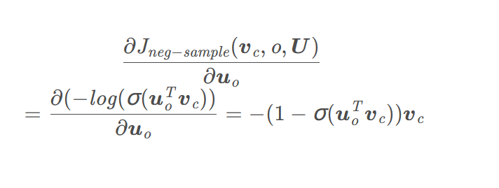
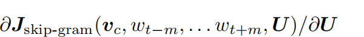
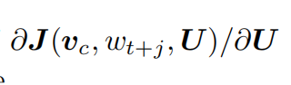
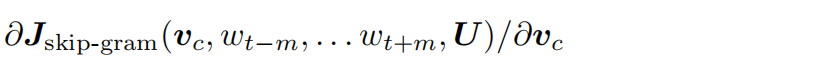
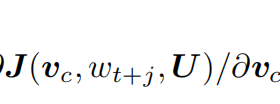
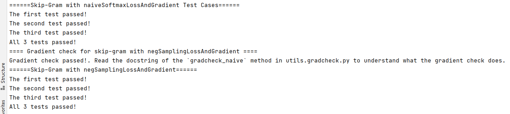

# Assignment2

## 手写部分

(a):左侧求和项中仅有$y_o = 1$,其余$y_w = 0,w \neq o$.因此成立

(b):显然$J = -u_O^T v_C + \log \sum_{w \in Vocab} exp\{u_w^Tv_c\}$
$$
\frac{\partial J}{\partial v_c} = -u_O + \sum_w u_w \frac{exp(u_w^Tv_c)}{\sum_w exp(u_w^Tv_c)} = U\hat y - Uy 
= U(\hat y - y)
$$
(c):

当w=o时：$\frac{\partial J}{\partial u_O} = v_C(\hat y_O - 1)$

当$w \neq O$时：$\frac{\partial J}{\partial u_O} = v_C \hat y_w$

(d):

$\frac{\partial J}{\partial U} = v_C(\hat y - y)^T$

(e):

$\frac{\partial \sigma(x)}{\partial x} = \sigma(x) (1 - \sigma(x))$

(f):

$\frac{\partial J_{neq}}{\partial v_C} = u_O (1 - \sigma(u_O^Tv_C)) - \sum_{k = 1}^K [\sigma(-u_K^Tv_C) - 1]u_K$



$\frac{\partial J_{neq}}{\partial u_K} = [1 - \sigma(-u_K^Tv_C)]v_C$

为何有效：仅在采样范围内计算梯度，不用计算softmax中的全部词汇表的归一化概率

(g):

$\frac{\partial J_{neq}}{\partial u_K} = \sum_{w_i = w_k}[1 - \sigma(-u_i^Tv_C)]u_i$

(h):

(i):

= $\sum_{j \neq 0,-m \leq j \leq m}$

(ii):

= $\sum_{j \neq 0,-m \leq j \leq m}$ 

(iii):0

## Coding部分

作业上接口的规约写得似乎有些问题，参考这个解答即可。

（a）word2vec.py文件

实现sigmoid方法：

```python
def sigmoid(x):
    """
    Compute the sigmoid function for the input here.
    Arguments:
    x -- A scalar or numpy array.
    Return:
    s -- sigmoid(x)
    """

    ### YOUR CODE HERE (~1 Line)
    s = (1 / (1 + np.exp(-x)))
    ### END YOUR CODE

    return s
```

实现naiveSoftmaxLossAndGradient方法：

```python

def naiveSoftmaxLossAndGradient(
    centerWordVec,
    outsideWordIdx,
    outsideVectors,
    dataset
):
    """ Naive Softmax loss & gradient function for word2vec models

    Implement the naive softmax loss and gradients between a center word's 
    embedding and an outside word's embedding. This will be the building block
    for our word2vec models. For those unfamiliar with numpy notation, note 
    that a numpy ndarray with a shape of (x, ) is a one-dimensional array, which
    you can effectively treat as a vector with length x.

    Arguments:
    centerWordVec -- numpy ndarray, center word's embedding
                    in shape (word vector length, )
                    (v_c in the pdf handout)
    outsideWordIdx -- integer, the index of the outside word
                    (o of u_o in the pdf handout)
    outsideVectors -- outside vectors is
                    in shape (num words in vocab, word vector length) 
                    for all words in vocab (tranpose of U in the pdf handout)
    dataset -- needed for negative sampling, unused here.

    Return:
    loss -- naive softmax loss
    gradCenterVec -- the gradient with respect to the center word vector
                     in shape (word vector length, )
                     (dJ / dv_c in the pdf handout)
    gradOutsideVecs -- the gradient with respect to all the outside word vectors
                    in shape (num words in vocab, word vector length) 
                    (dJ / dU)
    """

    ### YOUR CODE HERE (~6-8 Lines)
    v_T = centerWordVec.reshape(-1,1)
    y_hat = softmax(( outsideVectors @ v_T).T)
    loss = - np.log(y_hat)[0,outsideWordIdx]
    U = outsideVectors.T
    y_onehot = np.zeros(shape = (1,outsideVectors.shape[0]))
    y_onehot[0,outsideWordIdx] = 1
    gradCenterVec = np.squeeze(U @ (y_hat - y_onehot).T)
    gradOutsideVecs = v_T @ (y_hat - y_onehot)
    ### Please use the provided softmax function (imported earlier in this file)
    ### This numerically stable implementation helps you avoid issues pertaining
    ### to integer overflow. 

    ### END YOUR CODE

    return loss, gradCenterVec, gradOutsideVecs.T
```

实现negtivesamplingloss方法

```python
def negSamplingLossAndGradient(
    centerWordVec,
    outsideWordIdx,
    outsideVectors,
    dataset,
    K=10
):
    """ Negative sampling loss function for word2vec models

    Implement the negative sampling loss and gradients for a centerWordVec
    and a outsideWordIdx word vector as a building block for word2vec
    models. K is the number of negative samples to take.

    Note: The same word may be negatively sampled multiple times. For
    example if an outside word is sampled twice, you shall have to
    double count the gradient with respect to this word. Thrice if
    it was sampled three times, and so forth.

    Arguments/Return Specifications: same as naiveSoftmaxLossAndGradient
    """

    # Negative sampling of words is done for you. Do not modify this if you
    # wish to match the autograder and receive points!
    negSampleWordIndices = getNegativeSamples(outsideWordIdx, dataset, K)
    indices = [outsideWordIdx] + negSampleWordIndices

    ### YOUR CODE HERE (~10 Lines)
    sampled_vectors = outsideVectors[negSampleWordIndices]
    v_T = centerWordVec.reshape(-1,1)
    u_O = outsideVectors[outsideWordIdx].reshape(-1,1)
    loss = -np.log(sigmoid(np.sum(np.multiply(centerWordVec,outsideVectors[outsideWordIdx]))))-np.sum(np.log(sigmoid(-(sampled_vectors @ v_T))))
    gradCenterVec = np.squeeze((-(1 - sigmoid(u_O.T @ v_T)) * u_O - (sampled_vectors.T @ (sigmoid(-sampled_vectors @ v_T) - 1))))
    gradOutsideVecs = np.zeros(outsideVectors.shape)
    gradOutsideVecs[outsideWordIdx] = np.squeeze(-(1 - sigmoid(u_O.T @ v_T)) * v_T)
    for i in range(1,len(indices)):
        u_ = outsideVectors[indices[i]].reshape(-1,1)
        gradOutsideVecs[indices[i]] += np.squeeze((1 - sigmoid(-u_.T @ v_T)) * v_T)
    ### END YOUR CODE

    return loss, gradCenterVec, gradOutsideVecs
```

实现skip-gram方法

```python
def skipgram(currentCenterWord, windowSize, outsideWords, word2Ind,
             centerWordVectors, outsideVectors, dataset,
             word2vecLossAndGradient=naiveSoftmaxLossAndGradient):
    """ Skip-gram model in word2vec

    Implement the skip-gram model in this function.

    Arguments:
    currentCenterWord -- a string of the current center word
    windowSize -- integer, context window size
    outsideWords -- list of no more than 2*windowSize strings, the outside words  //不超过2*windowSize的String个数
    word2Ind -- a dictionary that maps words to their indices in
              the word vector list
    centerWordVectors -- center word vectors (as rows) is in shape 
                        (num words in vocab, word vector length) 
                        for all words in vocab (V in pdf handout)
    outsideVectors -- outside vectors is in shape 
                        (num words in vocab, word vector length) 
                        for all words in vocab (transpose of U in the pdf handout)
    word2vecLossAndGradient -- the loss and gradient function for
                               a prediction vector given the outsideWordIdx
                               word vectors, could be one of the two
                               loss functions you implemented above.

    Return:
    loss -- the loss function value for the skip-gram model
            (J in the pdf handout)
    gradCenterVec -- the gradient with respect to the center word vector
                     in shape (word vector length, )
                     (dJ / dv_c in the pdf handout)
    gradOutsideVecs -- the gradient with respect to all the outside word vectors
                    in shape (num words in vocab, word vector length) 
                    (dJ / dU)
    """

    loss = 0.0
    #gradCenterVecs = np.zeros(centerWordVectors.shape)
    gradCenterVecs = np.zeros((centerWordVectors.shape))
    gradOutsideVectors = np.zeros(outsideVectors.shape)
    ### YOUR CODE HERE (~8 Lines)
    outside_word_idx = [word2Ind[s] for s in outsideWords]
    for i in outside_word_idx:
        a,b,c = word2vecLossAndGradient(centerWordVectors[word2Ind[currentCenterWord]],i,outsideVectors,dataset)
        gradCenterVecs[word2Ind[currentCenterWord]] += b
        gradOutsideVectors += c
        loss += a
    ### END YOUR CODE
    return loss, gradCenterVecs, gradOutsideVectors
```

最终结果：



(b)在sgd.py中实现随机梯度下降算法

```python

def sgd(f, x0, step, iterations, postprocessing=None, useSaved=False,
        PRINT_EVERY=10):
    """ Stochastic Gradient Descent

    Implement the stochastic gradient descent method in this function.

    Arguments:
    f -- the function to optimize, it should take a single
         argument and yield two outputs, a loss and the gradient
         with respect to the arguments
    x0 -- the initial point to start SGD from
    step -- the step size for SGD
    iterations -- total iterations to run SGD for
    postprocessing -- postprocessing function for the parameters
                      if necessary. In the case of word2vec we will need to
                      normalize the word vectors to have unit length.
    PRINT_EVERY -- specifies how many iterations to output loss

    Return:
    x -- the parameter value after SGD finishes
    """

    # Anneal learning rate every several iterations
    ANNEAL_EVERY = 20000

    if useSaved:
        start_iter, oldx, state = load_saved_params()
        if start_iter > 0:
            x0 = oldx
            step *= 0.5 ** (start_iter / ANNEAL_EVERY)

        if state:
            random.setstate(state)
    else:
        start_iter = 0

    x = x0

    if not postprocessing:
        postprocessing = lambda x: x

    exploss = None

    for iter in range(start_iter + 1, iterations + 1):
        # You might want to print the progress every few iterations.

        loss = None
        ### YOUR CODE HERE (~2 lines)
        loss,grad = f(x)
        x -= grad * step
        ### END YOUR CODE

        x = postprocessing(x)
        if iter % PRINT_EVERY == 0:
            if not exploss:
                exploss = loss
            else:
                exploss = .95 * exploss + .05 * loss
            print("iter %d: %f" % (iter, exploss))

        if iter % SAVE_PARAMS_EVERY == 0 and useSaved:
            save_params(iter, x)

        if iter % ANNEAL_EVERY == 0:
            step *= 0.5

    return x
```


(c):
