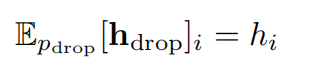
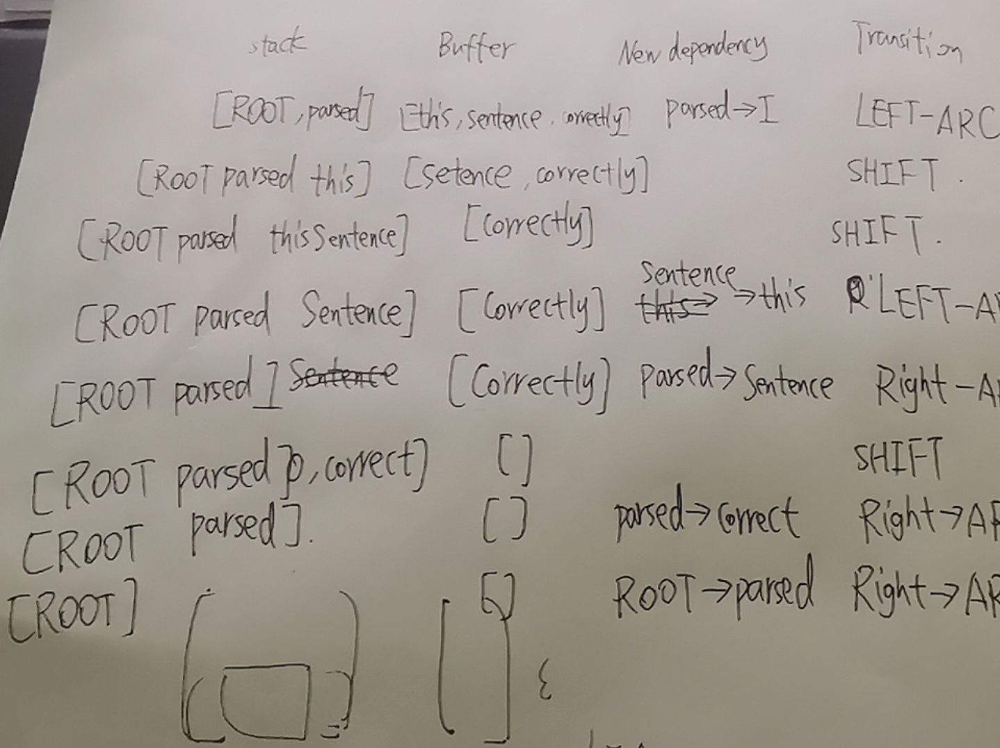

# assign3

## 1:神经网络和机器学习

（a）adam算法

(i)通过以前所有计算出的梯度项和当前计算出的梯度的加权值，减小了当前时间步下梯度的影响，利用以往梯度信息，防止梯度一次性计算出现一定错误，或卡在局部最优解，利用以往梯度信息能进行一些校正，使得学习更稳定。随时间推移，距离当前时间步越远的梯度影响变得越小。

(ii)梯度平方加权较小的参数更新地越快。因为梯度相对较小，每次走地步长就应该相对增大。（或者说是梯度地方差较小，每次更新较为安全，学习更稳定）

（b）Dropout策略

(i)由

得到$(1 - p_{drop})\gamma h_i= h_i$

得到$\gamma = \frac{1}{1 - p_{drop}}$

(ii)为什么Dropout仅在训练时使用，在测试时不使用？

训练时：相当于训练多个网络，起到了类似了bagging的效果。防止了feature codaption，取得防止过拟合的参数。

测试时：已经取得了在多个网络下训练得到的较好参数，为保持模型复杂性提高准确率不再采用dropout。同时防止随机性

## 2:基于神经网络的依存分析

(a)如图所示：



(b):2n步。每个单词入栈一次，出栈一次。

(c):实现PartialParse类中的初始化方法init和parse_step方法

```python
    def __init__(self, sentence):
        """Initializes this partial parse.

        @param sentence (list of str): The sentence to be parsed as a list of words.
                                        Your code should not modify the sentence.
        """
        # The sentence being parsed is kept for bookkeeping purposes. Do NOT alter it in your code.
        self.sentence = sentence

        ### YOUR CODE HERE (3 Lines)
        ### Your code should initialize the following fields:
        ###     self.stack: The current stack represented as a list with the top of the stack as the
        ###                 last element of the list.
        ###     self.buffer: The current buffer represented as a list with the first item on the
        ###                  buffer as the first item of the list
        ###     self.dependencies: The list of dependencies produced so far. Represented as a list of
        ###             tuples where each tuple is of the form (head, dependent).
        ###             Order for this list doesn't matter.
        ###
        ### Note: The root token should be represented with the string "ROOT"
        ### Note: If you need to use the sentence object to initialize anything, make sure to not directly 
        ###       reference the sentence object.  That is, remember to NOT modify the sentence object. 
        self.stack = ["ROOT"]
        self.buffer = self.sentence.copy()
        self.dependencies = []
        ### END YOUR CODE


    def parse_step(self, transition):
        """Performs a single parse step by applying the given transition to this partial parse

        @param transition (str): A string that equals "S", "LA", or "RA" representing the shift,
                                left-arc, and right-arc transitions. You can assume the provided
                                transition is a legal transition.
        """
        ### YOUR CODE HERE (~7-12 Lines)
        ### TODO:
        ###     Implement a single parsing step, i.e. the logic for the following as
        ###     described in the pdf handout:
        ###         1. Shift
        ###         2. Left Arc
        ###         3. Right Arc
        if transition == "S":
            self.stack.append(self.buffer[0])
            del self.buffer[0]
        elif transition == "LA":   #加入左箭头
            self.dependencies.append((self.stack[-1],self.stack[len(self.stack) - 2]))
            del self.stack[len(self.stack) - 2]
        else:
            self.dependencies.append((self.stack[len(self.stack) - 2],self.stack[-1]))
            del self.stack[-1]
        ### END YOUR CODE
```

(d)：实现在minibatch中的parse方法

```python
def minibatch_parse(sentences, model, batch_size):
    """Parses a list of sentences in minibatches using a model.

    @param sentences (list of list of str): A list of sentences to be parsed
                                            (each sentence is a list of words and each word is of type string)
    @param model (ParserModel): The model that makes parsing decisions. It is assumed to have a function
                                model.predict(partial_parses) that takes in a list of PartialParses as input and
                                returns a list of transitions predicted for each parse. That is, after calling
                                    transitions = model.predict(partial_parses)
                                transitions[i] will be the next transition to apply to partial_parses[i].
    @param batch_size (int): The number of PartialParses to include in each minibatch


    @return dependencies (list of dependency lists): A list where each element is the dependencies
                                                    list for a parsed sentence. Ordering should be the
                                                    same as in sentences (i.e., dependencies[i] should
                                                    contain the parse for sentences[i]).
    """
    dependencies = []

    ### YOUR CODE HERE (~8-10 Lines)
    ### TODO:
    ###     Implement the minibatch parse algorithm.  Note that the pseudocode for this algorithm is given in the pdf handout.
    ###
    ###     Note: A shallow copy (as denoted in the PDF) can be made with the "=" sign in python, e.g.
    ###                 unfinished_parses = partial_parses[:].
    ###             Here `unfinished_parses` is a shallow copy of `partial_parses`.
    ###             In Python, a shallow copied list like `unfinished_parses` does not contain new instances
    ###             of the object stored in `partial_parses`. Rather both lists refer to the same objects.
    ###             In our case, `partial_parses` contains a list of partial parses. `unfinished_parses`
    ###             contains references to the same objects. Thus, you should NOT use the `del` operator
    ###             to remove objects from the `unfinished_parses` list. This will free the underlying memory that
    ###             is being accessed by `partial_parses` and may cause your code to crash.
    partial_parse = [PartialParse(setence) for setence in sentences]
    unfinished_parses = partial_parse
    dependencies = [partial_parse[i].dependencies for i in range(len(partial_parse))]
    while len(unfinished_parses) > 0:
        last = min(batch_size,len(unfinished_parses))
        transitions = model.predict(unfinished_parses[:last])
        for i in range(last):
            unfinished_parses[i].parse_step(transitions[i])
        temp  =  unfinished_parses[last:]
        te = []
        for p in unfinished_parses[:last]:
            if len(p.stack) > 1 or len(p.buffer) > 0:
                te.append(p)
        unfinished_parses = te + temp
    ### END YOUR CODE

    return dependencies
```

（e）:

