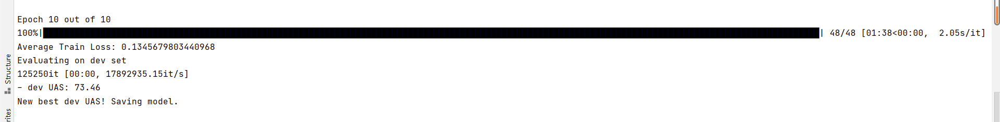
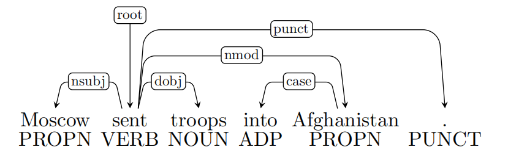
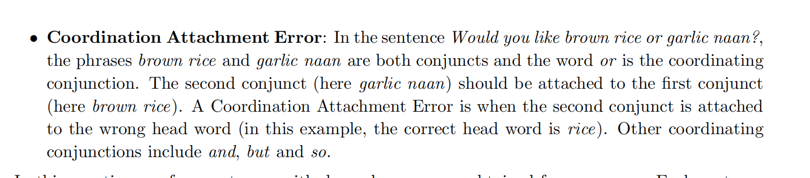

# assign3

## 1:神经网络和机器学习

（a）adam算法

(i)通过以前所有计算出的梯度项和当前计算出的梯度的加权值，减小了当前时间步下梯度的影响，利用以往梯度信息，防止梯度一次性计算出现一定错误，或卡在局部最优解，利用以往梯度信息能进行一些校正，使得学习更稳定。随时间推移，距离当前时间步越远的梯度影响变得越小。

(ii)梯度平方加权较小的参数更新地越快。因为梯度相对较小，每次走地步长就应该相对增大。（或者说是梯度地方差较小，每次更新较为安全，学习更稳定）

（b）Dropout策略

(i)由

得到$(1 - p_{drop})\gamma h_i= h_i$

得到$\gamma = \frac{1}{1 - p_{drop}}$

(ii)为什么Dropout仅在训练时使用，在测试时不使用？

训练时：相当于训练多个网络，起到了类似了bagging的效果。防止了feature codaption，取得防止过拟合的参数。

测试时：已经取得了在多个网络下训练得到的较好参数，为保持模型复杂性提高准确率不再采用dropout。同时防止随机性

## 2:基于神经网络的依存分析

(a)如图所示：


(b):2n步。每个单词入栈一次，出栈一次。

(c):实现PartialParse类中的初始化方法init和parse_step方法

```python
    def __init__(self, sentence):
        """Initializes this partial parse.

        @param sentence (list of str): The sentence to be parsed as a list of words.
                                        Your code should not modify the sentence.
        """
        # The sentence being parsed is kept for bookkeeping purposes. Do NOT alter it in your code.
        self.sentence = sentence

        ### YOUR CODE HERE (3 Lines)
        ### Your code should initialize the following fields:
        ###     self.stack: The current stack represented as a list with the top of the stack as the
        ###                 last element of the list.
        ###     self.buffer: The current buffer represented as a list with the first item on the
        ###                  buffer as the first item of the list
        ###     self.dependencies: The list of dependencies produced so far. Represented as a list of
        ###             tuples where each tuple is of the form (head, dependent).
        ###             Order for this list doesn't matter.
        ###
        ### Note: The root token should be represented with the string "ROOT"
        ### Note: If you need to use the sentence object to initialize anything, make sure to not directly 
        ###       reference the sentence object.  That is, remember to NOT modify the sentence object. 
        self.stack = ["ROOT"]
        self.buffer = self.sentence.copy()
        self.dependencies = []
        ### END YOUR CODE


    def parse_step(self, transition):
        """Performs a single parse step by applying the given transition to this partial parse

        @param transition (str): A string that equals "S", "LA", or "RA" representing the shift,
                                left-arc, and right-arc transitions. You can assume the provided
                                transition is a legal transition.
        """
        ### YOUR CODE HERE (~7-12 Lines)
        ### TODO:
        ###     Implement a single parsing step, i.e. the logic for the following as
        ###     described in the pdf handout:
        ###         1. Shift
        ###         2. Left Arc
        ###         3. Right Arc
        if transition == "S":
            self.stack.append(self.buffer[0])
            del self.buffer[0]
        elif transition == "LA":   #加入左箭头
            self.dependencies.append((self.stack[-1],self.stack[len(self.stack) - 2]))
            del self.stack[len(self.stack) - 2]
        else:
            self.dependencies.append((self.stack[len(self.stack) - 2],self.stack[-1]))
            del self.stack[-1]
        ### END YOUR CODE
```

(d)：实现在minibatch中的parse方法

```python
def minibatch_parse(sentences, model, batch_size):
    """Parses a list of sentences in minibatches using a model.

    @param sentences (list of list of str): A list of sentences to be parsed
                                            (each sentence is a list of words and each word is of type string)
    @param model (ParserModel): The model that makes parsing decisions. It is assumed to have a function
                                model.predict(partial_parses) that takes in a list of PartialParses as input and
                                returns a list of transitions predicted for each parse. That is, after calling
                                    transitions = model.predict(partial_parses)
                                transitions[i] will be the next transition to apply to partial_parses[i].
    @param batch_size (int): The number of PartialParses to include in each minibatch


    @return dependencies (list of dependency lists): A list where each element is the dependencies
                                                    list for a parsed sentence. Ordering should be the
                                                    same as in sentences (i.e., dependencies[i] should
                                                    contain the parse for sentences[i]).
    """
    dependencies = []

    ### YOUR CODE HERE (~8-10 Lines)
    ### TODO:
    ###     Implement the minibatch parse algorithm.  Note that the pseudocode for this algorithm is given in the pdf handout.
    ###
    ###     Note: A shallow copy (as denoted in the PDF) can be made with the "=" sign in python, e.g.
    ###                 unfinished_parses = partial_parses[:].
    ###             Here `unfinished_parses` is a shallow copy of `partial_parses`.
    ###             In Python, a shallow copied list like `unfinished_parses` does not contain new instances
    ###             of the object stored in `partial_parses`. Rather both lists refer to the same objects.
    ###             In our case, `partial_parses` contains a list of partial parses. `unfinished_parses`
    ###             contains references to the same objects. Thus, you should NOT use the `del` operator
    ###             to remove objects from the `unfinished_parses` list. This will free the underlying memory that
    ###             is being accessed by `partial_parses` and may cause your code to crash.
    partial_parse = [PartialParse(setence) for setence in sentences]
    unfinished_parses = partial_parse
    dependencies = [partial_parse[i].dependencies for i in range(len(partial_parse))]
    while len(unfinished_parses) > 0:
        last = min(batch_size,len(unfinished_parses))
        transitions = model.predict(unfinished_parses[:last])
        for i in range(last):
            unfinished_parses[i].parse_step(transitions[i])
        temp  =  unfinished_parses[last:]
        te = []
        for p in unfinished_parses[:last]:
            if len(p.stack) > 1 or len(p.buffer) > 0:
                te.append(p)
        unfinished_parses = te + temp
    ### END YOUR CODE

    return dependencies
```

（e）:

实现网络：

```python
class ParserModel(nn.Module):
    """ Feedforward neural network with an embedding layer and two hidden layers.
    The ParserModel will predict which transition should be applied to a
    given partial parse configuration.

    PyTorch Notes:
        - Note that "ParserModel" is a subclass of the "nn.Module" class. In PyTorch all neural networks
            are a subclass of this "nn.Module".
        - The "__init__" method is where you define all the layers and parameters
            (embedding layers, linear layers, dropout layers, etc.).
        - "__init__" gets automatically called when you create a new instance of your class, e.g.
            when you write "m = ParserModel()".
        - Other methods of ParserModel can access variables that have "self." prefix. Thus,
            you should add the "self." prefix layers, values, etc. that you want to utilize
            in other ParserModel methods.
        - For further documentation on "nn.Module" please see https://pytorch.org/docs/stable/nn.html.
    """
    def __init__(self, embeddings, n_features=36,
        hidden_size=200, n_classes=3, dropout_prob=0.5):
        """ Initialize the parser model.

        @param embeddings (ndarray): word embeddings (num_words, embedding_size)
        @param n_features (int): number of input features
        @param hidden_size (int): number of hidden units
        @param n_classes (int): number of output classes
        @param dropout_prob (float): dropout probability
        """
        super(ParserModel, self).__init__()
        self.n_features = n_features
        self.n_classes = n_classes
        self.dropout_prob = dropout_prob
        self.embed_size = embeddings.shape[1]
        self.hidden_size = hidden_size
        self.embeddings = nn.Parameter(torch.tensor(embeddings))

        ### YOUR CODE HERE (~9-10 Lines)
        ### TODO:
        ###     1) Declare `self.embed_to_hidden_weight` and `self.embed_to_hidden_bias` as `nn.Parameter`.
        ###        Initialize weight with the `nn.init.xavier_uniform_` function and bias with `nn.init.uniform_`
        ###        with default parameters.
        ###     2) Construct `self.dropout` layer.
        ###     3) Declare `self.hidden_to_logits_weight` and `self.hidden_to_logits_bias` as `nn.Parameter`.
        ###        Initialize weight with the `nn.init.xavier_uniform_` function and bias with `nn.init.uniform_`
        ###        with default parameters.
        ###
        ### Note: Trainable variables are declared as `nn.Parameter` which is a commonly used API
        ###       to include a tensor into a computational graph to support updating w.r.t its gradient.
        ###       Here, we use Xavier Uniform Initialization for our Weight initialization.
        ###       It has been shown empirically, that this provides better initial weights
        ###       for training networks than random uniform initialization.
        ###       For more details checkout this great blogpost:
        ###             http://andyljones.tumblr.com/post/110998971763/an-explanation-of-xavier-initialization
        ###
        ### Please see the following docs for support:
        ###     nn.Parameter: https://pytorch.org/docs/stable/nn.html#parameters
        ###     Initialization: https://pytorch.org/docs/stable/nn.init.html
        ###     Dropout: https://pytorch.org/docs/stable/nn.html#dropout-layers
        ### 
        ### See the PDF for hints.
        self.embed_to_hidden_weight = nn.Parameter(torch.empty(self.embed_size*self.n_features,self.hidden_size))
        nn.init.xavier_uniform_(self.embed_to_hidden_weight)
        self.embed_to_hidden_bias = nn.Parameter(torch.empty(1,self.hidden_size))
        nn.init.uniform_(self.embed_to_hidden_bias)

        self.dropout = nn.Dropout(p=dropout_prob)  # dropout层

        self.hidden_to_logits_weight = nn.Parameter(torch.empty(self.hidden_size,self.n_classes))
        nn.init.xavier_uniform_(self.hidden_to_logits_weight)
        self.hidden_to_logits_bias = nn.Parameter(torch.empty(1,self.n_classes))
        nn.init.uniform_(self.hidden_to_logits_bias)


        ### END YOUR CODE

    def embedding_lookup(self, w):
        """ Utilize `w` to select embeddings from embedding matrix `self.embeddings`
            @param w (Tensor): input tensor of word indices (batch_size, n_features)

            @return x (Tensor): tensor of embeddings for words represented in w
                                (batch_size, n_features * embed_size)
        """

        ### YOUR CODE HERE (~1-4 Lines)
        ### TODO:
        ###     1) For each index `i` in `w`, select `i`th vector from self.embeddings
        ###     2) Reshape the tensor using `view` function if necessary
        ###
        ### Note: All embedding vectors are stacked and stored as a matrix. The model receives
        ###       a list of indices representing a sequence of words, then it calls this lookup
        ###       function to map indices to sequence of embeddings.
        ###
        ###       This problem aims to test your understanding of embedding lookup,
        ###       so DO NOT use any high level API like nn.Embedding
        ###       (we are asking you to implement that!). Pay attention to tensor shapes
        ###       and reshape if necessary. Make sure you know each tensor's shape before you run the code!
        ###
        ### Pytorch has some useful APIs for you, and you can use either one
        ### in this problem (except nn.Embedding). These docs might be helpful:
        ###     Index select: https://pytorch.org/docs/stable/torch.html#torch.index_select
        ###     Gather: https://pytorch.org/docs/stable/torch.html#torch.gather
        ###     View: https://pytorch.org/docs/stable/tensors.html#torch.Tensor.view
        ###     Flatten: https://pytorch.org/docs/stable/generated/torch.flatten.html
        x = torch.zeros(w.shape[0],self.embed_size * self.n_features)
        o = 0
        for i in w:
            x[o] = torch.flatten(torch.index_select(self.embeddings,dim = 0,index = i))
            o+=1
        ### END YOUR CODE
        return x


    def forward(self, w):
        """ Run the model forward.

            Note that we will not apply the softmax function here because it is included in the loss function nn.CrossEntropyLoss

            PyTorch Notes:
                - Every nn.Module object (PyTorch model) has a `forward` function.
                - When you apply your nn.Module to an input tensor `w` this function is applied to the tensor.
                    For example, if you created an instance of your ParserModel and applied it to some `w` as follows,
                    the `forward` function would called on `w` and the result would be stored in the `output` variable:
                        model = ParserModel()
                        output = model(w) # this calls the forward function
                - For more details checkout: https://pytorch.org/docs/stable/nn.html#torch.nn.Module.forward

        @param w (Tensor): input tensor of tokens (batch_size, n_features)

        @return logits (Tensor): tensor of predictions (output after applying the layers of the network)
                                 without applying softmax (batch_size, n_classes)
        """
        ### YOUR CODE HERE (~3-5 lines)
        ### TODO:
        ###     Complete the forward computation as described in write-up. In addition, include a dropout layer
        ###     as decleared in `__init__` after ReLU function.
        ###
        ### Note: We do not apply the softmax to the logits here, because
        ### the loss function (torch.nn.CrossEntropyLoss) applies it more efficiently.
        ###
        ### Please see the following docs for support:
        ###     Matrix product: https://pytorch.org/docs/stable/torch.html#torch.matmul
        ###     ReLU: https://pytorch.org/docs/stable/nn.html?highlight=relu#torch.nn.functional.relu
        x  = self.embedding_lookup(w)
        h = F.relu(x @ self.embed_to_hidden_weight + self.embed_to_hidden_bias)
        h = self.dropout(h)
        logits = h @ self.hidden_to_logits_weight + self.hidden_to_logits_bias
        ### END YOUR CODE
        return logits
```

实现train_for_one_epcho和train方法

```python
def train(parser, train_data, dev_data, output_path, batch_size=1024, n_epochs=10, lr=0.0005):
    """ Train the neural dependency parser.

    @param parser (Parser): Neural Dependency Parser
    @param train_data ():
    @param dev_data ():
    @param output_path (str): Path to which model weights and results are written.
    @param batch_size (int): Number of examples in a single batch
    @param n_epochs (int): Number of training epochs
    @param lr (float): Learning rate
    """
    best_dev_UAS = 0


    ### YOUR CODE HERE (~2-7 lines)
    ### TODO:
    ###      1) Construct Adam Optimizer in variable `optimizer`
    ###      2) Construct the Cross Entropy Loss Function in variable `loss_func` with `mean`
    ###         reduction (default)
    ###
    ### Hint: Use `parser.model.parameters()` to pass optimizer
    ###       necessary parameters to tune.
    ### Please see the following docs for support:
    ###     Adam Optimizer: https://pytorch.org/docs/stable/optim.html
    ###     Cross Entropy Loss: httsps://pytorch.org/docs/stable/nn.html#crossentropyloss

    loss_func = nn.CrossEntropyLoss()
    optimizer = optim.Adam(parser.model.parameters())
    ### END YOUR CODE

    for epoch in range(n_epochs):
        print("Epoch {:} out of {:}".format(epoch + 1, n_epochs))
        dev_UAS = train_for_epoch(parser, train_data, dev_data, optimizer, loss_func, batch_size)
        if dev_UAS > best_dev_UAS:
            best_dev_UAS = dev_UAS
            print("New best dev UAS! Saving model.")
            torch.save(parser.model.state_dict(), output_path)
        print("")


def train_for_epoch(parser, train_data, dev_data, optimizer, loss_func, batch_size):
    """ Train the neural dependency parser for single epoch.

    Note: In PyTorch we can signify train versus test and automatically have
    the Dropout Layer applied and removed, accordingly, by specifying
    whether we are training, `model.train()`, or evaluating, `model.eval()`

    @param parser (Parser): Neural Dependency Parser
    @param train_data ():
    @param dev_data ():
    @param optimizer (nn.Optimizer): Adam Optimizer
    @param loss_func (nn.CrossEntropyLoss): Cross Entropy Loss Function
    @param batch_size (int): batch size

    @return dev_UAS (float): Unlabeled Attachment Score (UAS) for dev data
    """
    parser.model.train() # Places model in "train" mode, i.e. apply dropout layer
    n_minibatches = math.ceil(len(train_data) / batch_size)
    loss_meter = AverageMeter()

    with tqdm(total=(n_minibatches)) as prog:
        for i, (train_x, train_y) in enumerate(minibatches(train_data, batch_size)):
            optimizer.zero_grad()   # remove any baggage in the optimizer
            loss = 0. # store loss for this batch here
            train_x = torch.from_numpy(train_x).long()
            train_y = torch.from_numpy(train_y.nonzero()[1]).long()

            ### YOUR CODE HERE (~4-10 lines)
            ### TODO:
            ###      1) Run train_x forward through model to produce `logits`
            ###      2) Use the `loss_func` parameter to apply the PyTorch CrossEntropyLoss function.
            ###         This will take `logits` and `train_y` as inputs. It will output the CrossEntropyLoss
            ###         between softmax(`logits`) and `train_y`. Remember that softmax(`logits`)
            ###         are the predictions (y^ from the PDF).
            ###      3) Backprop losses
            ###      4) Take step with the optimizer
            ### Please see the following docs for support:
            ###     Optimizer Step: https://pytorch.org/docs/stable/optim.html#optimizer-step
            logits = parser.model(train_x)
            loss = loss_func(logits,train_y)
            loss.backward()
            optimizer.step()
            ### END YOUR CODE
            prog.update(1)
            loss_meter.update(loss.item())

    print ("Average Train Loss: {}".format(loss_meter.avg))

    print("Evaluating on dev set",)
    parser.model.eval() # Places model in "eval" mode, i.e. don't apply dropout layer
    dev_UAS, _ = parser.parse(dev_data)
    print("- dev UAS: {:.2f}".format(dev_UAS * 100.0))
    return dev_UAS
```

在debug模式下的结果如图：



(f)错误案例分析

依存分析中通常会有四种不同的错误类型

- 介词短语依附错误
  - 介词短语修饰了错误的头部，例如下图中into Afghanistan错误地依附了troops而本来应该依附于sent



- 动词短语依附错误
  - 实例：Leaving the store unattended, I went outside to watch the parade，其中leaving the store unattended就是动词短语，其对应的正确头部应该是went

- 修饰词依附错误
  - 实例: I am extremely short。其中extremely应该修饰short，即其对应的head应该是short

- 

i)

种类：动词短语依附错误

incorrect dependency:wedding->fearing my death

corret dependency:heading->fearing my death

ii)

种类：Coordinate Attachment Error

incorrect denpendency:makes->rescur

correct dependency:rush->rescur

iii)

种类：介词短语依附错误

incorrct denpendency:named->midland

correct dependency:guy->midland

iv)

种类：修饰错误

incorrect dependency:elements->most

correct dependency:crucial->most
