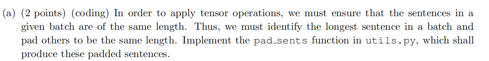

# assignment4

(f):

将注意力分数部分mask为true的位置设置成-inf，然后再经过softmax计算后该处的分数会变为0.解码器的输出的hidden state不应与padding部分的任何token对应的hidden state作注意力运算。

(i):

优点：参数量少，计算量小。

缺点：s中某一位置的分量不能和h中另外某一位置的分量作点积，只能是对应位置相乘。因此在相似性计算中优势不足。s与h必须是相同维度。

(ii):

优点：参数多能够对复杂情况建模，捕获更多有用信息

缺点：计算复杂

## 机器翻译系统的分析

(a):原始语言的每个单词很多情况下由不同的子词所组成，子词的含义的组合就能更好地代表单词地含义。还可解决out-of-vocabluary的问题，面对不在单词表中的单词根据其子词情况还能准确地还原其含义。并且存储子词相较于存储整个单词耗费存储空间更小。

(b):单词是由子词所构成的，所以其含义以每个子词的含义加之相互作用而决定，所以其表示的语义更丰富，因此embedding较大。而子词是更小的单元通常其表示的含义是特定的，因此embedding较小。

(c):在多语言环境下模型能学习到任务间的关联，学习到不同语言之间共通的翻译模式，学习到另外的知识，因而能将知识迁移运用到目标语言的翻译中。低资源的语言翻译可以从其他语言对中获取额外知识。泛化性能较高

(d):

i)模型本身限制，可能是注意力机制出现错误，可改变注意力机制为乘性注意力等。	

iii）模型本身限制。语义信息捕捉不到位或者词表中没有Littlefish的词语可适当增加隐藏层维度增强捕捉语义。

ii)specific linguistic structure：多引入一些词汇。可能是专有名词的限制，可以适当引入**专家系统**

(e)

i)

如果包含：说明模型记住了一些训练集中源语言和目标语言特定的映射，会适时使用复制机制。

如果不包含：模型真正学到了翻译的方法及语义对应。

ii)

在训练过程中梯度消失问题仍然存在，在解码过程中不能很好地保留很长距离之外的信息。

(f)机器翻译中的BLUE得分

i）

$c_1$的BLUE得分：

$p_1 = \frac{0+1+1+1+0}{5} = 0.6$,$p_2 = \frac{0+1+1+0}{4} = 0.5$

取$r_2$作为BP计算的对象（$r_1$和$r_2$和$c_1$的长度之差相同，但是$r_1$更短）

得到BP = 1

最终$BLUE = 1 \cdot exp\{0.5 \cdot \log p_1 + 0.5 \cdot \log p_2 = \sqrt{0.3}\}$

$c_2$的BLUE得分：

$p_1 = \frac{1 + 1 + 0 + 1 + 1}{5} = 0.8,p_2 = \frac{1 + 0 + 0 + 1}{4} = 0.5$

取$r_2$作为BP计算的对象（$r_1$和$r_2$和$c_1$的长度之差相同，但是$r_1$更短）

得到BP = 1

最终$BLUE  = 1 \cdot exp\{0.5 \log 0.4   \} = \sqrt{0.4}$ 

总体来看$c_2$翻译更好

ii)

重新计算BLUE得分得到$c_1$更好，显然不是一个好翻译。

