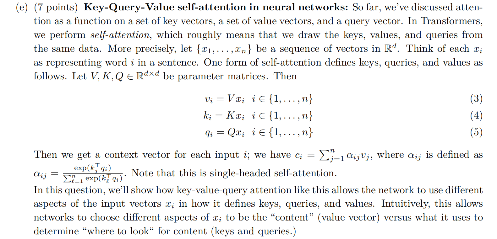
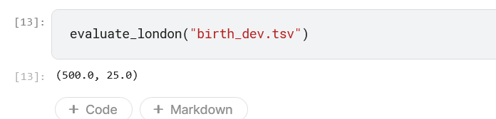
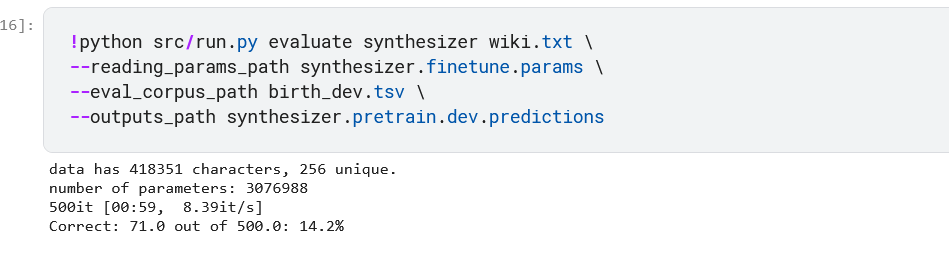

# assignment5

## Attention Mechnism

(a)向量q仅和$k_j$夹角很小（内积很大），和其他向量$k_i ,i \neq j$夹角都很大（内积很小）。

(b)$q  = A(k_a + k_b)$其中A为一较大常数。

(c)

i)$q  = A(\mu_a + \mu_b)$.A为较大常数由于协方差矩阵趋向于0因此每个维度上的值都无限接近于其均值。于是可以认为$k_a \approx \mu_a,k_b \approx \mu_b$。于是$q \cdot k_a = q \cdot k_b \approx A$但$q \cdot k_i = (\mu_a + \mu_b) \cdot \mu_i = 0$

于是结论成立。

ii)

可以近似$k_a  =\xi \mu_a$,其中$\xi$近似从分布$N(1, \frac{1}{2})$中抽样。

于是$k_a^T \cdot q = \xi A,k_b^T \cdot q  = A$

讨论：当$\xi \rightarrow 0$时，结果趋向于$v_b$否则趋向于$v_a$

(d)

i)$q_1 = A\mu_a$且$q_2 = A\mu_b$或者交换位置，A为较大常数

ii)$c = \frac{1}{2}(v_a + v_b)$

$q_a$仅与$k_a$方向基本一致，计算注意力分数后a对应的分数为很大，其余的很小.所以$c_1$近似等于$v_a$

$v_b$同理。multi-head attention将两者的计算分开了。

(e)

i)首先计算注意力分数

$\alpha_{21} = \frac{\mu_a \cdot (\mu_d  + \mu_b)}{1} = 0$         $\alpha_{22} = \beta^2$       $\alpha_{23} = 0$

则$c_2 = x_2 = \mu_a$

不能,$x_2$总会和自身自己作注意力运算，获得注意力分数后对$\mu_a$有加权

ii)

写成矩阵形式得到：
$$
[c_1,c_2,c_3] = V[x_1,x_2,x_3] softmax_{列}([x_1,x_2,x_3]^TK^TQ[x_1,x_2,x_3])
$$
由问题的提示可以构造：

$V = (\mu_b \mu_c^T - \mu_c \mu_b^T + \mu_b \mu_d^T + \mu_c \mu_d^T) / \beta^2$

这样就有

$v_1 = \mu_b,v_3 = \mu_b - \mu_c,v_2 = 0$

这样就只需要使得$\alpha_{21} = A,\alpha_{13}  =A$即可达成目标。

其中A是**很大的常数**,只需想办法尽可能让不正交的项目相乘。

构造$K^TQ = u_du_a^T + u_cu_d^T$即可达成目标。

可令$K = E,Q = (u_du_a^T + u_cu_d^T) / \beta^2$

## **Pretrained Transformer models and knowledge access**

(a)**Check out the demo.**

(b)read the NAMEDATASET

(c)实现不带training的finetuning

(d)

执行第二行的代码后获得的准确率：

在london baseline上的表现情况如图：

(e):**Define a** **span corruption** **function for pretraining.**

(f)：最终的结果为：

(g):最终结果如图

## **Considerations in pretrained knowledge**

相对预训练模型，能使得模型学到更general的语义知识，非预训练模型参数随机初始化不包含对下游任务通用语义方面的学习。

缺乏可解释性或推理依据导致用户可能不会相信模型的决策。

观察该person name的表示与预训练资料中哪个person name的表示最接近，使用这个最接近person name的居住地作为答案。

这可能导致模型具有某些偏见或bias，即看到哪些人名字就倾向于将其预测成某个地方，而实际上名字和地点并无明确关联。