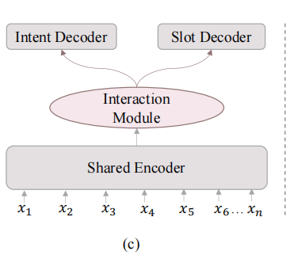
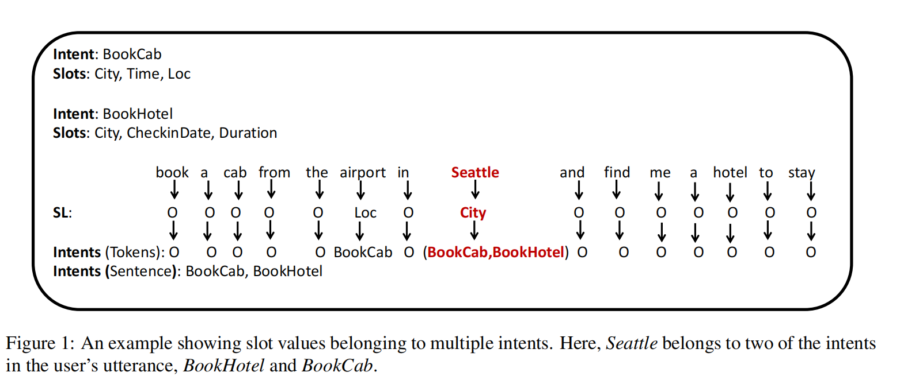

# Dialogue System

## **A Survey on Spoken Language Understanding: Recent Advances and New** **Frontiers**

### 基础概念

- **意图识别**：给定token序列$X=(x_1,x_2 \cdots x_n)$，输出意图标签$o^,$

- **槽位填充**：序列标注任务$O^S = (O_1^S, \cdots O_n^S)$
- **联合模型**：联合进行意图识别和槽填充
- 关注句子的不同部分
- 已识别出的意图应该对后续意图的预测有影响

数据集：ATIS,SNIPS

- **衡量指标**：F1得分（精确度和召回率的**加权平均**），INTENT准确度（intent accuracy），OVERALL准确度（overall accuracy）

### 分类方法

- 单模型：不能捕捉两种任务（意图识别和槽填充）间的shared knowledge
  - 由于separate training

- 联合模型
  - 隐式联合模型：直接使用一个encoder在潜在表示空间中创建shared representation。缺点是可解释性差，性能差。
  - 
  - 显式联合模型：
    - single flow interaction:仅考虑从意图到槽位的信息流动
    - Bidirectional Flow Interaction:考虑意图和槽位交互影响
      - 优点：可解释性强，性能高，**能够相对完全地捕获任务间的shared knowledge**

- 预训练范式：能够**提供较丰富的语义特征**
  - 

### 挑战和前沿

- contextual SLU：因为用户和系统可能会引用在之前的对话中引入的实体，从而引入歧义，这就需要模型来包含上下文信息，以减轻歧义
  - **挑战**：区分不同对话历史间的信息，长距离依赖关系，减轻噪声等
- 多意图SLU：系统需要处理多个意图以及对应的槽位
  - **挑战**：如何联合多个意图信息来指导槽填充，数据少
- 中文SLU
  - **挑战**：单词信息整合，单词拆分标准
- 跨领域SLU：每个domain收集大量数据是不现实的。
  - 隐式domain transfer:联合多领域数据集训练（参数共享）。能够隐式地抽取共享特征但不可抽取每个领域的**独有特征**
  - 显式domain transfer:使用shared-private架构。同时考虑domain-shared知识和domain-specific知识
  - **挑战**：领域知识迁移（当用于SF和ID时需要更细粒度的迁移方式），zero-shot（如target domain完全没有数据）
- 多语言SLU
  - **挑战**：源语言和目标语言的对齐，泛化性能（由于新语言的层出不穷）
- Low-Resource SLU：Few-shot SLU,Zero-shot SLU,无监督SLU
  - **挑战**：如何在low-resource下充分利用intent和slot间的交互。缺少基准

## A Label-Aware BERT Attention Network for Zero-Shot Multi-Intent Detection in Spoken Language Understanding

### 动机

- 先前的工作意图依赖于分类，但用户对话风云变幻，复杂多变，较难追踪。可能导致zero-shot问题
- 大多数SLU系统不能handle没有显式连接的多意图识别
- Unseen Intents的零样本问题
- 前人工作无法处理意图不存在于句子的单独部分的问题

### 方法

- 考虑intent label的语义，而不是仅仅作为one-hot vector

- 训练阶段，使用self-attentive方法获取句子向量
  - 全局句子向量$r$:

对训练集中的每个意图，通过另一BERT ENCODER获取K个线性无关的基向量。将全局句子向量往上面进行投影。投影的每个分量扔给分类器分类即可。

- 测试阶段：对新来的意图使用同样的方法处理（设新来意图为L个）。扩展L个基向量。

### 关键实验结果

- 意图越多，模型效果越好
- 仅少量unseen intents即可大幅度提升性能
- 相比于无连词数据集，性能大幅提升

### 贡献

- 扩展BERT模型，采用label敏感的方法来处置未见label的问题
- 成功证明了LEBAN的few-shot和zero-shot能力
- 通过5个数据集的试验，证明了同时考虑上下文语义和label标签语义的有效性

- **不足之处**：
- 对语义差距较明显的zero-shot任务还是处理得不够好：
    - eg:模型只见过get-estimated-arrival,而如测试集中出现了depature模型无法辨别。
    - 可能可以通过引入知识库的方式解决
  
- 模型还是有可能会bias到某些关键词上(how many的many)

## AGIF: An Adaptive Graph-Interactive Framework for Joint Multiple Intent Detection and Slot Filling

### 动机

- 先前的对话系统没有考虑意图和用于指导token级别槽位预测的信息融合上的**细粒度**信息
  - 和单意图不同，多意图要考虑多个意图的信息融合来指导slot预测
- 先前的工作将多意图信息融合到一个context vector中，每个token都被同样复杂的意图信息指导(context vector)
  - 针对所有token提供相同的意图信息可能会产生歧义性，导致每个token捕捉**自身意图相关的信息**很困难。
  - 故每个token应该尽可能关注自身应该关注的意图，而不是简单地关注整个多意图整体。

### 方法

- 使用一共享的encoder获得表示向量捕捉意图识别和槽位填充的**共享信息**
- 意图识别：使用多标签分类器
- **自适应Intent-Slot图交互槽位填充器：**
  - 鼓励每个token去关注**属于自己的相关意图信息**
  - 使用带多头注意力的GAT提升训练稳定性
  - encoder输出通过LSTM后，通过图结构获取该时间步用于预测槽位信息的embedding表示
  - 图结构：意图结点相互连接，每个槽位token结点连接到所有意图结点。
  - 经过L层的传播后，进行分类
- **多任务学习目标**：
  - 损失函数为意图识别和槽位填充损失加权之和

### 关键实验结果（可以补充）

意图单独考虑指导槽位填充的有效性：

### 贡献

- model the interaction between multiple intents and slot at each token,which can make a fifine-grained intent information transfer for slot prediction

## **Exploiting Shared Information for Multi-intent Natural Language Sentence Classification（隐变量模型+n-gram特征）**

### 动机

- 前人做法：
  - C个意图，就C个二分类器判断是否起作用
  - 意图组合作为一单独的label
    - 没有考虑不同类别间共享的有价值信息，由此引入数据稀疏性问题（如果每种组合只有一个实例）（buy_game#play_game和buy_game#play_music不是完全不同）
- **目标**：探索不同的意图之间的信息重合**能否被采纳**进而提升意图分类的性能

### 方法

- **Class-Based Model:**加入被意图组合共享的特征
  - #n-gram_target:其中target可以是单意图标签或多意图标签组合
  - 但为了不将意图组合视作一个标签，将target拆开为每个意图引入n-gram特征
  - 更多通用的特征：
    - eg:get,buy经常出现，定义n_gram action特征
- **Hidden Variable Based Model**：引入隐变量，表明序列中每个单词所属意图
  - **隐条件随机场**
  - 隐变量表明每个token属于哪个意图
  - 
    - n-gram target feature:g(w_i,c)
    - 意图转移概率t(h_i,h_{i-1},c)
    - 发射概率e(w_i,h_i,c)：当前单词有多少概率由该意图产生

## **GL-GIN: Fast and Accurate Non-Autoregressive Model for Joint Multiple** **Intent Detection and Slot Filling**

### 动机

- 自回归模型可能**推理缓慢**（依赖于上一个时间步）以及**信息泄露**（双向上下文信息的泄露？）

### 方法

### 实验结果

- SOTA:Local Graph消除非自回归的问题很有用(uncoorinated problem)
- 非自回归的方式在解码过程极大加速
- LOCAL GRAPH成功促进了信息修正

### 贡献

- local-aware交互图：消除由于非自回归导致的词槽上下文不相关问题（B-singer followed by I-song）
- **Global交互图**：考虑词槽-词槽，词槽-意图，意图-意图的信息流动。能够并行生成词槽序列
  - INTENT-SLOT：每一个词槽与所有预测出来的意图相连接，自动获取意图信息
  - SLOT-SLOT：消除由于非自回归导致的词槽上下文无关问题
  - INTENT-INTENT:建模每个意图的关系

- 第一次尝试在联合意图识别和槽位填充任务中**运用非自回归模型**

## **Joint Multiple Intent Detection and Slot Labeling for** **Goal-Oriented Dialog**

### 动机

- 真实世界中用户可能具有**多种意图**。token级别的slot-label能够**属于多个意图**

- 同时在token-level和sentence-level**预测多意图**

### 方法

- 同时**融合token-level和setence-level的信息**用于多意图预测。在token粒度上预测意图。并使用LSTM网络捕获**这种依赖关系**。
  - 依赖关系：BookCab更可能与Bookhotel共现而不是Orderfood
- BI-LSTM作为encoder。$C^I$是其最后隐藏层。用于sentence-level的多意图分类。
- **槽位填充**
  - LSTM作为decoder。每个时间步隐藏状态是上一时间步隐藏状态,上一个时间步Label,当前时间步encoder状态，以及**上下文词向量**$C^I$和$C_i^S$的函数。$C_i^S$是当前隐藏层针对encoder所有状态的加权之和。
  - 使用SLOT-GATED方法：使用intent-context-vector建立intent和slot的联系。slot-gate是$c_i^S$和$C^I$的**函数**。即$gs = \sum v \cdot tanh(c_i^S + w \cdot c^I)$。最终$h_i^{enc} + c_i^S \cdot gs$用于预测$y_i^S$.

- **token-level的多意图识别**
  - decoder的每个时间步输出被送入全连接sigmoid层进行**多分类**。计算方式和以上类似。

### 关键实验结果

- 实验方式：在每个token的slot-label上引入intent标签。

### 贡献与结论

- 在句子级别和token级别联合进行多意图分类 

## Two-stage multi-intent detection for spoken language understanding

## **A CO-INTERACTIVE TRANSFORMER FOR JOINT SLOT FILLING AND INTENT ****DETECTION**

### 动机

- 前人工作：没有考虑意图识别和槽位填充两者的信息交互，且是**同时考虑信息交互**

### 方法

**重点1（参数共享）**：利用最终对slot和intent进行分类的(decoder处)的embedding matrix $W^S \in R^{d \times |S_{label}|}$和$W^I \in R^{d \times |I_{label}|}$。

**重点2(注意力)**：计算每个token对于其的注意力，并加权求和。得到n个token表示（对应slot），n个token表示（对应Intent）

slot token和intent token作Cross-attention，并与原始token表示相加。

每个token的最终表示为slot token和intent token的连接。再送入FFN网络。加入CRF层状态转移。

## **Discovering New Intents Using Latent Variables**

- 未知意图，Ｕｎｌａｂｌｅｄ　ｄａｔａ

### 动机

- 大多数现存方法不能将有标签intent数据的知识转移，或者缺乏能力转移先验知识
- 不能够探索无标签数据的内在结构（是表达意图本身的抽象结构）
- 意图发现和已知意图的win2win逻辑

### 方法

选取最好的ｉｎｔｅｎｔ　ａｓｓｉｇｎ，则优化目标为：

使用对比学习建模后验概率：（图中的伪对比损失）

为防止灾难性以往，加入Ｌａｂｅｌｄａｔａ上的LOSS（图中的交叉熵损失）

其中学习目标为：

由于模型不依赖于伪标签，可以在聚类一定的次数后重新定义K值。

### 关键实验结果

### 贡献与结论

- 我的看法：
  - 相当于对抗网络，相当于找到两个任务联合建模其之间的信息流动（ｗｉｎ２ｗｉｎ逻辑）。
  - 迭代算法(EM)，逐步接近最优解。
  - 伪数据构造 -> 评估伪数据质量（**自监督**对比），同时引入对比

## **Deep Open Intent Classifification with Adaptive Decision Boundary**

### 动机

- open intent:不能在当前意图集合中找到的意图

- 当前模型不能在open intent和known intent间找到识别的平衡点，找不到合适的决策边界。
- open intent的识别很大程度上依赖于决策边界。

### 方法

对每个样本利用BERT模型编码得到mean-pooling后的句子向量。再通过一线性变换加上RELU激活函数。

对BERT模型进行预训练。

对每个intent类别求其均值得到中心点的feature vector

对每个intent类别k，关联一个神经网络参数$\hat \Delta_k$，其半径采用$\log (1 + \hat \Delta_k)$计算。成为softplus activation function。

**损失函数（trade off between empirical risk and open space risk）**

- 分类正确的样本距离中心的距离尽可能缩小。

- 分类错误的样本尽可能使其靠近决策面边界。

使用GD算法优化每个类别的参数$\hat \Delta_k$

eval:如果与每个中心距离都大于该中心的对应的距离，那么为open intent否则为距离中心最小的。

### 关键实验结果

- 性能极其优越
  - 模型可以学习到**特定**和**紧凑**的决策边界，对每个类别,因此效果极好
- 学习过程
  - 先增加后收敛：首先emprical risk占据主导地位，当能够囊括较多的known intent后open risk占据主导地位。最终**达到一个平衡**
- 有标签数据比例的影响：
  - 在不同有标签数据的比例下表现得更加robust

- Effects Of The Known Class
  - 在不同数量下更加鲁棒

### 贡献与结论

- 提出了open intent classification得方法
  - 预训练+使用Bounary loss调节类别半径

## **Discovering New Intents via Constrained Deep Adaptive ****Clustering with Cluster Refifinement**

**attention：**聚类需要衡量样本间的相似性（拉普拉斯矩阵）

## 动机

- 对意图本身的定义严重依赖于先验知识。但是现有方法通过特征工程引入先验知识，这可能造成过拟合。
  - 不是靠how,what,why等聚类（bias）
- 并不事先知道所有的意图种类并且unlabel数据包含噪声(因为有有意图数据和无意图数据)
  - 使用有label数据监督sim

- 对一些low confidence的assignments的消减，减轻了**事先聚类类别**的影响。

## 方法

**step1:**对每个样本计算其意图特征表示$I_i$

**step2:**有监督sim训练。先计算两两计算样本间的相似度：

$S_{ij} = \frac{I_iI_j^T}{||I_i||||I_j||}$

对确实是同一类的样本，$S_{ij}$尽可能小，否则尽可能大。使用交叉熵作为目标。

**step3**:半监督sim训练。设定阈值u和l。使用所有label和unlabel数据进行训练。再分别计算$S_{ij}$。

如果两数据有标签，那么相同标签的$S_{ij}$尽可能大否则要尽可能小。否则如果$S_{ij}$大于阈值u，则目标为使其增大。如果$S_{ij}$小于阈值v,则目标为使其减小。迭代过程中增大阈值l，减小阈值u。**训练过程为从容易分类的样本到难以分类的样本。**

**step4**:**使用EM算法消除所有low assienment score.以对意图的数量更加鲁棒。（自监督）**使用K-means初始化聚类中心。衡量每个$I_i$与聚类中心的距离以判定属于该类的概率，并使概率分布接近一目标分布。计算目标分布与计算表示结果切断微分联系。

step4的文献为：Xie, J.; Girshick, R.; and Farhadi, A. 2016. Unsupervised deep embedding for clustering analysis. In *International conference on* *machine learning*, 478–487.

## 关键试验结果

## 贡献

- 不依赖于特征工程的端到端意图聚类

- 使用预训练模型和极其有限的带标签数据来指导聚类过程
