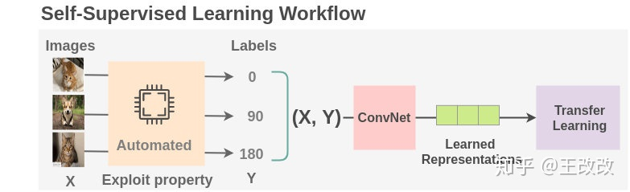
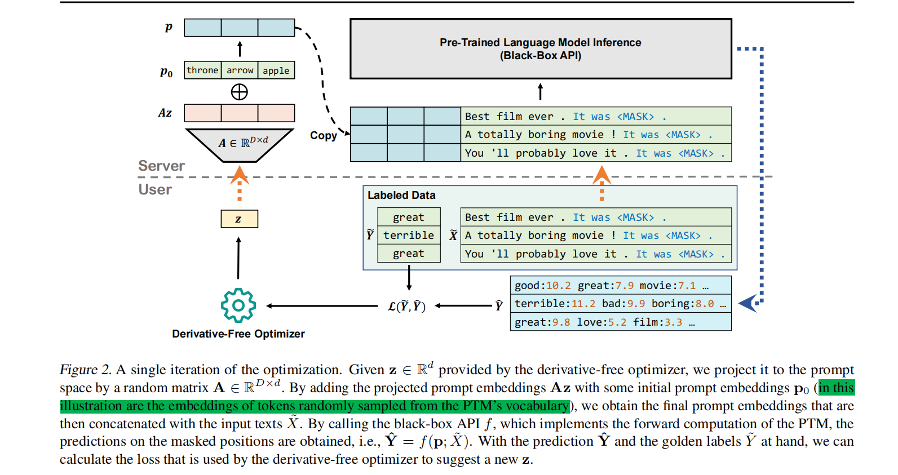
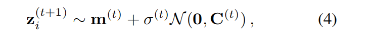
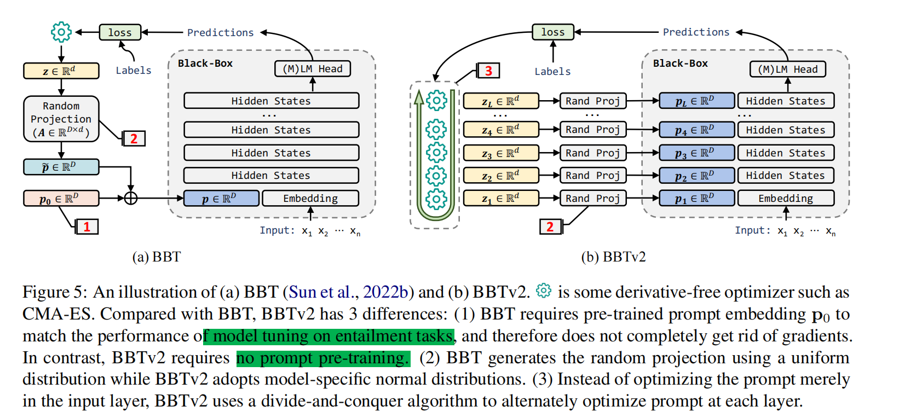
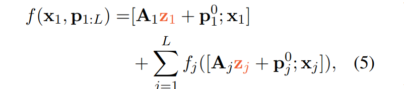

# Learning Method

“If intelligence is a cake, the bulk of the cake is self-supervised learning, the icing on the cake is supervised learning, and the cherry on the cake is reinforcement learning (RL).”

## 无监督学习

### 自监督学习

Word2Vec,BERT，GAN，自动标签生成（clustering）等

**通过利用数据的某些属性来设置伪监督任务来替换人类注释**。主要分为**生成式方法**和**对比式方法**

1. 根据所有待预测部分之外的信息预测任意一部分信息。
2. 根据过去预测未来。
3. 根据过去最近的情况预测未来。
4. 根据现在预测过去。
5. 根据底层信息预测顶层信息。
6. 根据可见的信息预测不可见的信息。
7. 假设有一部分输入数据未知，并且对其进行预测。

## 半监督学习

## 有监督学习	

## Prompt

### BBT（黑盒预训练模型调试策略）

**motivation**

大模型通常被用作一个服务(service)，贵，模型代码不能开源，衍生出language model as a service。

1. 离散prompt不能有效挖掘labeled data信息
2. 现有连续prompt方法（prompt拼接到输入之前）优化需要访问模型参数或梯度信息，且需要一个高维度才能达到有力效果
3. DFO(deverative free optimization)收敛较慢，当dimension search较高时
4. 现有工作发现主流PTM尽管有较多模型参数，但是intrinstic dim较小。

**methods**

产生soft prompt向量$z$后，由于预训练模型的本征维度很小，于是我们考虑在维数为d的子空间上优化向量z。并使用一个随机矩阵$A$将产生的向量z投影回原始的prompt空间中。

但是如直接将z投影到与PTM本身兼容的子空间中是很困难的。我们转而优化初始prompt$p_0$的增量。

**直接使用accuacy，reward稀疏，尤其在低样本的数据下**。转而使用交叉熵和合页损失函数。

最后，使用CMA算法优化。

$p_0$也可以通过**预训练**的方式获取。

**关键实验结果**

- gradient-based optimization tends to overfifit the small training data while DFO tends to fifind better solutions due to its exploration mechanism.

- feature-based methods cannot achieve competitive results when
  labeled data is limited
- a small subspace (e.g., *d* = 100) is hard to cover a good solution, while a large subspace (e.g., *d* = 1000) may lead to poor generalization

**contribution and future work**

- 语言模型即服务:prompt the PTM by only access their inference。提出一种方案不需要访问模型参数和梯度。模型能够成功处理真实世界的语言任务。

- 更有效的random space generation
  - matrix A
- 现有的模板（It was [MASK]）和标签word都是手工设计的
  - prompt工程
  - label word工程
  - prompt pretraining
  - prompt ensembling

### BBTv2(BBT的升级版本)

**bbtv1 limitation**

- Entailment Task表现不够优秀：必须使用prompt pretraining才能达到与model tuning相同的结果。故**没有完全与梯度无关**
- Many-label Classification任务上收敛速度慢

- 使用Uniform random projection的矩阵A作为projection使得在训练数据上过拟合。

**methods**

受deep prompt tuning的启发，将prompt token注入到PTM的每一层。并且使用DFO算法优化他们。

每一层连接上prompt token。

由于目标函数可以写成加性形式，因此可使用分治算法逐层优化（交替）每一层的prompt。

Proj的矩阵A也应该更改。我们**假设在word embedding数值分布上存在一个高质量的prompt**，我们让投影后结果的分布和word embedding分布尽可能接近。

**contribution**

- 使用更少的参数，和full model tuning和PET(parameter effective tuning 只tuning一小部分的parameter)达到一样好的结果，

### The Power of Scale for Parameter-Efficient Prompt Tuning

## 其他

### TRAIN SHORT, TEST LONG: ATTENTION WITH LINEAR BIASES ENABLES INPUT LENGTH EXTRAPOLATION

**motivation**

- 模型在推理阶段遇到比训练阶段更长的语料时如何进行推理？
  - 现有的方法不能做到有效的外推

**contribution**

- 提出了一个新的position method:Attention with linar bias.使得模型有效外推。在无外推的情况下，相比原始pos embedding有着相似或更加的结果。
- 加速训练

### Intrinsic Dimensionality Explains the Effectiveness of Language Model Fine-Tuning

**motivation**

