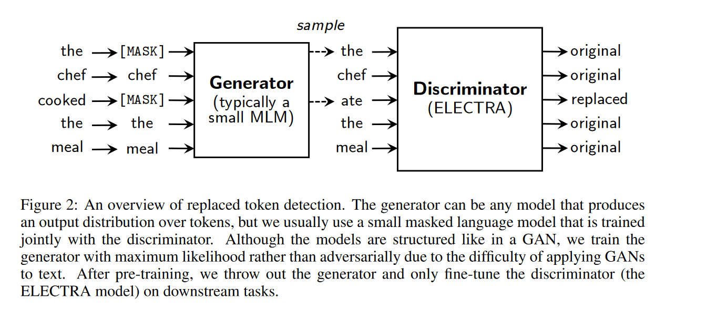
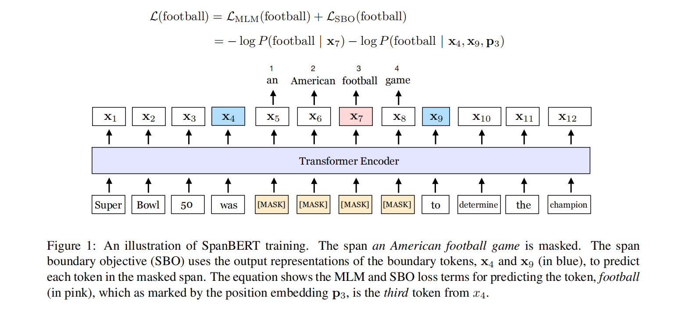

# Models

## ELECTRA

- 相比于MLM更少的计算量，更多的性能
- 方法：采用类似GAN的架构。生成器为小型MLM，判别器为ELECTRA.对原始语料随机采样一些token并将其mask掉。生成器采用MLM损失预测MASK位置的TOKEN，判别器采用极大似然估计的目标，若当前token被生成器替换则增大预测替换概率，否则减小。fine-tuning阶段仅fine-tuning 判别器

- 与GAN的区别：
  - Generator采用极大似然MLM损失，而不是骗过判别器
  - 判别器的目标导致其需要预测没有被替换的token为正常token，而不是认为生成器生成的所有token都是错误的。

## RoBERTa

### 改进之处

- 使用更多的数据训练

- Dynamic Masking：每次序列喂入模型的时候重新mask,而不是像BERT一样让训练集重复相同的mask
- 模型输入格式和NSP任务：
  - SEG-PAIR+NSP（原始BERT使用）
  - SENTENCE-PAIR+NSP(将BSZ增大)
    - 使用单句性能下降，可能为**模型无法学习到长距离依赖性**
  - FULL SENTENCE
  - DOC SENTENCE(在FULL的基础上加上可以跨越文章边界)

- 使用大BATCH训练：能提升MLM的困惑度和端任务的准确率

- Text Encoding

### 实验结果

- GLEU：和其他模型不同，ROBERTA不需要多任务finetuning,在测试时仅需要单任务模型的集成，多种任务的SOTA性能
- SQuAD：**不依赖于数据增广**

## SpanBERT

盖掉连续的span而不是random token

使用boundary regression目标函数，以span边界的token预测内部的token

- 可以鼓励模型以边界token信息存储span信息

移除了NSP目标，可能因为：

- 模型可能从更长的文章中获利，而不是简单的sentence pair
- 大概率不相关句子间的预测，会在模型中添加噪音

